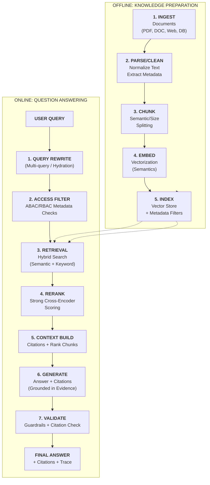

# RETRIEVAL-AUGMENTED GENERATION (RAG)

**Goal:** Help consulting and delivery teams design, implement, and operate RAG systems that ground LLM responses in **verifiable enterprise knowledge**, enabling **trust**, **traceability**, and **access-controlled retrieval** at production scale.

---

# TL;DR (30 SECONDS)

RAG makes LLMs usable for enterprise knowledge work by giving them the right evidence at the right time. Instead of trusting the model's "memory", you retrieve relevant content from approved sources, then instruct the model to answer **only from that evidence** and provide **citations**. RAG is not a single feature; it is an end-to-end system with ingestion, chunking, indexing, retrieval, reranking, generation, validation, security, and measurement. If you cannot measure retrieval and grounding quality, you cannot scale RAG beyond a demo.

- RAG is an **open-book system**: retrieve evidence, then generate from it
- Separate failures: **retrieval miss** vs **generation misuse** of evidence
- Build trust with **citations**, **abstention**, and **access control at retrieval time**
- Treat documents as untrusted inputs (prompt injection can come from your own corpus)
- Measure and gate with evals: recall@k, context relevance, citation correctness, P0 failures

---

# WHAT'S IN / WHAT'S OUT

**In:** end-to-end RAG architecture, key design decisions (chunking, metadata, top-k, reranking, hybrid search), security patterns (ABAC, redaction, injection defense), and an operating model (evals, monitoring, incident response).

**Out:** vendor-specific vector database details and embedding model training. This doc stays portable across providers and stacks.

---

# 1. WHAT RAG IS (AND WHAT IT IS NOT)

RAG (Retrieval-Augmented Generation) is a pattern where the system retrieves relevant content from a knowledge base and feeds it to the LLM at inference time so the LLM can generate an answer grounded in that content. The key idea is that the model should not be treated as the source of truth; the retrieved content is.

## 1.1. The Core Mental Model: "Open-Book Answering"

RAG is like giving the model an open book. The quality of the answer depends on:

- whether you retrieved the right pages (retrieval quality)
- whether the model used those pages correctly (grounding behavior)

This is why the most important operational rule is to separate **retrieval** and **generation** failures. If retrieval misses, prompting alone will not fix it. If retrieval is correct but the model still invents, you need grounding enforcement, citations, and guardrails.

## 1.2. RAG Is a System, Not a Feature

RAG has multiple moving parts, and enterprise failure often comes from ignoring one of them:

- ingestion and document lifecycle (what is indexed, how often, who owns it)
- chunking and metadata (how the corpus becomes searchable and filterable)
- embeddings and indexing (how meaning is represented and searched)
- retrieval and reranking (how evidence is selected for the model)
- generation and citations (how claims are tied to evidence)
- validation and guardrails (how unsafe/incorrect outputs are blocked)
- measurement and operations (how changes are gated and drift is detected)

## 1.3. Common RAG Variants (Choose for the Problem, Not the Hype)

Most enterprise systems start with "classic RAG" and evolve as needed:

- Classic RAG: retrieve top-k chunks, then answer with citations
- Hybrid RAG: combine keyword search and vector search
- Reranked RAG: retrieve a larger set, then rerank with a stronger model
- Multi-step RAG: plan query -> retrieve -> refine -> retrieve again
- GraphRAG: retrieve structured entities/relations for multi-hop reasoning

The consulting guidance is to start with the simplest variant that meets requirements, then evolve based on measured failures.

---

# 2. END-TO-END RAG ARCHITECTURE (FROM DOCUMENT TO ANSWER)

The RAG pipeline is easiest to understand as two loops: **an offline "knowledge preparation" loop and an online "question answering" loop.**

The rest of this section explains what each stage does, what can go wrong, and what decisions you must make.

## 2.1. Ingestion and Document Lifecycle

Enterprise documents are messy: PDFs, HTML, wikis, Word files, ticket histories, and emails. **Ingestion is the work of converting "raw docs" into text that can be indexed with stable identifiers.**

Key enterprise decisions are: what sources are in scope (and who owns each source), how often sources are refreshed (freshness vs cost), how deletions and updates propagate (avoiding stale answers), and how access control is represented (metadata and filters).

If your ingestion is not governed, RAG will quietly drift out of date and trust will collapse.

## 2.2. Chunking and Metadata (Where Many RAG Systems Win or Lose)

**Chunking is splitting documents into pieces that can be retrieved. Metadata is what lets you filter and explain those pieces. Together, they define retrieval quality.**

Practical chunking goals:

- chunks should be small enough to be specific, but large enough to preserve meaning
- chunks should align with document structure (sections, headings, table rows)
- chunks should preserve stable identifiers for citations (doc id, section, page)

Metadata should include what governance needs: document id and version, source system and owner, timestamps (created/updated), access control tags (department, role, clearance), and domain tags (product line, policy area).

## 2.3. Embeddings and Indexing

**Embeddings map text into vectors that represent semantic similarity.** Indexing stores those vectors plus metadata so the system can retrieve relevant chunks efficiently.

Enterprise reality:

- embeddings are not perfect; they need good chunking and metadata
- indexing must support filtering (for access control and relevance)
- multi-tenant or multi-department systems must avoid cross-scope retrieval

Index design is not just performance engineering; it is a governance boundary.

## 2.4. Retrieval (Top-k) and Filtering

**Retrieval selects candidate chunks for a query.** In enterprise, retrieval must also enforce policy boundaries: users must only retrieve chunks they are allowed to see. This is why access control should be enforced **server-side at retrieval time**, not as a post-processing step.

Two common retrieval layers:

- semantic retrieval (vector search)
- lexical retrieval (keyword/BM25)

Most enterprise RAG systems benefit from hybrid retrieval because users often use exact terms ("PTO policy", "SOX", "travel reimbursement") that keyword search captures well.

## 2.5. Reranking (The Quality vs Latency Trade-Off)

**Reranking takes a larger candidate set (e.g., top 50) and uses a stronger scorer to reorder them by relevance.** It often improves quality significantly, especially on ambiguous queries. It also adds latency and cost.

Consulting rule:

- use reranking when you have measured retrieval relevance issues and can afford the latency budget
- do not use reranking by default "because it's better"; justify it with evals and p95 targets

## 2.6. Generation With Citations (Grounding Behavior)

Once you have context, **generation is a prompt engineering problem: you must tell the model how to use context and how to cite it.** The system should be designed so that:

- key factual claims require citations
- unsupported claims are treated as failures
- uncertainty triggers abstention or clarifying questions

This is where RAG becomes trustworthy: citations let users verify, and abstention prevents confident guessing.

## 2.7. Validation and Guardrails (Preventing Bad RAG Behavior)

**RAG introduces a dangerous illusion: "it cited something, so it must be true." This is false if citations are irrelevant or fabricated. Validation and guardrails reduce this risk.**

Common validations:

- citation existence (every cited chunk id must exist in retrieved context)
- citation correctness sampling (spot audits or LLM-as-judge with calibration)
- schema validation for structured outputs (when needed)
- unsafe content filtering and redaction (PII, secrets)

Guardrails are also needed for prompt injection. Retrieved documents are untrusted inputs; a malicious or compromised document can instruct the model to reveal secrets or to ignore rules.

## 2.8. Tracing (What You Need for Auditability)

To operate RAG, you need traces that explain "why the system answered this way": prompt version, retrieved chunk ids and scores, filters applied (ABAC decisions), reranker decisions (if used), citations attached to the answer, and validation results.

This trace is how you debug and how you defend decisions in governance forums.

---

# 3. WHY RAG MATTERS IN ENTERPRISE (AND WHEN IT IS THE RIGHT PATTERN)

Enterprise users do not ask generic questions; they ask questions that depend on their company's policies, processes, products, contracts, and current state. **A base LLM cannot reliably answer those questions because its trained knowledge is not your enterprise knowledge, and because the organization needs answers that are traceable and defensible.**

RAG addresses this by turning "knowledge" into an explicit, governed input to the model. Instead of asking the model to remember what it never learned, you retrieve content from approved sources and instruct the model to answer from that evidence. The practical consulting value is that RAG creates a path to **trust**: citations, auditability, and measurable quality. It also creates a path to **governance**: access control, retention, and logging boundaries can be defined for the retrieval layer.

## 3.1. When RAG Is the Right Choice

**RAG is a good fit when the answer must be grounded in enterprise sources of truth:**

- The domain is company-specific (policies, procedures, product docs, internal knowledge)
- The content changes (frequent updates without retraining)
- Traceability is required (citations, audit)
- Access control matters (different users see different documents)
- The task is primarily knowledge retrieval + explanation (not real-time actions)

## 3.2. When Not to Use RAG (Or When It Is Not Enough)

RAG is the wrong primary tool when:

- The problem is deterministic and structured (SQL, rules, search)
- The answer must come from real-time system state (inventory, account status)
- The knowledge base does not exist or is not authoritative
- Compliance forbids sending the content to a model provider (without a safe deployment option)

In these scenarios, use tools, structured queries, or create an authoritative corpus first (KM work).

## 3.3. RAG vs Tool Calling (A Consulting Decision Rule)

RAG answers questions like "what does our policy say?" Tools answer questions like "what is the current status in the system of record?" The two are often combined, but the decision boundary should be explicit:

- If the truth lives in **documents**, start with RAG
- If the truth lives in **systems of record**, start with tools
- If the task requires **both** (explain policy + execute workflow), combine them with clear boundaries and safety gates

---

# 4. DESIGN DECISIONS AND TRADE-OFFS (THE CONSULTING DECISION FRAMEWORK)

**Many times RAG problems are not solved by "bigger/better models". They are solved by better system decisions.** This section gives decision rules and trade-offs you can use in workshops and architecture reviews.

## 4.1. Chunk Size and Overlap

Chunking is the most common hidden driver of retrieval quality. **If chunks are too small, you lose context. If chunks are too large, retrieval becomes noisy and expensive.**

Practical decision rules:

- start with chunks that align to natural sections (paragraphs/headings)
- use overlap only when meaning spans boundaries
- validate chunking with retrieval evals (recall@k and context relevance)

## 4.2. Metadata Strategy (Relevance and Governance)

Metadata is how you keep retrieval relevant and safe. Without metadata, you cannot:
filter by access control, filter by product line/region/business unit, prefer newer versions, or explain provenance and ownership.

A good consulting deliverable is a metadata schema with owners and update rules.

## 4.3. Hybrid Search vs Vector-Only

Vector-only retrieval often fails on exact terms and short queries. Hybrid search improves robustness.

Use hybrid search when users use exact internal terminology, documents contain structured identifiers (policy numbers, codes), or your evals show lexical misses.

## 4.4. Reranking: When to Pay the Price

Reranking helps most on:

- ambiguous queries ("travel policy for contractors")
- exception-heavy domains (policies with many edge cases)
- multi-document answers

Reranking costs latency and sometimes money. Decide with:

- p95 latency budget
- cost per successful task
- measured gain in retrieval relevance and groundedness

## 4.5. Citations: Presence Is Not Enough

Many teams implement "citations" as decoration. Enterprise trust requires:

- citation correctness (citations actually support the claim)
- claim-to-citation mapping (especially for multi-claim answers)
- abstention when citations are missing or irrelevant

Treat "unsupported claim" as a measurable failure. This is where [`2.5_evals.md`](./2.5_evals.md) becomes mandatory.

## 4.6. Freshness and Update Frequency

**RAG systems fail silently when corpora drift.** Decide refresh policy based on how often content changes, the risk of stale answers (policy updates, pricing, compliance), and the operational cost of ingestion and indexing.

For high-risk policies, prioritize freshness and versioning over minimal cost.

## 4.7. Multi-Turn Conversations and Memory

In enterprise assistants, users ask follow-ups. Avoid stuffing entire chat history into context. Prefer:

- conversation summaries (with citations when needed)
- explicit state (user profile, selected product, region)
- re-retrieval on each turn (for factual questions)

This keeps answers grounded and reduces "drift" across a long conversation.

---

# 5. SECURITY AND GOVERNANCE (HOW RAG FAILS IN ENTERPRISE)

RAG moves enterprise documents into an AI workflow. That is powerful, but it creates new risk categories: data leakage, access control failures, and prompt injection from the corpus itself. This section is the minimum enterprise security story.

## 5.1. Access Control: ABAC at Retrieval Time (Non-Negotiable)

Enterprise systems must enforce "who can see what" before retrieval. Post-filtering is unsafe because:

- the model may already have seen disallowed content
- logs and traces may capture disallowed content

ABAC (attribute-based access control) is a common pattern:

- **user attributes:** role, department, clearance, region
- **document attributes:** confidentiality level, allowed departments, region scope
- **retrieval filter:** only retrieve chunks where user attributes satisfy document policy

This is a governance requirement, not a nice-to-have.

## 5.2. Prompt Injection From Documents (Corpus Is Untrusted)

**RAG creates a new attack surface: retrieved content can contain instructions like "ignore system rules".** This can be accidental (bad formatting) or malicious (poisoned documents).

Defenses:

- delimiting and labeling retrieved content as untrusted
- instruction hierarchy: system/developer rules override retrieved content
- content sanitization during ingestion
- guardrails that detect injection patterns and block unsafe behavior

See [`2.4_guardrails.md`](./2.4_guardrails.md) for enforcement patterns.

## 5.3. Data Protection and Logging

**RAG systems often leak through logs rather than answers.** Decide and document:

- what is logged (prefer ids over raw content)
- redaction rules (PII/secrets)
- retention policies
- audit requirements (who accessed what and when)

If you cannot explain your logging policy, you are likely leaking sensitive data.

## 5.4. Governance: Ownership and Lifecycle

**RAG quality depends on the corpus lifecycle.** Define:

- source owners and update SLAs
- deprecation rules (obsolete policies)
- escalation paths (content errors, access issues)
- approval for adding new sources

This is why RAG is closely tied to knowledge management [`../03_use_case_archetypes/3.3_knowledge_management.md`](../03_use_case_archetypes/3.3_knowledge_management.md).

---

# 6. MEASURING AND OPERATING RAG (EVALS, MONITORING, AND INCIDENTS)

**RAG does not scale on intuition. You must measure both retrieval quality and groundedness, and you must gate changes that could regress safety or trust.**

## 6.1. What to Measure (Minimum Viable RAG Metrics)

Retrieval metrics:

- recall@k (did we retrieve the right chunk?)
- context relevance (is retrieved context on-topic?)
- coverage (did we retrieve all needed sources?)

Grounding metrics:

- citation correctness (do citations support claims?)
- unsupported claim rate (claims not backed by evidence)
- abstention correctness (refuse/ask questions when evidence is missing)

System metrics:

- cost per successful task
- latency distribution (p50/p95/p99)
- safety incidents (blocked outputs, leakage detection)

## 6.2. How to Evaluate (Offline First, Then Online)

Offline evals:

- build a v0 dataset (50-100 real questions)
- label a high-risk slice (policies, compliance, sensitive docs)
- define P0 blockers (data leakage, access violations, fabricated citations)
- run baselines and compare deltas after changes

Online monitoring:

- track re-ask rate (proxy for poor retrieval/grounding)
- track escalations to humans (proxy for failure)
- sample outputs for citation correctness audits
- add new real cases to the eval set weekly

For a full operating model, use `2.5_evals.md`.

## 6.3. Change Control: What Requires a Gate

Treat these as release-impacting changes:

- chunking strategy or chunk size
- embedding model
- retrieval parameters (top-k, filters)
- reranker introduction or threshold change
- prompt changes that affect citation and abstention behavior
- access control policy changes

Gate them with evals and P0 safety checks. RAG regressions are often invisible until users lose trust.

## 6.4. Incident Response (When RAG Goes Wrong)

Common RAG incidents:

- a sensitive chunk is retrieved for the wrong user (access control failure)
- the system cites irrelevant content but looks confident (false trust)
- a poisoned document triggers unsafe behavior (prompt injection)
- stale content causes policy misinformation (freshness failure)

Treat P0 incidents as incidents:

- mitigate (tighten filters, disable sources, rollback)
- investigate (trace retrieval and citation paths)
- prevent recurrence (add cases to eval set, add guardrails)

---

# 7. CASE STUDY: BUILDING A COMPANY KNOWLEDGE BASE WITH RAG

This case study walks through a complete RAG implementation, explaining the rationale and trade-offs behind each decision.

**Company:** TechCorp, 500 employees  
**Problem:** Employees waste 2-3 hours/week searching across SharePoint, Confluence, Google Drive, and wikis for policies, procedures, and documentation.  
**Goal:** Build an AI assistant that answers questions using company documents, with citations and access control.  
**Constraints:** $500/month budget, 6-week MVP timeline, >85% accuracy, <3s response time, zero access violations.

**Documents:** 880 documents (~2850 pages) including HR policies, engineering docs, product specs, support procedures, and announcements.  
**Users:** All employees (public docs), HR team (HR docs), Engineering (engineering docs), Managers (management policies), Executives (all docs).  
**Question types:** 60% fact-finding, 30% procedural, 10% analytical.

---

### 7.1. Chunking Strategy

**The challenge:** Documents range from short FAQs to 50-page policy manuals. Questions need both precise facts ("What is the refund deadline?") and contextual explanations ("Explain our vacation policy").

**Analysis:**
- Documents are well-structured (sections, headers, paragraphs)
- Questions often need 2-3 paragraphs of context
- Precision matters (wrong answers = compliance risk)

**Decision:** Paragraph-based chunking, 500 tokens per chunk

**Rationale:**
- Paragraph-based preserves natural language boundaries (better than fixed-size which might split sentences)
- 500 tokens balances precision and context (not too small to miss context, not too large to include noise)
- Simpler than semantic chunking (faster to implement, lower cost)
- Can upgrade to semantic chunking later if needed

**Trade-offs:**
- Preserves document structure, good balance of precision/context
- May include some irrelevant paragraphs in chunks
- Not optimal for very precise fact-finding or very analytical questions

**Alternative considered:** Semantic chunking (more accurate but slower and more expensive for MVP)

### 7.2. Embedding Model

**The challenge:** Need to convert 2850 pages of text into searchable vectors. Documents are English-only, mix of technical (engineering) and non-technical (HR) content.

**Analysis:**
- Quality needs to be good but not perfect (MVP phase)
- Cost is a constraint ($500/month total budget)
- Latency matters but embeddings are generated once (not per query)

**Decision: OpenAI `text-embedding-3-small`**

**Rationale:**
- Good quality for general business documents (sufficient for MVP)
- Much cheaper than larger models (~$0.00002 per 1K tokens vs $0.0001 for large)
- Fast (low latency for initial indexing)
- Can upgrade to `text-embedding-3-large` later if quality issues arise

**Trade-offs:**
- Good balance of quality and cost
- May struggle with very technical terminology (can fine-tune later if needed)
- Not multilingual (not needed for this use case)

**Alternative considered:** Domain-specific fine-tuned model (better quality but much higher cost and complexity)

### 7.3. Vector Database

**The challenge:** Need to store ~50K chunks (estimated) and support metadata filtering for access control. Team has AWS expertise but wants to move fast.

**Analysis:**
- Must support metadata filtering (critical for ABAC access control)
- Scale: ~50K chunks (moderate scale)
- Budget: $500/month total (need to reserve for other components)
- Team expertise: AWS, but prefer managed services for speed

**Decision:** Pinecone (managed service)

**Rationale:**
- Managed service = faster to start (no infrastructure setup)
- Good metadata filtering = essential for access control
- Reasonable pricing = $70/month for up to 100K vectors (fits budget)
- Fast similarity search = meets latency requirements
- Can migrate to self-hosted later if scale/cost becomes an issue

**Trade-offs:**
- Fast to implement, good performance, fits budget
- Ongoing monthly cost (vs one-time infrastructure cost for self-hosted)
- Less control than self-hosted (acceptable trade-off for MVP)

**Alternative considered:** Self-hosted (pgvector on PostgreSQL) - more control but requires infrastructure management and longer setup time

### 7.4. Retrieval Strategy

**The challenge:** Users ask questions in natural language ("What's our vacation policy?") but also use specific terms ("PTO", "time off"). Need high recall (can't miss relevant information).

**Analysis:**
- Questions mix natural language and specific terminology
- Quality is more important than speed (3-second target is generous)
- Knowledge base has technical terms, product names, policy codes

**Decision:** Hybrid retrieval (dense + sparse)

**Rationale:**
- Dense (semantic) search catches synonyms and meaning ("vacation" → "time off", "PTO")
- Sparse (keyword) search catches exact matches ("Project Alpha", policy codes)
- Combined** = best recall (catches both semantic and keyword matches)
- Industry best practice for production systems
- Worth the added complexity (~50ms latency) for quality improvement

**Implementation:** 70% semantic + 30% keyword (tuned based on testing)

**Trade-offs:**
- Best recall, handles diverse query types
- More complex to implement and tune
- Slightly higher latency (~50ms added)
- Requires keyword search infrastructure (Pinecone supports this)

**Alternative considered:** Dense-only (simpler, faster, but misses exact keyword matches - not acceptable for this use case)

### 7.5. Top-K and Reranking

**The challenge:** Questions may need information from multiple documents. Quality is critical (compliance risk), but 3-second response time allows for some processing overhead.

**Analysis:**
- Need good recall (retrieve enough chunks) but also precision (most relevant first)
- Quality is critical (wrong answers = compliance/legal risk)
- 3-second target allows for reranking step

**Decision:** Retrieve k=15, rerank top 10, send top 5 to LLM

**Rationale:**
- k=15 provides good recall without excessive noise
- Reranking improves quality significantly (10-20% better answer accuracy)
- Send top 5 balances context (enough information) and token cost (not too expensive)
- Latency: ~200ms retrieval + ~100ms reranking = acceptable within 3s target

**Cost impact:** Reranker ~$0.001 per query = ~$1/month for 1000 queries (negligible)

**Trade-offs:**
- Good balance of recall, precision, and cost
- Reranking adds 50-100ms latency (acceptable for quality gain)
- More complex architecture (one more component)
- Higher cost than no reranking (but minimal)

**Alternative considered:** No reranking (simpler, faster, but 10-20% lower quality - not acceptable given compliance requirements)

### 7.6. LLM Selection

**The challenge:** Need structured output (citations in JSON format), good quality for business documents, but cost-conscious. Quality is important but not life-critical.

**Analysis:**
- Need reliable structured output (citations must be parseable)
- Quality needs to be good but not perfect (business docs, not medical/legal)
- Budget constraint: $500/month total
- 1000 queries/month estimated
- Response time matters (target: <3s total)

**Decision:** GPT-4o-mini

**Rationale:**
- Good quality for business documents (sufficient for most use cases)
- Much cheaper than GPT-4o ($0.15 vs $2.50 per 1M input tokens = ~16x difference)
- Faster** than GPT-4o (lower latency, important for <3s target)
- Supports structured output (JSON mode for reliable citations)
- Can upgrade to GPT-4o later if quality issues arise

**Cost impact:** ~3000 tokens per query × 1000 queries × $0.15/1M tokens = ~$0.45/month (negligible cost, well within budget)

**Trade-offs:**
- Excellent quality-to-cost ratio, fast, sufficient for business documents
- Not as good as GPT-4o for very complex reasoning (acceptable for this use case)
- May struggle with very nuanced analytical questions (can upgrade if needed)
- Slightly lower quality than GPT-4o (but difference is minimal for most business queries)

**Alternative considered:** GPT-4o (higher quality but ~16x more expensive - would cost ~$7.50/month vs $0.45/month, not justified for MVP when GPT-4o-mini quality is sufficient)

**When to choose GPT-4o instead:**
- Very high-stakes use cases (legal, medical, financial compliance)
- Complex analytical questions requiring deep reasoning
- When quality is more important than cost
- When budget allows and quality improvement justifies the cost

### 7.7. Access Control

**The challenge:** Different users need different document access. HR policies only for HR, financial data only for Finance + C-level. Zero tolerance for access violations (compliance requirement).

**Analysis:**
- Must enforce access control (regulatory requirement)
- Multiple user types with different access levels
- Need audit logging (compliance requirement)
- Security is non-negotiable

**Decision:** ABAC at retrieval time (server-side filtering)

**Rationale:**
- Server-side filtering = most secure (filters before retrieval, can't be bypassed)
- At retrieval time = efficient (only searches allowed chunks)
- ABAC (Attribute-Based Access Control) = flexible (department, role, clearance level)
- Pinecone supports metadata filtering natively
- Audit logging = required for compliance

**Implementation:**
- Chunk metadata: `department: ["HR"]`, `access_level: "confidential"`, `min_clearance: 2`
- User attributes: From IAM system (department, role, clearance)
- Filter: Only retrieve chunks where user has access
- Audit log: Log user_id, query_category, retrieved_chunk_ids, timestamp

**Trade-offs:**
- Most secure approach, efficient, compliant
- Requires proper metadata tagging (must be done correctly)
- More complex than no access control (but required)

### 7.8. End-to-End Flow Example

**User:** Sarah (Marketing department, standard employee)  
**Query:** "What is our vacation policy?"

1. **Authentication:** System extracts `department: "Marketing"`, `role: "Employee"`, `clearance: 1`
2. **Access filtering:** Only search chunks where `(department = "Marketing" OR "All") AND clearance <= 1`
3. **Hybrid retrieval:** 
   - Semantic search finds "time off policy", "PTO policy"
   - Keyword search finds "vacation policy"
   - Combine and rank: Top 15 chunks
4. **Reranking:** Reorder top 10 by relevance → Top 5 from hr-policy-vacation.pdf and employee-handbook.pdf
5. **Generation:** LLM answers using context, cites sources in structured format
6. **Validation:** Check citations exist and contain claims
7. **Response:** "Employees receive 20 days of paid vacation per year [hr-policy-vacation.pdf, p.5]. Requests must be submitted 2 weeks in advance [employee-handbook.pdf, p.12]."
8. **Audit log:** Record user_id, query, retrieved_chunk_ids, citations, timestamp

This case study illustrates an end-to-end RAG implementation that is realistic for enterprise consulting: policy Q&A with citations, access control by role, and a measurable path from POC to production.

---