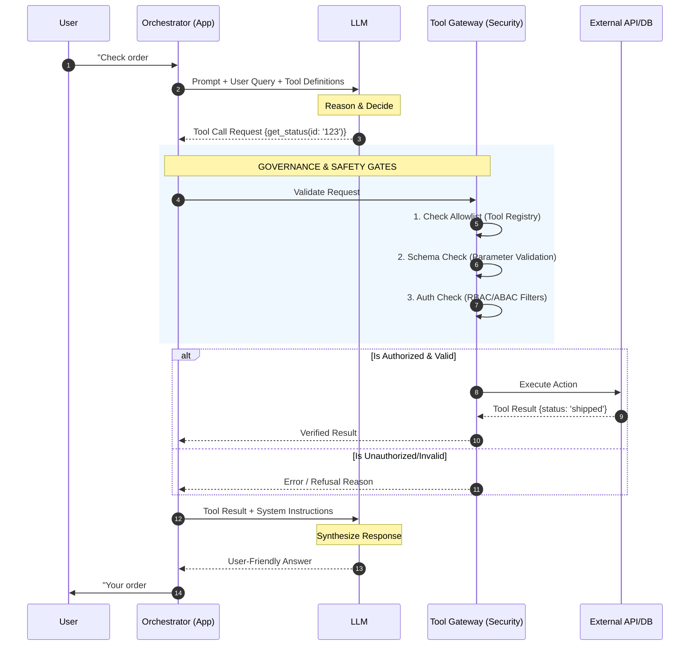

# TOOL CALLING (FUNCTION CALLING)

**Goal:** Help enterprise teams design, implement, and operate tool calling so LLM systems can access **real-time state** and perform **safe actions** while maintaining **authorization, reliability, auditability, and measurable quality**.

**Prerequisites:**
- [`../01_foundations/1.1_llm_fundamentals.md`](../01_foundations/1.1_llm_fundamentals.md) — Understanding LLM capabilities and limitations
- [`../01_foundations/1.2_prompt_engineering.md`](../01_foundations/1.2_prompt_engineering.md) — How to structure prompts
- [`2.1_rag.md`](./2.1_rag.md) — Understanding RAG (often combined with tool calling)

**Related:**
- [`2.7_agentic_ai.md`](./2.7_agentic_ai.md) — Tool calling in agentic systems
- [`2.4_guardrails.md`](./2.4_guardrails.md) — Security controls for tool calls
- [`2.5_evals.md`](./2.5_evals.md) — Measuring tool calling quality
- [`2.6_observability_llomps.md`](./2.6_observability_llomps.md) — Observing tool calls


---

# TL;DR (30 SECONDS)

Tool calling is what makes an LLM system useful beyond text: it can read real-time state (CRM, ticket status, inventory) and perform actions (create a ticket, update a record). The enterprise risk is that **actions have consequences**. You must treat tool calling as a controlled system: tools are allowlisted, arguments are validated server-side, retries are safe (idempotent), and the assistant must never claim an action happened unless the tool result confirms it. The fastest way to ship safely is to measure end-to-end task success with evals and gate releases on P0 failures.

- Use tools for **real-time truth** and **actions**; use RAG for document knowledge
- The key split is **selection vs execution**: LLM proposes, system enforces
- Define tool contracts with schemas; validate arguments server-side
- Require **truthful confirmation**: no "done" unless the tool succeeded
- Build reliability patterns: retries, idempotency, rate limiting, circuit breakers
- Track and gate with evals: tool success rate, invalid args, unauthorized attempts, p95 latency

---

# WHAT'S IN / WHAT'S OUT

**In:** end-to-end tool calling architecture, tool contract design (schemas, validation), reliability patterns, security patterns (allowlists, authorization, audit), and an operating model (evals, monitoring, incident playbooks) plus a realistic enterprise case study.

**Out:** vendor-specific APIs and framework-specific glue code. Keep the concepts portable across providers and orchestration stacks.

---

# 1. WHY TOOL CALLING MATTERS IN ENTERPRISE (AND WHEN IT IS THE RIGHT PATTERN)

Enterprise assistants are expected to do more than talk. Users ask questions that require real-time state ("is the ticket resolved?") and they ask for actions ("open a ticket for this incident"). If the system cannot access systems of record, the assistant will either be useless or hallucinate. Tool calling solves this by letting the system execute deterministic functions and return their results to the model.

**The consulting challenge is that tool calling changes the risk profile. The assistant is no longer only producing text; it is participating in operations.** That introduces **authorization**, **audit**, and **reliability** requirements that do not exist in plain text generation. Tool calling is therefore both a capability lever and a governance boundary.

## 1.1. When Tool Calling Is the Right Choice

Use tool calling when:

- the truth is in a system of record (CRM, ERP, ticketing, inventory, HR systems)
- the user needs a real-time answer (status, availability, balances)
- the user needs an action (create/update/cancel/approve)
- the workflow spans multiple systems (fetch -> decide -> act -> confirm)

## 1.2. When Not to Use Tool Calling

Tool calling is often unnecessary when:

- the task is purely informational and the truth is in documents (use RAG)
- a deterministic UI flow or rule engine would be simpler and safer
- the action is high-risk and cannot be reliably authorized or audited

The consulting rule is to introduce tools only when they create clear business value and when the enforcement layer is ready.

## 1.3. Tool Calling vs RAG (The Decision Boundary)

Use a simple decision boundary:

- If the truth is in **documents**, use RAG.
- If the truth is in **systems of record**, use tools.
- If the workflow requires both (policy + action), combine them with explicit boundaries and gates.

**RAG without tools leads to stale answers for real-time questions. Tools without grounding can lead to unsafe actions without policy context. Most enterprise copilots use both.**

---

# 2. WHAT TOOL CALLING IS (AND WHAT IT IS NOT)

Tool calling (function calling) is a mechanism where the model proposes a tool invocation using a predefined schema, the system executes the tool, and the tool result is returned to the model so it can continue the workflow.

## 2.1. The Core Mental Model: "LLM Proposes, System Enforces"

The LLM should be treated as an intelligent planner, not as a privileged operator. A safe architecture separates:

- **Selection:** the LLM proposes which tool to use and with what arguments
- **Execution:** the system validates, authorizes, executes, and logs the tool call

This separation is the difference between "an assistant" and "an attack surface".

## 2.2. What Tool Calling Is Not

Tool calling is not permission to execute arbitrary code, it is not a substitute for IAM (authorization must exist and be enforced server-side), it is not safe by default (you must design for idempotency, retries, and audit), and it is not a reason to skip evals (actions are precisely what must be tested).

## 2.3. The End-to-End Flow



A typical enterprise flow is: the user request arrives (untrusted input), the system builds context (user identity, permissions, policy constraints), the model chooses whether to answer directly or call a tool, and if a tool call is proposed the system validates arguments against schema, authorizes based on user + policy, executes the tool, and logs a trace (tool name, args summary, outcome). Finally, the model produces the user-facing answer and must reference tool outputs truthfully.

**Step 1: User Query**
- User: "Check the status of order #12345 and process a refund if it's not shipped"

**Step 2: LLM Receives Tool List**
- System sends LLM:
  - Available tools: `get_order_status`, `process_refund`, `check_inventory`
  - Tool schemas (what each tool does, what parameters it needs)
  - User query

**Step 3: LLM Decides to Call Tool**
- LLM analyzes query and decides: "I need to call `get_order_status` first"
- LLM generates tool call: `{tool: "get_order_status", parameters: {order_id: "12345"}}`

**Step 4: Validation**
- System checks: Is `get_order_status` in the allowlist? ✅ Yes
- System checks: Does user have permission to check orders? ✅ Yes
- System validates: Does `order_id` match schema (string, required)? ✅ Yes

**Step 5: Tool Execution**
- System calls: `get_order_status(order_id="12345")`
- External service returns: `{status: "pending", shipped: false}`

**Step 6: LLM Receives Result**
- LLM sees: Order is not shipped
- LLM decides: User asked to process refund if not shipped, so I should call `process_refund`
- LLM generates second tool call: `{tool: "process_refund", parameters: {order_id: "12345"}}`

**Step 7: Second Tool Call (Same Validation + Execution)**
- Validation ✅
- Execution: `process_refund(order_id="12345")` → Returns `{refund_id: "REF789", status: "processed"}`

**Step 8: Final Response**
- LLM generates: "I checked order #12345 and it hasn't been shipped yet. I've processed a refund (Refund ID: REF789). You should receive the refund in 3-5 business days."

**Step 9: Audit Logging**
- System logs: User ID, tools called, parameters (sanitized), results, timestamp

---

# 3. TOOL CONTRACTS (SCHEMAS, VALIDATION, AND OUTPUT DESIGN)

Tool calling only works when tools are well-defined. "A function" is not a tool contract. A tool contract defines:
what the tool does, which inputs are allowed, what outputs look like, what errors mean, and what is safe to retry.

**Example:** Well-Designed Tool Schema

```json
{
  "name": "get_order_status",
  "description": "Retrieves the current status of an order. Use this when the user asks about order status, shipping information, or delivery dates.",
  "parameters": {
    "type": "object",
    "properties": {
      "order_id": {
        "type": "string",
        "description": "The unique order identifier (e.g., 'ORD-12345'). Always required.",
        "pattern": "^ORD-[0-9]{5}$"
      },
      "include_tracking": {
        "type": "boolean",
        "description": "Whether to include tracking information. Defaults to false.",
        "default": false
      }
    },
    "required": ["order_id"]
  }
}
```

**What makes this schema good:**
- Clear description: Tells LLM when to use this tool
- Parameter descriptions: Each parameter explains what it is and when to use it
- Type validation: `order_id` is a string, `include_tracking` is a boolean
- Pattern validation: `order_id` must match format `ORD-XXXXX`
- Required fields: Clearly marked (`order_id` is required)
- Defaults: `include_tracking` has a default value

## 3.1. Schema Design (Keep It Narrow)

Tools should be minimal and intention-revealing. Prefer:

- `get_ticket_status(ticket_id)` over `query_database(sql)`
- `create_ticket(summary, category, severity)` over `create_record(json_blob)`

Broad tools create broad attack surfaces and make evaluation harder.

## 3.2. Argument Validation (Server-Side, Always)

Validation is not optional. The system must validate tool arguments against the schema before execution. This prevents:

- malformed calls
- missing required fields
- unsafe values (e.g., negative refunds, wrong currency)
- injection into downstream systems

Validation is also where you enforce constraints like maximum refund amounts, allowed categories, and required approvals.

## 3.3. Output Design (Make Truthful Confirmation Easy)

Tool outputs should be structured and explicit. The assistant should confirm outcomes based on tool results. If the tool returns "pending", the assistant must not say "done".

A practical pattern is to return:

- `status` (success/failure/pending)
- `id` (created/updated entity id)
- `message` (user-safe summary)
- `audit` (trace ids, timestamps, actor)

This helps with compliance and post-incident reconstruction.

---

# 4. SECURITY: AUTHORIZATION, ALLOWLISTS, AND "CONFUSED DEPUTY"

Tool calling is a security feature as much as an AI feature. The model can be manipulated by users and by retrieved documents. Your system must ensure that the model cannot use privileges the user does not have.

## 4.1. Allowlists (Production Default)

**In production, tool availability should be allowlisted.** The model must not "discover" tools dynamically unless the environment is low-risk and tightly controlled.

Allowlists provide:

- predictable behavior
- smaller attack surface
- easier audit and testing
- safer incident response (disable a tool quickly)

## 4.2. Authorization (IAM Is Not Optional)

**Authorization must be enforced server-side using user identity and policy. Never rely on the model to decide if the user is allowed to do something**. Common patterns:

- RBAC/ABAC checks per tool
- scoped tokens and service accounts
- per-tenant boundaries (prevent cross-tenant data access)

## 4.3. Confused Deputy Risk

A "confused deputy" is when the system uses its own privileges on behalf of a user who should not have those privileges. Tool calling is a direct route to confused deputy incidents if authorization is weak. Defensive patterns:

- validate the user identity at execution time
- enforce policy per tool and per argument (not only per tool)
- log tool calls with actor identity and trace ids
- require human approval for high-risk actions

## 4.4. Prompt Injection and Tool Abuse

Injection can try to cause unsafe tool calls. Treat user input and retrieved documents as untrusted. Use:

- strong instruction hierarchy (system rules override untrusted content)
- guardrails to detect malicious patterns
- schema constraints and server-side validation to block unsafe args

See `2.4_guardrails.md` for enforcement details.

---

# 5. OBSERVABILITY OF TOOL CALLS

Observability is critical for understanding what your system is doing, debugging issues, and meeting compliance requirements.

## 5.1. What to Instrument

**Minimum instrumentation (MVP):**
1. **Tool name:** Which tool was called
2. **Parameters (sanitized):** What parameters were passed (remove sensitive data)
3. **Execution time:** How long it took (latency)
4. **Success/failure:** Did it succeed or fail?
5. **Error message:** If it failed, what was the error?
6. **User ID:** Who made the request
7. **Timestamp:** When it was called

**Production instrumentation (additional):**
8. **Request ID:** Unique ID to trace end-to-end (connects tool call to user request)
9. **Retry count:** How many times it was retried
10. **Rate limit status:** Was it rate limited?
11. **Circuit breaker status:** Was circuit breaker open?
12. **Token usage:** If tool calls LLM internally, track tokens
13. **Cost:** Cost per tool call (for FinOps)

## 5.2. Tracing End-to-End

**The problem:** A user request might trigger multiple tool calls. You need to trace the entire flow to understand what happened.

**Solution: Request ID (correlation ID)**

**How it works:**
1. User makes request → Generate unique request ID (e.g., `req_abc123`)
2. All tool calls in this request use the same request ID
3. Logs, metrics, traces all include this request ID
4. You can search logs by request ID to see the full flow

**Example trace:**

```
Request ID: req_abc123
User: user_456
Query: "Check order #12345 and process refund if not shipped"

Timeline:
10:30:00.100 - User query received
10:30:00.150 - LLM decided to call get_order_status
10:30:00.200 - Tool call: get_order_status(order_id="ORD-12345")
10:30:00.445 - Tool result: {status: "pending", shipped: false}
10:30:00.500 - LLM decided to call process_refund
10:30:00.550 - Tool call: process_refund(order_id="ORD-12345", amount=99.99)
10:30:00.795 - Tool result: {refund_id: "REF-789", status: "processed"}
10:30:00.900 - Final response generated
10:30:00.950 - Response sent to user
```

## 5.3. Metrics to Track

**Key metrics for tool calling:**

1. **Tool call success rate:** % of tool calls that succeed
   - Target: >99% for critical tools, >95% for non-critical
   - Alert if: Success rate drops below threshold

2. **Tool call latency (P50, P95, P99):** How long tool calls take
   - P50 (median): Typical latency
   - P95: 95% of calls are faster than this
   - P99: 99% of calls are faster than this (catches outliers)
   - Alert if: P95 latency exceeds SLA (e.g., >2 seconds)

3. **Error rate by tool:** Which tools fail most often?
   - Helps identify problematic tools
   - Example: `process_refund` has 5% error rate → investigate

4. **Error rate by error type:** What types of errors occur?
   - Transient errors (retryable) vs permanent errors (not retryable)
   - Example: 80% of errors are rate limits → need better rate limiting

5. **Tool call volume:** How many calls per tool per time period?
   - Helps with capacity planning
   - Example: `get_order_status` called 10,000 times/day

6. **Cost per tool call:** Financial tracking
   - Example: `process_refund` costs $0.01 per call (API fees)

**Example dashboard:**

```
Tool Call Metrics (Last 24 hours)

Tool Name              | Calls | Success Rate | P95 Latency | Error Rate
-----------------------|-------|--------------|-------------|------------
get_order_status       | 10,234| 99.8%        | 245ms       | 0.2%
process_refund         | 1,234 | 98.5%        | 1.2s        | 1.5%
check_inventory        | 5,678 | 99.9%        | 180ms       | 0.1%
update_account         | 890   | 97.2%        | 890ms       | 2.8%
```

**For detailed observability patterns, see:** [`2.6_observability_llmops.md`](./2.6_observability_llmops.md)

---

# 6. CASE STUDY: CUSTOMER SUPPORT BOT WITH TOOL CALLING

This case study walks through a complete tool calling implementation, explaining the rationale behind each decision.

**Company:** E-CommerceCorp, online retailer  
**Problem:** Customer support team spends 40% of time on routine tasks (checking order status, processing refunds, updating accounts). Customers wait 15+ minutes for simple requests.  
**Goal:** Build an AI assistant that can handle routine support tasks autonomously, with human escalation for complex issues.  
**Constraints:** $2000/month budget, 8-week MVP timeline, >95% accuracy for order status checks, <5s response time, zero security incidents, full audit trail for compliance.

**Users:** Customer support agents (can process refunds, update accounts), customers (can only check their own orders), supervisors (can access all tools).  
**Tool requirements:** Check order status, process refunds, update account information, check inventory, create support tickets.

## 6.1. Tool Schema Design

LLM needs clear instructions on when and how to use each tool. Schemas must be descriptive enough for the LLM to make good decisions, but not so verbose that they confuse it.

**Analysis:**
- Tools need to handle various user phrasings ("check my order", "where is my package", "order status")
- Parameters must be validated (order IDs have specific format)
- Some tools are idempotent (check order status), others are not (process refund needs idempotency key)

**Decision: Comprehensive schemas with clear descriptions and validation**

**Rationale:**
- Clear descriptions help LLM choose the right tool
- Parameter validation prevents errors before API calls
- Idempotency keys prevent duplicate refunds

**Example: Well-designed schema for `get_order_status`**

```json
{
  "name": "get_order_status",
  "description": "Retrieves the current status and shipping information for an order. Use this when the user asks about order status, shipping, delivery, tracking, or 'where is my order'. Always verify the user has access to this order before calling.",
  "parameters": {
    "type": "object",
    "properties": {
      "order_id": {
        "type": "string",
        "description": "The order identifier. Format: ORD- followed by 5 digits (e.g., 'ORD-12345'). This is required.",
        "pattern": "^ORD-[0-9]{5}$"
      },
      "include_tracking": {
        "type": "boolean",
        "description": "Whether to include tracking number and shipping details. Defaults to false. Set to true if user asks about tracking or shipping.",
        "default": false
      }
    },
    "required": ["order_id"]
  }
}
```

**Example: Well-designed schema for `process_refund` (with idempotency)**

```json
{
  "name": "process_refund",
  "description": "Processes a refund for an order. Use this ONLY when the user explicitly requests a refund. This action is irreversible. Requires idempotency_key to prevent duplicate refunds. Always confirm with the user before processing large refunds (>$500).",
  "parameters": {
    "type": "object",
    "properties": {
      "order_id": {
        "type": "string",
        "description": "The order identifier to refund. Format: ORD-XXXXX.",
        "pattern": "^ORD-[0-9]{5}$"
      },
      "amount": {
        "type": "number",
        "description": "Refund amount in dollars. Must be positive and cannot exceed order total. If not specified, refunds the full order amount.",
        "minimum": 0.01,
        "maximum": 10000
      },
      "reason": {
        "type": "string",
        "description": "Reason for refund (e.g., 'customer request', 'defective product', 'wrong item'). Required for compliance.",
        "enum": ["customer_request", "defective", "wrong_item", "late_delivery", "other"]
      },
      "idempotency_key": {
        "type": "string",
        "description": "Unique key to ensure idempotency. Generated automatically by the system. If the same key is used twice, returns the previous result without processing a duplicate refund.",
        "pattern": "^[a-f0-9]{32}$"
      }
    },
    "required": ["order_id", "reason", "idempotency_key"]
  }
}
```

**Trade-offs:**
- ✅ Clear descriptions help LLM make good decisions
- ✅ Validation prevents errors
- ⚠️ Verbose schemas increase token usage (slightly higher cost)
- ⚠️ More complex to maintain (but worth it for quality)

## 6.2. Validation Strategy

Need to validate tool calls at multiple layers to prevent errors, security issues, and ensure compliance.

**Analysis:**
- Schema validation catches format errors (wrong order ID format)
- Business logic validation catches logical errors (refund amount > order total)
- Permission validation prevents unauthorized access (user can't refund other people's orders)

**Decision: Multi-layer validation (schema → business logic → permissions)**

**Rationale:**
- Each layer catches different types of errors
- Fail fast (catch errors early, before expensive API calls)
- Security: Permission validation prevents unauthorized actions

**Implementation:**

```python
# Pseudocode
def validate_tool_call(tool_call, user):
    # Layer 1: Schema validation
    if not schema.validate(tool_call.parameters):
        return error("Invalid parameters: " + schema.get_errors())
    
    # Layer 2: Business logic validation
    if tool_call.tool_name == "process_refund":
        order = get_order(tool_call.parameters["order_id"])
        if tool_call.parameters["amount"] > order.total:
            return error("Refund amount cannot exceed order total")
        if order.status == "refunded":
            return error("Order already refunded")
    
    # Layer 3: Permission validation
    if not user.can_call_tool(tool_call.tool_name):
        return error("You don't have permission to call this tool")
    
    if tool_call.tool_name == "get_order_status":
        order = get_order(tool_call.parameters["order_id"])
        if order.user_id != user.id and not user.is_support_agent():
            return error("You can only check your own orders")
    
    return validated
```

**Trade-offs:**
- ✅ Catches errors early (before API calls)
- ✅ Multiple layers of security
- ⚠️ Adds latency (but minimal, ~10-20ms)
- ⚠️ More complex code (but necessary for production)

## 6.3. Idempotency Approach

Refund processing must be idempotent. If a tool call fails and retries, or if a user clicks "submit" twice, we can't process duplicate refunds.

**Analysis:**
- Refunds are financial transactions (must be accurate)
- Network issues can cause duplicate requests
- Users might click "submit" multiple times

**Decision: Idempotency keys (UUID) generated per request**

**Rationale:**
- UUID ensures uniqueness (very low collision probability)
- System stores "already processed" state
- If same key used twice, return previous result (don't process again)

**Implementation:**

```python
# Pseudocode
def process_refund_with_idempotency(order_id, amount, reason, idempotency_key):
    # Check if already processed
    previous_result = get_refund_by_idempotency_key(idempotency_key)
    if previous_result:
        return previous_result  # Already processed, return previous result
    
    # Process refund
    refund = execute_refund(order_id, amount, reason)
    
    # Store idempotency key
    store_idempotency_key(idempotency_key, refund)
    
    return refund
```

**How idempotency key is generated:**
- Generated by system when user makes request (not by LLM)
- Passed to LLM as part of tool schema (LLM includes it in tool call)
- Stored with refund record

**Trade-offs:**
- ✅ Prevents duplicate refunds
- ✅ Safe to retry on failures
- ⚠️ Requires storage (idempotency key → result mapping)
- ⚠️ Storage must be fast (check before processing)

**Alternative considered:** Check-before-act (check if refund already exists) - rejected because race conditions could cause duplicate refunds if two requests arrive simultaneously.

## 6.4. Retry/Backoff Strategy

External APIs (order system, payment processor) can fail temporarily. Need to retry intelligently without overwhelming services or causing duplicate actions.

**Analysis:**
- Order status API fails ~1% of the time (transient network errors)
- Refund API fails ~2% of the time (payment processor overload)
- Need to retry transient errors, but not permanent errors

**Decision: Exponential backoff with max 3 retries, jitter, and idempotency**

**Rationale:**
- 3 retries balances success rate vs latency (most transient errors resolve in 3 tries)
- Exponential backoff gives services time to recover
- Jitter prevents thundering herd (multiple requests retrying at same time)
- Idempotency ensures retries are safe (won't cause duplicate actions)

**Implementation:**

```python
# Pseudocode
def execute_tool_with_retry(tool_call, max_retries=3):
    for attempt in range(max_retries):
        try:
            result = execute_tool(tool_call)
            return result
        except TransientError as e:
            if attempt == max_retries - 1:
                return error("Service unavailable after 3 retries")
            
            # Exponential backoff with jitter
            base_delay = 2 ** attempt  # 1s, 2s, 4s
            jitter = random.uniform(0, 0.3) * base_delay  # Add randomness
            wait_time = base_delay + jitter
            sleep(wait_time)
        except PermanentError as e:
            return error("Cannot retry: " + str(e))
```

**Retry decision matrix:**

| Error Type       | Retry? | Max Retries | Backoff              |
|------------------|--------|-------------|----------------------|
| Network timeout  | Yes    | 3           | Exponential          |
| 5xx server error | Yes    | 3           | Exponential          |
| 429 rate limit   | Yes    | 2           | Exponential (longer) |
| 404 not found    | No     | 0           | N/A                  |
| 400 bad request  | No     | 0           | N/A                  |
| 401 unauthorized | No     | 0           | N/A                  |

**Trade-offs:**
- ✅ Handles transient errors gracefully
- ✅ Jitter prevents thundering herd
- ⚠️ Adds latency (retries take time)
- ⚠️ More complex error handling

## 6.5. Security Controls (Allowlist, Auditing)

**The challenge:** Must prevent unauthorized tool access, log all actions for compliance, and prevent "confused deputy" attacks.

**Analysis:**
- Different users have different permissions (customers vs support agents vs supervisors)
- Compliance requires full audit trail (financial regulations)
- Security is non-negotiable (zero tolerance for breaches)

**Decision: Strict allowlist + user-specific permissions + comprehensive audit logging**

**Rationale:**
- Allowlist ensures only approved tools can be called
- User-specific permissions prevent privilege escalation
- Audit logging required for compliance and security

**Implementation:**

**1. Allowlist (tool-level):**

```python
# Pseudocode
ALLOWED_TOOLS = {
    "get_order_status": {"allowed_for": ["customer", "support_agent", "supervisor"]},
    "process_refund": {"allowed_for": ["support_agent", "supervisor"]},  # Customers cannot refund
    "update_account": {"allowed_for": ["customer", "support_agent"]},
    "check_inventory": {"allowed_for": ["support_agent", "supervisor"]},
    "create_support_ticket": {"allowed_for": ["customer", "support_agent"]},
}
```

**2. User permission validation:**

```python
# Pseudocode
def validate_user_permission(tool_name, user):
    if tool_name not in ALLOWED_TOOLS:
        return error("Tool not allowed")
    
    user_role = user.role
    if user_role not in ALLOWED_TOOLS[tool_name]["allowed_for"]:
        return error("You don't have permission to call this tool")
    
    return validated
```

**3. Resource-level permission (prevent confused deputy):**

```python
# Pseudocode
def validate_resource_access(tool_call, user):
    if tool_call.tool_name == "get_order_status":
        order = get_order(tool_call.parameters["order_id"])
        # Customers can only access their own orders
        if user.role == "customer" and order.user_id != user.id:
            return error("You can only check your own orders")
    
    if tool_call.tool_name == "process_refund":
        order = get_order(tool_call.parameters["order_id"])
        # Support agents can refund any order, but log it
        if user.role == "support_agent":
            log_audit_event("support_agent_refund", user.id, order.id)
    
    return validated
```

**4. Audit logging:**

```python
# Pseudocode
def log_tool_call(tool_call, user, result, execution_time):
    audit_log.write({
        "timestamp": now(),
        "request_id": get_request_id(),
        "user_id": user.id,
        "user_role": user.role,
        "tool_name": tool_call.tool_name,
        "parameters": sanitize_parameters(tool_call.parameters),  # Remove sensitive data
        "result": "success" if result.success else "failure",
        "error_message": result.error if not result.success else None,
        "execution_time_ms": execution_time,
        "ip_address": user.ip_address
    })
```

**Trade-offs:**
- ✅ Comprehensive security (multiple layers)
- ✅ Full audit trail for compliance
- ⚠️ More complex permission logic
- ⚠️ Audit logs require storage (but necessary)

**Alternative considered:** Simple allowlist only (no user-specific permissions) - rejected because customers shouldn't be able to call admin tools.

## 6.6. Observability Setup

Need to monitor tool calls for performance, errors, and compliance. Must trace end-to-end requests.

**Analysis:**
- Multiple tool calls per user request (need to trace full flow)
- Performance matters (<5s response time)
- Need to identify bottlenecks and errors

**Decision: Request ID tracing + comprehensive metrics + structured logging**

**Rationale:**
- Request ID connects all tool calls to user request (end-to-end trace)
- Metrics help identify performance issues and errors
- Structured logs enable searching and analysis

**Implementation:**

**1. Request ID (correlation ID):**

```python
# Pseudocode
def handle_user_request(user_query, user):
    request_id = generate_request_id()  # e.g., "req_abc123"
    
    # All tool calls use this request_id
    result = execute_tool_calls(user_query, user, request_id)
    
    return result
```

**2. Metrics tracked:**

- Tool call success rate (per tool)
- Tool call latency (P50, P95, P99 per tool)
- Error rate by error type
- Tool call volume (calls per minute)
- Cost per tool call

**3. Structured logging:**

```json
{
  "request_id": "req_abc123",
  "timestamp": "2024-01-15T10:30:00.100Z",
  "tool_name": "get_order_status",
  "parameters": {"order_id": "ORD-12345"},
  "execution_time_ms": 245,
  "result": "success",
  "user_id": "user_456"
}
```

**Trade-offs:**
- ✅ Full observability (can debug any issue)
- ✅ Performance monitoring (identify bottlenecks)
- ⚠️ Logging overhead (but minimal, ~1-2ms per call)
- ⚠️ Storage costs (but necessary for production)

## 6.7. End-to-End Flow Example

**User:** Sarah (customer)  
**Query:** "Check the status of order ORD-12345 and if it hasn't shipped, I want a refund"

**Step 1: Request received**
- System generates request ID: `req_abc123`
- User authenticated: `user_id: user_456`, `role: customer`

**Step 2: LLM receives tool list and query**
- Available tools: `get_order_status`, `process_refund` (but customer can only check status, not process refunds directly)
- LLM analyzes: "User wants to check order status, then potentially request refund"

**Step 3: First tool call - `get_order_status`**
- LLM generates: `{tool: "get_order_status", parameters: {order_id: "ORD-12345", include_tracking: true}}`
- Validation:
  - ✅ Tool in allowlist
  - ✅ User has permission (customers can check orders)
  - ✅ Parameters valid (order_id format correct)
  - ✅ Resource access: Order belongs to user_456 ✅
- Execution: `get_order_status(ORDER-12345)` → Returns `{status: "pending", shipped: false, tracking: null}`
- Logged: `request_id: req_abc123, tool: get_order_status, execution_time: 245ms, result: success`

**Step 4: LLM receives result and decides next action**
- LLM sees: Order hasn't shipped (status: "pending")
- LLM decides: User wants refund, but customer cannot process refunds directly. LLM should inform user and offer to create support ticket or escalate.

**Step 5: LLM generates response (no second tool call)**
- LLM: "I checked order ORD-12345 and it hasn't shipped yet (status: pending). I can't process refunds directly, but I can create a support ticket for you. Would you like me to do that?"
- User: "Yes, please create a ticket"

**Step 6: Second tool call - `create_support_ticket`**
- LLM generates: `{tool: "create_support_ticket", parameters: {order_id: "ORD-12345", issue_type: "refund_request", description: "Customer requested refund for unshipped order"}}`
- Validation: ✅ All checks pass
- Execution: Creates ticket → Returns `{ticket_id: "TKT-789", status: "created"}`
- Logged: `request_id: req_abc123, tool: create_support_ticket, execution_time: 180ms, result: success`

**Step 7: Final response**
- LLM: "I've created support ticket TKT-789 for your refund request. A support agent will review it and process your refund within 24 hours."

**Step 8: Audit log entry**
```json
{
  "request_id": "req_abc123",
  "user_id": "user_456",
  "user_role": "customer",
  "query": "Check order ORD-12345 and refund if not shipped",
  "tool_calls": [
    {
      "tool": "get_order_status",
      "parameters": {"order_id": "ORD-12345"},
      "result": "success",
      "execution_time_ms": 245
    },
    {
      "tool": "create_support_ticket",
      "parameters": {"order_id": "ORD-12345", "issue_type": "refund_request"},
      "result": "success",
      "execution_time_ms": 180
    }
  ],
  "total_execution_time_ms": 425,
  "timestamp": "2024-01-15T10:30:00.525Z"
}
```

---


