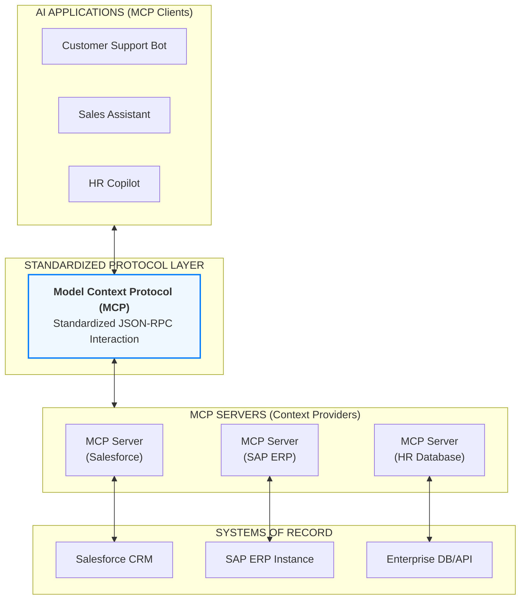

# MODEL CONTEXT PROTOCOL (MCP)

**Goal:** Help enterprise teams use MCP to standardize how AI applications connect to tools and data sources, enabling centralized governance, secure access, reuse, and auditability across multiple GenAI products.

**Prerequisites:**
- [`../01_foundations/1.1_llm_fundamentals.md`](../01_foundations/1.1_llm_fundamentals.md) — Understanding LLM capabilities
- [`2.2_tool_calling.md`](./2.2_tool_calling.md) — Understanding tool calling basics
- [`../01_foundations/1.2_prompt_engineering.md`](../01_foundations/1.2_prompt_engineering.md) — How LLMs interact with tools

**Related:**
- [`2.2_tool_calling.md`](./2.2_tool_calling.md) — MCP builds on tool calling concepts
- [`2.7_agentic_ai.md`](./2.7_agentic_ai.md) — MCP in agentic systems
- [`2.4_guardrails.md`](./2.4_guardrails.md) — Security controls for MCP servers


---

# TL;DR (30 SECONDS)

MCP is a standard way for AI applications to connect to external systems through a governed protocol layer. It is valuable in enterprises because it replaces duplicated, inconsistent integrations with reusable "servers" that expose approved tools and resources with consistent authentication, authorization, logging, and ownership. **MCP does not replace tool calling; it standardizes and governs how tools/data are exposed so multiple AI apps can reuse integrations safely.** If your organization has more than one AI application and more than one integration, MCP becomes a scalability and governance accelerator.

- MCP is a **universal adapter** for AI integrations (tools and resources)
- The business value is **reuse + governance + audit**, not a new AI capability
- Centralize authentication, authorization, and logging in the integration layer
- Treat MCP servers as products: owners, SLAs, versioning, and change control
- Gate changes with evals and monitor incidents like any critical platform component

---

# WHAT'S IN / WHAT'S OUT

**In:** MCP mental model, enterprise architecture, governance patterns (catalog, ownership, access control), when to use MCP vs direct integration, operational considerations, and an end-to-end enterprise case study.

**Out:** the full MCP spec and server implementation code. This document focuses on the decisions and operating model that matter in consulting and enterprise delivery.

---

# 1. WHAT MCP IS (AND IS NOT)

MCP is a protocol and runtime pattern for exposing tools and resources to AI applications in a standardized way. It creates a consistent interface so different clients (apps) can discover and use the same integrations (servers) with shared governance controls.

The simplest analogy is a universal adapter. Without MCP, each AI app creates custom connectors to Salesforce, Jira, ServiceNow, and internal databases. With MCP, a small number of MCP servers expose those capabilities in a standard way, and any AI app can connect using the same protocol and operational patterns.

In enterprise terms, MCP helps convert "integration work" into "platform capability".

## 1.1. MCP Does Not Replace Tool Calling

Tool calling is the mechanism by which the model proposes actions. MCP standardizes how those actions are exposed and executed through governed servers. A useful mental separation:

- **Tool calling:** how the model requests a tool invocation
- **MCP:** how the enterprise exposes a governed catalog of tools/resources, with consistent auth, auditing, and ownership

## 1.2. MCP Is Not a Security Shortcut

MCP helps centralize security controls, but it does not eliminate the need for:

- IAM design (RBAC/ABAC decisions)
- data classification and redaction policies
- incident response and monitoring
- evals and release gates for behavior changes

Treat MCP as a platform surface that must be secured like any other integration platform.

---

# 2. WHY MCP MATTERS IN ENTERPRISE (THE PROBLEM IT SOLVES)

Enterprises quickly move from "one AI demo" to "many AI products": an HR copilot, a support assistant, a sales assistant, and internal research tools. Each one needs access to the same systems of record (CRM, ticketing, data warehouse) and the same security controls (IAM, logging, secrets). **Without standardization, every team rebuilds integrations, security patterns diverge, and governance becomes impossible to audit at scale.**

**MCP matters because it turns integrations into a reusable platform capability. Instead of every AI application embedding credentials, error handling, and access rules, MCP lets you expose approved tools and resources through a standardized server interface.** The platform team can centralize governance (what exists, who owns it, who can use it) while product teams move faster by reusing integration building blocks.

## 2.1. The Consulting Decisions MCP Enables

MCP enables decisions such as:

- Should we build a shared integration layer or let each app integrate directly?
- How do we enforce consistent access control and audit logging across AI apps?
- How do we scale from 1 to N AI products without multiplying integration cost?
- How do we reduce security risk from scattered credentials and inconsistent logging?
- How do we make vendor/system changes once, rather than in every application?

## 2.2. When MCP Is Overkill

MCP can be unnecessary if:

- you have a single AI app with a single integration
- the environment is low-risk and internal-only with short lifespan
- governance requirements are minimal and teams can safely ship independently

The moment you have multiple apps and multiple shared integrations, MCP tends to pay for itself through reuse and governance.

---

# 3. ENTERPRISE ARCHITECTURE (CLIENTS, SERVERS, CATALOG, GOVERNANCE)

```


```

## 3.1. Core Components

An MCP enterprise setup typically includes:

- **MCP clients:** AI applications (support bot, HR copilot, analyst assistant)
- **MCP servers:** integration services exposing tools/resources (Salesforce, ServiceNow, data warehouse)
- **Catalog/registry:** an inventory of servers, capabilities, owners, and policies
- **Policy & identity layer:** authentication, authorization, and audit requirements
- **Observability:** logs, traces, metrics, and incident hooks

The consulting point is that the catalog is not optional if governance is a goal. Without an inventory, you cannot answer "what integrations exist" or "who can access them".

## 3.2. A Typical End-to-End Flow (Discovery -> Call -> Audit)

A typical MCP flow looks like:

1. AI app identifies the user and required permissions.
2. AI app discovers which MCP server provides the needed capability (via catalog).
3. AI app calls the tool/resource through the MCP server interface.
4. The MCP server authenticates and authorizes the request.
5. The MCP server calls the underlying system (CRM/ERP/DB/API).
6. The MCP server returns structured results to the AI app.
7. The MCP server logs the call (sanitized) with actor identity, tool name, and outcome.

The two enterprise benefits are (a) consistent behavior across apps, and (b) centralized auditability.

## 3.3. How MCP Interacts With RAG and Tools

MCP is a natural surface for both RAG and tool calling:

- For RAG, MCP can expose resources that represent governed corpora or retrieval endpoints.
- For tools, MCP can expose allowlisted, schema-defined operations with consistent auth and logging.

The point is that MCP helps you reduce duplication: a single governed integration can serve many apps.

---

# 4. GOVERNANCE AND SECURITY (WHAT ENTERPRISES CARE ABOUT)

MCP is typically justified by governance. This section frames the controls as consulting decisions and delivery requirements.

## 4.1. Ownership and SLAs (Treat MCP Servers as Products)

Each MCP server should have:

- an owner team
- a maintainer/on-call contact
- an SLA (availability, latency, support)
- versioning and deprecation policy

**Without ownership, servers become unmanaged risk and slow everyone down.**

## 4.2. Authentication, Authorization, and Tenant Boundaries

MCP servers should centralize authentication and authorization:

- authenticate the calling application (service identity)
- authorize the request based on user identity and policy
- enforce tenant boundaries and data classification constraints

The most important principle is the same as tool calling: **do not rely on the model to enforce permissions**. Enforcement happens server-side.

## 4.3. Audit Logging and Data Minimization

Auditability is usually a core driver for MCP. A practical policy:

- log what happened (tool/resource name, actor identity, timestamp, outcome)
- avoid logging sensitive payloads; prefer ids and summaries
- apply redaction to tool args and results before logging
- define retention and access control for logs

**If you cannot explain logging, you cannot pass audits.**

---

# 5. OPERATIONS: CHANGE CONTROL, RELIABILITY, AND OBSERVABILITY

MCP is platform infrastructure. If it is down, many AI apps are down. If it regresses, many apps regress. This is why operations must be explicit.

## 5.1. Versioning and Deprecation

Servers should be versioned, and clients should have a migration path. Common practices:

- semantic versioning (breaking vs non-breaking changes)
- deprecation windows for breaking changes
- backward-compatible evolution when possible

This prevents "platform change breaks all apps" incidents.

## 5.2. Reliability Patterns

Because MCP servers call external systems, they need standard reliability controls:

- rate limiting and quota per client
- retries with backoff for transient errors
- circuit breakers when dependencies are failing
- timeouts and clear error contracts

These patterns belong to the integration layer so each AI app does not reinvent them.

## 5.3. Observability and Incident Response

At minimum, track:

- request volume by client and tool
- error rates by tool/dependency
- latency distribution (p50/p95/p99)
- security events (denied access, suspicious patterns)

Treat incidents as platform incidents: mitigate, roll back, add regression tests (evals), and communicate changes.

## 5.4. How Evals Apply to MCP

MCP itself is not "the model", but it changes the behavior of AI systems by changing available tools/resources, their semantics, and error modes. Therefore, MCP changes must be gated by evals in at least two ways:

- integration tests and reliability tests at the MCP server layer
- end-to-end evals at the AI application layer (does behavior improve or regress?)

See [`2.5_evals.md`](./2.5_evals.md) for the evaluation operating model and release gates.

---

# 6. WHEN TO USE MCP VS DIRECT INTEGRATION (DECISION FRAMEWORK)

**The consulting decision is not "MCP is good" or "MCP is bad". It is whether MCP reduces risk and cost at your scale.**

Use MCP when:

- you have multiple AI apps that share integrations
- you need centralized governance and auditability
- you want consistent security controls and secrets handling
- you want to update integrations once and reuse across apps

Consider direct integration when:

- you have a single app with a single integration
- time-to-value matters more than platform consistency (short-lived POC)
- governance needs are minimal and the risk is low

If you choose MCP, treat it as a platform program with ownership and change control, not as a quick feature.

---

# 7. CASE STUDY: IMPLEMENTING MCP IN ENTERPRISE

This case study walks through a complete MCP implementation, explaining the rationale behind each decision.

**Company:** GlobalRetail, 5,000 employees, multinational retailer  
**Problem:** Company has 8 AI applications (customer support bot, sales assistant, inventory manager, HR copilot, finance assistant, IT helpdesk, marketing copilot, warehouse assistant) that need to access 12 external systems (Salesforce CRM, SAP ERP, HR database, inventory system, payment processor, shipping APIs, email system, document storage, analytics platform, customer database, supplier portal, compliance system). Each application was building its own integrations, leading to code duplication, security inconsistencies, and maintenance burden.  
**Goal:** Standardize all AI integrations using MCP, create centralized governance, reduce integration code duplication by 80%, improve security posture.  
**Constraints:** $50K budget, 12-week timeline, zero downtime migration, must maintain existing functionality, compliance requirements (GDPR, PCI-DSS).

---

### 5.1. Decision: MCP vs Direct Integration

**The challenge:** Should we use MCP for all integrations, or keep some as direct integrations?

**Analysis:**
- 8 applications need access to 12 systems
- Many systems are used by multiple applications (Salesforce used by 5 apps, SAP by 4 apps)
- Security and compliance are critical (customer data, financial data)
- Need centralized governance for audit and compliance

**Decision:** Use MCP for all integrations used by 2+ applications, direct integration only for single-app, simple integrations.

**Rationale:**
- MCP provides standardization and governance (critical for compliance)
- Reduces code duplication (80% of integrations are shared)
- Centralized security controls (easier to audit, secure)
- Even single-app integrations benefit from MCP governance (catalog, permissions)

**Trade-offs:**
- ✅ Standardization, governance, security
- ✅ Reduced duplication, easier maintenance
- ⚠️ Initial setup overhead (but pays off long-term)
- ⚠️ Slight latency overhead (MCP layer adds ~10-20ms, acceptable)

**Alternative considered:** Keep direct integrations for single-app use cases - rejected because even single-app integrations benefit from MCP governance (catalog, audit, security).

## 7.1. MCP Server Design Decisions

**The challenge:** How should we organize MCP servers? One server per external system? Or group related systems?

**Analysis:**
- 12 external systems, 8 applications
- Some systems are related (e.g., payment processor + shipping API both used for orders)
- Some systems have different access patterns (read-only vs read-write)
- Need to balance granularity (fine-grained control) vs simplicity (fewer servers to manage)

**Decision:** One MCP server per external system (12 MCP servers total).

**Rationale:**
- **Clear ownership:** Each system has clear owner (Salesforce team owns Salesforce MCP server)
- **Independent scaling:** Each server can scale independently based on usage
- **Security boundaries:** Each server has its own authentication, permissions, audit
- **Simpler maintenance:** Update one server when external system API changes
- **Clearer catalog:** Catalog entry maps 1:1 to external system

**Trade-offs:**
- ✅ Clear ownership, independent scaling, security boundaries
- ✅ Simpler to understand and maintain
- ⚠️ More servers to manage (12 vs fewer grouped servers)
- ⚠️ Applications may need to connect to multiple servers (but MCP protocol handles this)

## 7.2. Governance Model

**The challenge:** How should we structure governance? Centralized platform team? Distributed ownership?

**Analysis:**
- Need centralized catalog and permissions (for governance)
- But system owners know their systems best (for maintenance)
- Need clear responsibilities (who does what?)

**Decision:** Hybrid model: Centralized platform team manages catalog and permissions, system owners maintain their MCP servers.

**Rationale:**
- **Platform team:** Manages catalog, permissions, security policies, audit
- **System owners:** Develop, maintain, update their MCP servers
- **Clear separation:** Platform = governance, Owners = implementation
- **Accountability:** System owners responsible for their servers' security and maintenance

**Implementation:**
- **Platform team:** Maintains catalog, approves new MCP servers, sets security policies, manages permissions
- **System owners:** Register servers in catalog, maintain code, respond to issues, update documentation
- **Approval process:** New MCP servers require platform team approval (security review)

**Trade-offs:**
- ✅ Clear responsibilities, accountability
- ✅ System owners have autonomy (can update their servers)
- ✅ Centralized governance (platform team ensures consistency)
- ⚠️ Requires coordination (platform team + system owners)

## 7.3. Security Controls

**The challenge:** How should we secure MCP servers? Authentication, encryption, audit logging?

**Analysis:**
- Compliance requirements (GDPR, PCI-DSS) require strong security
- Multiple applications accessing sensitive data (customer data, financial data)
- Need audit trail for compliance

**Decision:** Comprehensive security: Service accounts, secrets manager, TLS encryption, comprehensive audit logging, data classification.

**Rationale:**
- **Service accounts:** Each MCP server uses dedicated service account (not user accounts)
- **Secrets manager:** All credentials stored in AWS Secrets Manager (encrypted, rotated)
- **TLS 1.3:** All communication encrypted in transit
- **Audit logging:** Log all tool calls (who, what, when, result) for compliance
- **Data classification:** Tag servers with classification (public, internal, confidential, restricted)
- **Access control:** Applications can only access servers with matching/lower classification

**Implementation:**
- **Authentication:** OAuth 2.0 for external APIs, service accounts for databases
- **Credential storage:** AWS Secrets Manager (automated rotation every 90 days)
- **Encryption:** TLS 1.3 for all MCP protocol communication
- **Audit logging:** Centralized logging system (all tool calls logged, PII redacted)
- **Data classification:** Catalog tags each server with classification

**Trade-offs:**
- ✅ Strong security, compliance-ready
- ✅ Centralized audit trail
- ⚠️ More complex setup (but necessary for enterprise)
- ⚠️ Credential rotation overhead (but automated)

## 7.4. Catalog Management

**The challenge:** How should we maintain the catalog? Manual documentation? Automated? What format?

**Analysis:**
- 12 MCP servers to document
- Need to keep catalog up-to-date (servers change over time)
- Need to be accessible to developers (discoverability)
- Need to support automation (applications need to query catalog)

**Decision:** Automated catalog with manual review: YAML files in Git repository, automated validation, web UI for browsing.

**Rationale:**
- **YAML files in Git:** Version-controlled, easy to edit, supports automation
- **Automated validation:** CI/CD validates catalog entries (required fields, format)
- **Web UI:** Human-readable interface for browsing catalog
- **API:** Applications can query catalog programmatically
- **Review process:** Changes require PR review (platform team approves)

**Implementation:**
- **Catalog format:** YAML files (one per MCP server) in Git repository
- **Validation:** CI/CD pipeline validates YAML structure, required fields
- **Web UI:** Internal wiki displays catalog (generated from YAML)
- **API:** REST API for applications to query catalog
- **Review:** PR process for catalog changes (platform team reviews)

**Trade-offs:**
- ✅ Version-controlled, automated validation
- ✅ Human-readable (YAML) and machine-readable (API)
- ✅ Review process ensures quality
- ⚠️ Requires discipline (teams must update catalog when servers change)

## 7.5. Migration Strategy

**The challenge:** How do we migrate 8 applications from direct integrations to MCP without downtime?

**Analysis:**
- 8 applications currently using direct integrations
- Can't have downtime (customer-facing applications)
- Need to maintain existing functionality
- Migration must be gradual (can't do all at once)

**Decision:** Gradual migration: Build MCP servers in parallel, migrate applications one at a time, feature flags for rollback.

**Rationale:**
- **Parallel development:** Build MCP servers while applications still use direct integrations (no disruption)
- **One at a time:** Migrate applications gradually (lower risk)
- **Feature flags:** Use feature flags to switch between direct integration and MCP (easy rollback)
- **Validation:** Test MCP servers thoroughly before migration
- **Rollback plan:** Can rollback to direct integration if issues arise

**Migration steps:**
1. **Week 1-4:** Build MCP servers (in parallel with existing integrations)
2. **Week 5-6:** Test MCP servers (load testing, integration testing)
3. **Week 7-10:** Migrate applications one at a time (start with low-risk apps)
4. **Week 11-12:** Monitor, fix issues, complete migration

**Trade-offs:**
- ✅ Zero downtime, gradual migration
- ✅ Easy rollback if issues
- ⚠️ Takes longer (12 weeks vs faster "big bang" migration)
- ⚠️ Temporary duplication (direct + MCP during migration)

## 7.6. End-to-End Flow Example

**Scenario:** Customer support bot needs to check order status and process a refund for order #12345.

### 7.6.1. Before MCP (Direct Integration)

**Flow:**
1. User asks: "Check status of order #12345 and process a refund if it's eligible"
2. Customer support bot has **hardcoded Salesforce API integration**
3. Bot directly calls Salesforce API: `GET /services/data/v58.0/sobjects/Order/12345`
4. Bot directly calls Salesforce API: `POST /services/data/v58.0/sobjects/Refund/` with order details
5. Bot responds to user with order status and refund confirmation

**Problems:**
- Each application has its own Salesforce integration code (duplication)
- No centralized governance (who has access? what permissions?)
- No audit trail (hard to track what was accessed)
- Security risks (API keys scattered across applications)
- Hard to update (change in Salesforce API requires updating all applications)

### 7.6.2. After MCP (Standardized Integration)

**Flow:**
1. User asks: "Check status of order #12345 and process a refund if it's eligible"
2. Customer support bot queries MCP catalog: "What servers can access Salesforce?"
3. Catalog returns: `mcp-salesforce-prod` server available
4. Bot connects to MCP server: `mcp-salesforce-prod`
5. Bot calls tool: `get_order(order_id="12345")` via MCP protocol
6. MCP server authenticates (service account), calls Salesforce API, returns order data
7. Bot calls tool: `process_refund(order_id="12345", amount=null)` via MCP protocol
8. MCP server validates permissions, processes refund, returns confirmation
9. Bot responds to user with order status and refund confirmation
10. **All tool calls logged** in centralized audit system

**Benefits:**
- Standardized interface (all apps use same MCP server)
- Centralized governance (catalog shows who can access what)
- Complete audit trail (all tool calls logged)
- Secure (credentials in secrets manager, not in code)
- Easy to update (change MCP server, all apps benefit)

---


