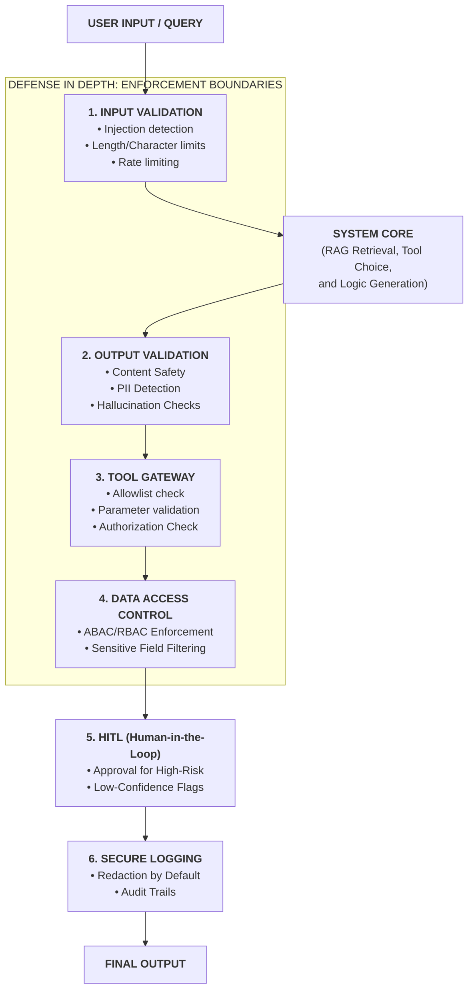

# GUARDRAILS (SAFETY ENFORCEMENT)

**Goal:** Help enterprise teams translate governance intent into **technical enforcement controls** that reduce safety, security, and data risks in GenAI systems while preserving usability and adoption.

**Prerequisites:**
- [`../01_foundations/1.1_llm_fundamentals.md`](../01_foundations/1.1_llm_fundamentals.md) — Understanding LLM limitations and behavior
- [`../01_foundations/1.2_prompt_engineering.md`](../01_foundations/1.2_prompt_engineering.md) — Understanding prompt structure and injection risks
- [`../01_foundations/1.3_hallucinations_basics.md`](../01_foundations/1.3_hallucinations_basics.md) — Understanding when LLMs generate false information

**Related:**
- [`2.1_rag.md`](./2.1_rag.md) — Guardrails for RAG systems (ABAC, sanitization)
- [`2.2_tool_calling.md`](./2.2_tool_calling.md) — Security controls for tool calls (allowlists, auditing)
- [`2.5_evals.md`](./2.5_evals.md) — Testing guardrail effectiveness


---

# TL;DR (30 SECONDS)

Guardrails are not "nice-to-have" prompt instructions; they are **enforcement mechanisms**. Prompts request behavior, but guardrails make unsafe behavior hard or impossible by validating inputs and outputs, enforcing access control and tool authorization server-side, and preventing sensitive data from leaking through responses, logs, or tools. In enterprise systems, the right model is **defense in depth**: assume users, documents, and even tools can be adversarial or buggy, then place checks at every boundary that matters. If you cannot measure guardrail performance (P0 incidents, false positives, false negatives), you cannot scale trust.

- Separate **requesting safety** (prompts) from **enforcing safety** (guardrails)
- Cover the full risk surface: **content**, **tools/actions**, and **data access/exposure**
- Treat user input and retrieved documents as **untrusted** (injection can come from your corpus)
- For tools, treat this as non-negotiable: **allowlist + auth + validation + idempotency + truthful confirmation**
- For data, default to: **ABAC at retrieval time**, minimization, redaction, and safe logging
- Operate it like a product: eval gates, monitoring, and incident response

---

# WHAT'S IN / WHAT'S OUT

**In:** an enterprise guardrail taxonomy, a system-level view of where guardrails live, concrete enforcement patterns (validation, allowlists, redaction, policy checks, HITL), injection mitigation, safe logging, and an operating model (evals, monitoring, incident response) plus a realistic case study.

**Out:** full governance frameworks, legal/compliance interpretations, and vendor-specific implementations. This page focuses on technical controls and decision language that remain stable across stacks.

---

# 1. WHAT GUARDRAILS ARE (AND WHAT THEY ARE NOT)

In many enterprise programs, "guardrails" gets reduced to a moderation endpoint or a blocklist prompt. That framing leads to systems that look safe in a demo but fail under adversarial usage. A better definition is:

**A guardrail is any technical control that reduces the probability or impact of a harmful outcome by constraining the system at a boundary** (input, retrieval, tool execution, output, logging).

This definition matters because it expands the set of available levers. You can reduce harm without only "blocking text". You can require approvals, restrict tool surfaces, enforce schemas, or restrict retrieval by persona. In other words, guardrails are a design and operating discipline, not a single component.

## 1.1. The Enterprise Threat Model (What Actually Goes Wrong)

Guardrails should be driven by concrete failure modes. In practice, most incidents cluster into a few patterns:

- **Prompt injection** (from users or documents) that tries to bypass policy or trigger privileged actions.
- **Data leakage** in outputs, prompts to providers, traces, logs, or stored tool payloads.
- **Unauthorized actions** (including "confused deputy") when a system uses service credentials in unintended ways.
- **Over-blocking** (false positives) that makes the system safe but unusable, killing adoption.

The lesson is not "block everything"; it is to design controls that reduce P0 risk while preserving business value.

## 1.2. Defense in Depth as a Consulting Principle

"Defense in depth" is not an abstract security slogan; it is a practical way to avoid single points of failure. If your only guardrail is an output filter, a single model slip becomes an incident. If your only guardrail is prompt discipline, a single jailbreak becomes an incident. Defense in depth spreads risk across layers so one failure is caught by another.

In consulting language, defense in depth is a claim you can defend: **"We do not rely on a single mechanism; we have checks at every boundary that matters."**

---

# 2. WHY GUARDRAILS MATTER IN ENTERPRISE (AND WHAT THEY ENABLE)

**In enterprise programs, the hardest problem is rarely "can the model answer a question?"; it is "can the organization trust the system in production?".** Trust requires **predictable boundaries**: what the system is allowed to say, what it is allowed to do, and what it is allowed to access. Guardrails are the mechanisms that make those boundaries real.

From a consulting perspective, guardrails turn safety from an opinion into a decision that leadership can defend. When you can point to enforcement controls, test results, and operational metrics, you can answer questions that otherwise become political:

- Can we ship this from POC to pilot given risk appetite, or do we need a HITL layer?
- Which tools can be enabled now, and which must stay manual until validation is stronger?
- What data is "in bounds", under which access control model, for which personas?
- What is a **P0 safety failure** (release blocker), and how do we prevent recurrence?

The strategic point is simple: governance says "what we want"; guardrails decide what is blocked, redacted, logged, approved, escalated, and audited.

## 2.1. The Three Guardrail Domains (Content, Tools, Data)

Most production incidents map to three domains. Keeping this taxonomy explicit makes consulting work faster because it keeps conversations MECE and clarifies ownership.

- **Content guardrails** prevent disallowed outputs (unsafe content, policy violations, high-stakes fabrication).
- **Tool guardrails** prevent unauthorized or unsafe actions (wrong tool, unsafe arguments, irreversible actions without approval).
- **Data guardrails** prevent unauthorized access and exposure (ABAC/RBAC, redaction, minimization, safe logging).

These domains overlap. Prompt injection, for example, is content risk when it changes outputs, but it becomes tool/data risk the moment the system can retrieve protected documents or execute actions.

## 2.2. Prompts vs Guardrails (The Non-Negotiable Separation)

Prompts define a behavior contract; guardrails enforce it. A reliable enterprise system needs both, but they serve different purposes.

You can ask for safety in a prompt ("do not reveal secrets"), but you cannot guarantee it with a prompt. If a user tries to jailbreak, if a retrieved document contains malicious text, or if the system hits an edge case, the model can still produce an unsafe output. Guardrails exist because **the model is not a security boundary**.

As a practical rule: if a requirement is high-stakes (privacy, compliance, money movement, access control), then **enforcement must be server-side**, and it must be testable without relying on model goodwill.

---

# 3. HOW GUARDRAILS WORK (SYSTEM VIEW)

```


```

Guardrails are easiest to implement correctly when the team can point to where they live in the end-to-end flow. For consulting delivery, it helps to make the system boundaries explicit before debating individual controls.

## 3.1. A Reference Flow (Where Enforcement Lives)

A simplified enterprise assistant flow looks like this:

1. User input arrives (identity and context known).
2. Input is normalized and screened (basic injection and policy checks).
3. Retrieval happens (if RAG): query is built, documents are fetched, access is enforced.
4. Model is called (prompt + retrieved evidence + tool schema definitions).
5. Output is validated (policy checks, schema constraints, citation requirements).
6. Tools are executed (if any), with server-side authorization and validation.
7. Response is returned and logged (with redaction, retention, and audit).

The key consulting insight is where to draw the boundary: **models generate proposals; servers decide what is allowed.**

## 3.2. The Guardrail Stack by Boundary

You can map guardrails to the boundaries they protect. This mapping becomes a practical checklist for architecture reviews and for non-technical stakeholders who need assurance.

- **Input boundary:** injection detection, intent classification, user identity binding, rate limiting, "safe defaults" for ambiguous cases.
- **Retrieval boundary:** ABAC/RBAC at retrieval time, document sanitization, provenance metadata, "untrusted corpus" assumptions.
- **Tool boundary:** allowlisted tool set, authentication, per-argument authorization, schema validation, idempotency keys, execution timeouts.
- **Output boundary:** content policy checks, structured output validation, citation presence, refusal UX, redaction before display.
- **Operational boundary:** safe logging, trace access controls, retention policies, incident response hooks.

If you are missing one of these boundaries, you usually discover it after an incident.

## 3.3. A Practical Severity Model (P0/P1/P2) for Guardrails

Guardrails become operational when the team agrees on severity. A practical starting point is to define **P0 failures** as release blockers that trigger incident response.

**P0 guardrail failures** typically include:

- access control violations (retrieving or exposing protected content)
- PII/secret leakage (in responses, logs, traces, or tool payloads)
- unauthorized tool actions (including false confirmations)
- unsafe instructions in high-risk domains (security bypass, illegal activity)

**P1/P2 failures** may be tolerable in early phases (POC/pilot) if monitored and improving, but the key is that the program makes this trade-off explicitly instead of implicitly.

---

# 4. HOW TO IMPLEMENT GUARDRAILS (DELIVERY PLAYBOOK)

**Implementing guardrails is both technical and organizational. The most common reason guardrails fail is not that a team cannot build filters; it is that ownership, severity, and operating loops were never agreed.** Treat guardrails like a product capability with clear artifacts and gates.

## 4.1. Phase the Work: POC -> Pilot -> Production

In consulting delivery, sequencing matters. You can move fast without being reckless if you place the right controls early.

**POC (prove value, discover failure modes):** start with conservative boundaries and a small "must refuse" set. Avoid write tools unless you can enforce server-side auth and validation. Capture failures as future eval cases.

**Pilot (stabilize behavior and reduce P0 risk):** implement defense in depth across content/tool/data, add HITL for high-risk actions, and start measuring false positives vs false negatives. Introduce release gates for P0 failures.

**Production (operate and scale):** formalize incident response, retention and audit, monitoring dashboards, and a weekly improvement cadence. Treat changes to guardrails as production changes: versioned, tested, and reviewable.

## 4.2. The Core Artifacts (What You Actually Deliver)

A consulting-grade guardrail implementation usually produces a small set of artifacts that make the work auditable and maintainable:

- **Policy-to-control map:** policy statements translated into enforceable checks (what is blocked, what is redacted, what is approved).
- **P0/P1/P2 definitions:** explicit examples and why they matter.
- **Tool registry:** allowlisted tools, schemas, auth model, and approval rules.
- **Data access model:** ABAC/RBAC rules, persona mapping, and retrieval filters.
- **Guardrail eval suite:** "must refuse" and "must pass" cases wired into CI (see `2.5_evals.md`).
- **Runbook:** incident steps, rollback procedures, and on-call ownership.

These artifacts are valuable because they survive personnel and vendor changes.

## 4.3. Content Guardrails: Enforcement Patterns That Scale

Content guardrails control what the system can say. They matter whenever outputs are user-visible or could affect reputation, compliance, or high-stakes decisions.

Start by writing "what must never happen" in plain English, then translate it into enforceable checks. Typical controls include input screening (block obvious disallowed requests), output screening (block or redact), and structured output validation (reject outputs that violate schema constraints). For enterprise workloads, the most scalable pattern is to combine a small number of deterministic validators (schemas, patterns for secrets, forbidden actions) with a calibrated classifier for fuzzy categories.

When you do require refusals, invest in a refusal UX that keeps the user productive. A refusal that explains what can be asked instead is often the difference between adoption and abandonment.

## 4.4. Tool Guardrails: The Action Safety Contract (Non-Negotiable)

Once tools exist, the system can affect money, customers, and operations. This is where programs get reputationally damaged if guardrails are weak.

Treat tool safety as a contract the platform enforces:

- **Allowlist tools** to keep the action surface small.
- **Authorize server-side** using user identity and policy (never trust the model to decide).
- **Validate arguments** against schema and business rules (amount limits, state transitions, tenant boundaries).
- **Use idempotency keys** to avoid duplicates under retries.
- **Confirm truthfully** (no "done" unless the tool succeeded and you checked the result).

If the team cannot implement this contract, the correct consulting recommendation is to delay enabling write tools and use a read-only or HITL design until readiness improves.

## 4.5. HITL (Human-in-the-Loop) as a First-Class Control

****HITL is not a failure mode. It is a risk control that can unlock business value while safety matures.** It is typically appropriate when actions are irreversible, impact exceeds a threshold, user trust is low, or context is ambiguous.

The main HITL patterns are pre-approval (safest, slower), risk-based conditional approval (best trade-off in many programs), and post-audit (fast, used only when risk is low). Regardless of the pattern, make the approval rule explicit, log it, and test it as part of the system.

## 4.6. Data Guardrails: Access Control, Redaction, and Minimization

Data is often the largest enterprise risk surface because it includes protected documents, customer records, and internal secrets. Two practical rules prevent most incidents.

First, enforce access control at the right layer. For RAG, ABAC/RBAC must happen at retrieval time because once a disallowed chunk is retrieved, the model has already seen it. For tools, authorization must be server-side per tool and per argument scope (tenant boundaries, account scope).

Second, minimize and redact. Redact PII/secrets before sending content to model providers, before logging prompts or tool payloads, and before returning responses when policy requires it. When in doubt, send and store less. **Data minimization** is a simple principle with outsized impact.

## 4.7. Safe Logging (Most Leaks Are Operational)

Many "model leaks" are actually logging leaks. A practical safe logging policy is to log identifiers and summaries rather than full content, redact by default, restrict access to logs and traces, define retention, and keep audit trails of who accessed sensitive logs. If the team cannot explain the logging policy in one slide, assume you are leaking.

---

# 5. HOW TO MEASURE AND OPERATE GUARDRAILS

Guardrails are only real if they are tested and operated. The goal is not "no incidents ever"; the goal is to detect issues early, mitigate safely, and prevent recurrence through gates. In consulting, this is where you move from "we built controls" to "we can run this as a capability".

## 5.1. What to Measure (And Why Those Metrics Matter)

Metrics should map to decisions. You measure guardrails to answer: can we ship, are we getting safer over time, and are we still usable?

At minimum, track:

- **P0 safety failures:** count and examples (must be zero for release).
- **False positives:** legitimate requests blocked (usability and adoption risk).
- **False negatives:** unsafe requests not blocked (safety and compliance risk).
- **Tool safety metrics:** unauthorized attempts, invalid args, false confirmations, retries.
- **Data leakage signals:** output/log scanning detections, access denials, anomaly signals.

Report these metrics by slice (high-risk intents, tool flows, sensitive personas). Overall averages hide concentrated risk.

## 5.2. Evals as Release Gates (Offline Regression + Online Reality)

Offline evals prevent backsliding. Build a v0 guardrail suite that includes "must refuse" cases (injection, exfiltration, unauthorized actions) and "must pass" cases (legitimate work that should not be blocked). Run it on every material change: prompt updates, policy thresholds, retrieval changes, tool schema changes.

Online monitoring catches reality. Watch blocked requests and complaints (false positives), sample outputs for policy compliance, track security events (denied access, suspicious patterns), and feed new failures into the eval suite weekly. The operating model in `2.5_evals.md` is a strong reference for making this sustainable.

## 5.3. Incident Response (When Guardrails Fail)

Treat P0 safety failures as incidents. A minimal playbook is to mitigate quickly (tighten thresholds, disable tools, rollback configurations), investigate with traces (actor identity, retrieval paths, tool calls), and prevent recurrence by turning the failure into a regression case and a gate. The point is not to blame; it is to make the system measurably safer.

---