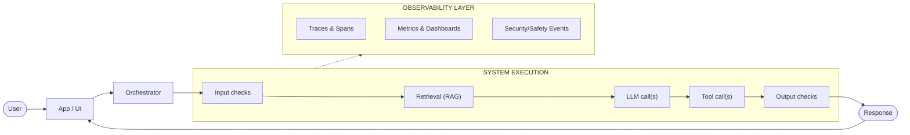

# OBSERVABILITY AND LLMOPS (OPERATING GENAI IN PRODUCTION)

**Goal:** Help enterprise teams instrument, monitor, and operate GenAI systems so decisions are evidence-based, incidents are diagnosable, and improvements are continuous across quality, safety, cost, and latency.

**Prerequisites:**
- [`../01_foundations/1.1_llm_fundamentals.md`](../01_foundations/1.1_llm_fundamentals.md) - LLM cost, latency, and token mechanics
- [`2.5_evals.md`](./2.5_evals.md) - Defining quality and building evaluation sets
- [`2.4_guardrails.md`](./2.4_guardrails.md) - Understanding enforcement boundaries and risk levels

**Related:**
- [`2.1_rag.md`](./2.1_rag.md) - Observability in retrieval pipelines
- [`2.2_tool_calling.md`](./2.2_tool_calling.md) - Tracking tool execution and gateway logs
- [`2.7_agentic_ai.md`](./2.7_agentic_ai.md) - Tracing multi-step agent loops


---

# TL;DR (30 SECONDS)

In GenAI systems, "it works on my laptop" is meaningless unless you can observe and operate the full system in production. Traditional SRE metrics (uptime, error rate, latency) are necessary but not sufficient: you also need visibility into retrieval, prompts, tool calls, guardrails, and user outcomes. The core operating idea is to connect **offline evals** (proof) with **online telemetry** (reality) so you can detect issues early, diagnose root causes quickly, and prevent recurrence by turning incidents into regression cases and release gates.

- Observe the full system, not just the model: **inputs, retrieval, model calls, tools, guardrails, UX**
- Treat online metrics as **signals**, and use evals as **gates** (signals trigger investigation, evals block regressions)
- Track slices, not only averages: **persona, intent, risk level, tool paths, tenant**
- Make safety operational: **P0 events page humans**, and every P0 becomes a regression test
- Control cost and latency as product constraints: **token budgets, caching, fallbacks**
- Privacy is part of observability: **minimize, redact, control access, define retention**

---

# WHAT'S IN / WHAT'S OUT

**In:** a consulting-grade, end-to-end playbook for GenAI observability and LLMOps: telemetry design, key metrics, dashboards and alerts, privacy-by-design logging, operating cadence, incident response, and a detailed enterprise case study.

**Out:** vendor-specific setup guides and detailed code for any single observability stack. The patterns here should remain stable even if you change frameworks, models, or tools.

---

# 1. WHAT OBSERVABILITY + LLMOPS MEAN FOR GENAI (AND WHAT THEY ARE NOT)

Teams often say "we need observability" but mean different things: logs for debugging, dashboards for executives, audit trails for compliance, or analytics for product improvement. For GenAI, you need all of these, but you must define them clearly because the telemetry itself can become a privacy and security risk.

## 1.1. Definitions: Request, Session, Trace, Span, Event

Use simple definitions that engineering and governance can share:

- **Request:** one user message handled by the system (even if it triggers multiple model/tool calls).
- **Session/conversation:** a sequence of related requests that share context over time.
- **Trace:** the end-to-end record of one request through the system (user -> retrieval -> model -> tools -> response).
- **Span:** a timed step within a trace (retrieval span, LLM call span, tool call span).
- **Event:** a structured record emitted at a point in time (guardrail decision, tool validation failure, user feedback submission).

The key point is correlation: every record must be joinable via stable identifiers (trace id, session id, request id), otherwise diagnosis becomes guesswork.

## 1.2. LLMOps vs MLOps vs Traditional SRE

LLMOps overlaps with MLOps and SRE, but it is not the same.

**Traditional SRE** ensures services are available and fast. It is necessary for GenAI (timeouts, retries, provider outages), but it cannot explain why answers are wrong.

**MLOps** focuses on training pipelines, datasets, and model lifecycle. Many GenAI systems use pre-trained foundation models, so your leverage shifts from training to system design: prompts, retrieval, tools, guardrails, orchestration.

**LLMOps** is the operating discipline for GenAI-as-a-system. It includes:

- versioning prompts and orchestration configs like code
- controlling rollouts (feature flags, canaries, fallbacks)
- using evals as release gates (quality and safety)
- observing production behavior and closing the loop (telemetry -> triage -> regression cases -> fixes)

In enterprise programs, LLMOps is how you move from "smart prototype" to "operable product".

## 1.3. The Two Feedback Loops: Offline Evals and Online Telemetry

Many teams choose one and neglect the other. That creates predictable failure modes.

**Offline evals** provide proof. They are repeatable and comparable, so they are the right basis for release gates and for measuring improvement over time. But evals can never fully represent reality.

**Online telemetry** provides reality. It captures real users, real context, and new failure modes. But online signals are often proxies (helpfulness ratings, follow-up rate, refusal rate) and can be misleading without careful interpretation.

The consulting-grade approach is to connect them:

- Online signals trigger investigation and generate candidate failure cases.
- Those cases are turned into labeled regression tests and added to eval suites.
- Future releases are gated against those regression cases to prevent recurrence.

This is the same idea that makes `2.5_evals.md` sustainable: treat production as a data source for better tests.

## 1.4. The Non-Negotiable Constraint: Observability Must Be Privacy-by-Design

Observability is a risk surface because it can store sensitive information: PII (personally identifiable information), internal documents, customer data, access tokens, and tool payloads. In regulated environments, this is often the main blocker to "log everything" approaches.

A practical enterprise stance is:

- **Minimize** what you capture (store what you need to operate, not what you can technically store).
- **Redact** by default (especially prompts, retrieved content, tool outputs).
- **Control access** to telemetry (engineering does not automatically get access to raw sensitive logs).
- **Define retention** and audit access (who accessed what, when, and why).

If you cannot explain your telemetry policy in a one-page spec, you are building risk.

---

# 2. WHY OBSERVABILITY MATTERS IN ENTERPRISE (AND WHAT IT ENABLES)

Enterprise GenAI programs rarely fail because the demo was impossible. They fail because the system cannot be trusted, operated, or defended once real users arrive. Production environments introduce scale, ambiguity, edge cases, and adversarial behavior (intentional or accidental). In that reality, observability is not "nice-to-have"; it is the foundation for operating trust.

From a consulting perspective, observability is how you replace anecdotes with evidence. It lets you say not only "the system is available", but also "the system is safe, useful, and economical for the intended workflows". Without telemetry and a defined operating loop, teams tend to oscillate between two bad states: shipping too early (risk) or never shipping (paralysis).

## 2.1. The Decisions Observability Enables

In enterprise consulting, observability supports concrete decisions:

- **Go/no-go decisions:** is the system ready for pilot or production, given P0/P1 thresholds?
- **Scaling decisions:** can we onboard more users without cost exploding or quality degrading?
- **Design decisions:** is the bottleneck retrieval, prompting, model choice, tool reliability, or guardrails?
- **Operating decisions:** do we roll back a change, tighten a policy, disable a tool, or add HITL?
- **Vendor decisions:** which stack supports required auditability, retention, and traceability constraints?

If you cannot answer these questions with evidence, the program is operating on opinions.

## 2.2. Why Traditional Observability Is Not Enough for GenAI

Traditional observability focuses on service health: errors, latency, saturation. GenAI needs that, but it also needs visibility into "soft failures" that look like successful requests:

- the system answers confidently but incorrectly (quality failure)
- retrieval returned irrelevant or stale documents (grounding failure)
- a tool call was proposed but rejected by validation (capability failure)
- the response leaks sensitive information (safety failure)
- guardrails block too much, reducing adoption (usability failure)

These failures do not show up as HTTP 500s. If you instrument only infrastructure, you will report "green" while the product fails.

## 2.3. Observability Maturity by Stage (POC -> Pilot -> Production)

Observability investment should match maturity:

**POC:** focus on learning and diagnosability. You want traces that explain failures and a small set of metrics that show bottlenecks (latency, cost, basic outcome success).

**Pilot:** focus on risk reduction and stability. You need P0 definitions, alerting for safety events, and dashboards that reveal adoption and false positives/negatives.

**Production:** focus on repeatability and governance. You need release gates, a weekly improvement cadence, runbooks, retention and access controls, and the ability to attribute incidents to changes.

If you build a production-grade telemetry program in week one, you will move too slowly. If you never build it, you will never scale.

---

# 3. HOW TO OBSERVE A GENAI SYSTEM (SYSTEM VIEW AND TELEMETRY DESIGN)

The fastest way to build effective observability is to start with the system flow and then design telemetry around the boundaries where failures hide. For GenAI, this usually means you must observe more than you are comfortable with, while still respecting privacy constraints. The answer is not "log nothing"; the answer is to log structured signals that are diagnosable and safe.

## 3.1. The End-to-End Map (Where Failures Hide)

Use a simple map that every team member can draw on a whiteboard:

```text


```

In this flow, failures often hide in predictable places:

- **Input:** injection attempts, ambiguous intents, missing identity, risky asks
- **Retrieval:** wrong documents, stale content, access control mistakes, connector drift
- **Model:** latency spikes, unexpected refusals, inconsistent formatting, hallucinations
- **Tools:** invalid arguments, auth failures, retries and duplicates, false confirmations
- **Guardrails:** over-blocking or under-blocking, brittle rules, policy drift
- **Operations:** sensitive data in logs, no correlation ids, no rollback path

The point of the map is to avoid the most common mistake: treating the final model output as the only observable surface.

## 3.2. Telemetry: What to Capture Per Request (Minimum Viable Schema)

The telemetry schema should support diagnosis and decision-making. It should also be stable across implementations so you can compare versions over time.

At minimum, capture the following per request (usually as a trace plus structured events):

- **Correlation ids:** request id, trace id, session id
- **Slice metadata:** tenant, user role/persona, locale, channel (with privacy-safe identifiers)
- **Versioning:** app version, prompt version, orchestration config version, retrieval config version, tool schema version, model provider + model id
- **Inputs (privacy-safe):** input length, language, intent label, risk label, PII detection flags (avoid raw text by default)
- **Retrieval (if used):** top-k, latency, access denials, number of sources, source types, citation coverage signals
- **LLM call(s):** latency, token counts, cost estimate, retry count, temperature/top-p (if applicable)
- **Tool call(s):** proposed vs executed tools, validation outcomes, tool latency, tool failures
- **Guardrail outcomes:** blocked/allowed, refusal category, redaction applied, safety classifier scores (if used)
- **Output signals (privacy-safe):** output length, citation presence flag, structured output validation pass/fail
- **User outcome signals:** user rating, escalation to human, follow-up within N minutes, conversation abandonment

If you cannot tie an alert or a diagnosis question to a field, do not capture it.

### 3.2.1. A Practical Example: One Event Record (Redacted)

The exact format depends on your stack, but a structured record should look like this (note the emphasis on ids, versions, and safe signals):

```json
{
  "trace_id": "t-...",
  "request_id": "r-...",
  "tenant_id": "tenant-123",
  "user_role": "employee",
  "intent": "policy_qna",
  "risk_level": "medium",
  "prompt_version": "pv-2025-12-18",
  "retrieval_config": "rc-v3",
  "model": "providerX:modelY",
  "latency_ms": 3120,
  "input_tokens": 820,
  "output_tokens": 260,
  "tool_calls_executed": 0,
  "guardrail_action": "allow",
  "pii_flag": false,
  "citations_present": true,
  "user_rating": null
}
```

This record is diagnosable without storing raw sensitive text.

## 3.3. Metrics Taxonomy: The "Five Buckets" That Matter

To avoid metric spam, group metrics into buckets and make the decision mapping explicit. A pragmatic taxonomy for enterprise GenAI:

### 3.3.1. Reliability (SRE Signals)

Reliability metrics answer: "is the system up and responsive?"

- availability and error rate (including provider timeouts)
- latency p50/p95/p99 by path (with/without retrieval, with/without tools)
- retry rates and fallback rates

### 3.3.2. Quality (Outcome and Proxy Signals)

Quality metrics answer: "did users get the outcome they came for?"

In GenAI, many quality signals are proxies. Common ones include user ratings, follow-up rate within a short window (high follow-up can mean confusion), escalation to human rate (can be good or bad depending on design), task success for tool flows (end-to-end completion), and citation presence for knowledge answers when citations are required.

The important operating stance is to treat proxies as **signals**, not as proof. Proof comes from evals and labeled audits.

### 3.3.3. Safety and Compliance

Safety metrics answer: "are we staying inside policy boundaries?"

- P0 safety failures (must be zero for release)
- guardrail blocks by category (injection, exfiltration, disallowed content)
- redaction counts and leakage detections
- access control denials (expected) vs violations (never acceptable)

### 3.3.4. Cost and Efficiency

Cost metrics answer: "is this economically adoptable at scale?"

- tokens per request and per conversation (by slice)
- cost per successful task (not cost per request)
- retrieval and tool costs (connectors, external APIs, database queries)
- cache hit rates and deduplication effectiveness

### 3.3.5. Adoption and Product Health

Adoption metrics answer: "is the system being used, and is it sticky?"

- weekly active users and repeat usage
- completion vs abandonment
- distribution of intents (what the product is really being used for)
- drift in usage patterns (new intents, new high-risk use)

## 3.4. Slicing Strategy: Averages Hide the Risk

GenAI risk concentrates in slices. A system can be helpful on average while failing catastrophically in a narrow but important slice (e.g., HR policies, finance approvals, privileged tool actions).

A practical slicing strategy:

- **Persona/role:** employee vs manager vs admin; internal vs external
- **Intent/workflow:** Q&A vs drafting vs tool actions vs troubleshooting
- **Risk level:** low/medium/high, based on data sensitivity and action impact
- **Tool path:** tool-less answers vs tool-enabled flows
- **Data source:** which corpus or connector (SharePoint vs Confluence vs CRM)
- **Tenant/business unit:** to detect policy differences and prevent cross-tenant leakage

If you do not slice, you will "optimize the average" and miss the risk.

## 3.5. Safe Logging and Trace Access (How to Stay Auditable Without Leaking)

A simple rule prevents most telemetry-driven incidents: **raw prompts and retrieved text should not be the default**. Store minimal signals, and capture raw content only under tightly controlled conditions (explicit sampling, explicit approvals, and short retention).

Practical patterns that work in enterprise programs:

- store hashes, lengths, and classifications rather than raw text
- store source ids and provenance metadata rather than document text
- redact PII and secrets before any persistence (including traces)
- separate "debug capture" into a gated workflow with limited retention
- restrict access by role (engineers can see metrics; a smaller group can see raw samples)

This is aligned with the safety intent in `2.4_guardrails.md`: operational leaks are still leaks.

## 3.6. Alerts: What Should Page Humans vs What Is Analytics

Not every metric should alert. A simple model is:

- **Pages:** events that imply immediate risk or outage (P0 safety violations, auth failures, provider outage).
- **Tickets:** degradations that can wait (rising refusal rate, cost growth, latency creep).
- **Analytics:** everything else (cohort analysis, long-term drift).

If you page on everything, the on-call team will stop trusting alerts. If you page on nothing, you will learn about incidents from users.

---

# 4. HOW TO IMPLEMENT OBSERVABILITY + LLMOPS (DELIVERY PLAYBOOK)

Implementation is not "install a tool". It is a delivery plan that creates an operable capability: shared definitions, stable telemetry, dashboards, alerts, and a cadence that turns data into decisions. The best programs treat this as a parallel workstream to building features, not as a late-stage add-on.

## 4.1. Phase 0: Align on Outcomes, P0s, and Operating Decisions

Before instrumenting anything, align stakeholders on what matters. This prevents two common failures: building telemetry that nobody uses, or building telemetry that is unusable due to privacy constraints.

Minimum alignment questions:

- What outcomes define success (task success, time-to-resolution, adoption)?
- What is a **P0 safety failure** for this use case?
- Which decisions will telemetry support (ship/hold, rollback, enable tools, add HITL)?
- Who owns each metric (product vs engineering vs security)?
- What is the telemetry policy (minimization, redaction, retention, access control)?

If you cannot answer these, do not start building dashboards.

## 4.2. Phase 1: Instrument the Critical Path (Minimum Viable Telemetry)

Start with the critical path: request -> retrieval -> model -> tools -> response. The goal is to be able to answer, for any incident: what happened, where it happened, and which version changed.

Minimum viable instrumentation includes:

- end-to-end traces with correlation ids
- version tags on every request (prompt/model/retrieval/tool schema)
- latency and token/cost metrics
- guardrail outcomes (blocked/allowed, reason category)
- tool call outcomes (proposed/executed, validation success, tool error)
- retrieval outcomes (top-k, latency, access denials)

Avoid capturing raw content in v1. Capture safe signals and provenance ids first, then add controlled sampling if needed.

## 4.3. Phase 2: Build Dashboards That Map to Decisions

Dashboards should answer questions, not display everything. A practical dashboard pack for enterprise GenAI:

- **Executive readiness view:** P0 count, stability, adoption, cost trend, top risks
- **SRE view:** latency, error rate, provider outages, fallbacks, saturation
- **Product view:** task success, user ratings, refusal rate, top intents, churn
- **Safety view:** blocks by category, leakage detections, access control signals
- **RAG view (if applicable):** citation rate, source coverage, connector health, staleness
- **Tools view (if applicable):** tool success, invalid args, retries, false confirmations

Do not try to answer every question with a single dashboard. Use a small set of views aligned to owners and decisions.

## 4.4. Phase 3: Alerts, Runbooks, and Kill Switches

Observability becomes operational when it is connected to action. That requires:

- **alerts** with clear thresholds and owners
- **runbooks** that describe mitigation and triage steps
- **kill switches** to disable risky capabilities quickly (tools, connectors, high-risk intents)
- **rollback paths** for prompts and config (versioned and controlled)

In GenAI, a kill switch is often the difference between a near-miss and a reportable incident.

## 4.5. Phase 4: Integrate With Release Processes (Gates and Progressive Delivery)

LLMOps requires change control. Prompts, retrieval configs, tool schemas, and guardrail thresholds must be treated like production changes.

Practical progressive delivery patterns:

- version every prompt and orchestration config
- use feature flags for tool enablement and risky workflows
- canary new versions to a small cohort or internal users
- use eval gates before widening rollout (`2.5_evals.md`)
- monitor leading indicators during rollout (refusal rate, latency, tool failures) and roll back quickly

This is where observability pays off: it gives you early warning signals before you impact all users.

## 4.6. Phase 5: Close the Loop (Telemetry -> Triage -> Regression -> Gates)

The improvement loop is the heart of LLMOps. A minimal loop that works:

1. Monitor production signals and sample traces (privacy-safe).
2. Identify recurring failures and high-risk near-misses.
3. Turn them into labeled cases and add them to eval suites.
4. Implement fixes (prompt, retrieval, tools, guardrails, UX).
5. Gate releases so the failure cannot regress.

This turns production into a continuous source of stronger tests and safer behavior.

## 4.7. The Artifacts You Deliver (What Makes This Consulting-Grade)

In a client engagement, the most valuable deliverables are often not the dashboards themselves, but the artifacts that make the system auditable and repeatable:

- a telemetry spec (fields, retention, access, redaction rules)
- a metric dictionary (definitions and owners)
- a dashboard pack aligned to roles
- alert thresholds and runbooks
- a release checklist that includes eval gates
- a weekly operating cadence and decision forum

These artifacts are how you make the program resilient to organizational churn.

---

# 5. HOW TO RUN LLMOPS (OPERATING MODEL)

Observability is the technical foundation; LLMOps is the operating model that turns telemetry into outcomes. In enterprise consulting, this is often where programs become credible: you can show not only that the system works today, but that it will remain safe and useful as it changes.

## 5.1. Roles and Ownership (Who Runs What)

LLMOps fails when "everyone" owns it. A practical ownership model:

- **Product owner:** defines outcomes, adoption targets, and trade-offs (helpfulness vs refusal rate, cost vs latency).
- **Engineering lead:** owns instrumentation, rollbacks, and feature flags for prompts/config/tools.
- **SRE/platform:** owns uptime, latency, provider resilience, and on-call process.
- **Security/risk:** owns P0 definitions, policy mapping, and incident response requirements.
- **Domain SMEs:** calibrate rubrics and audit outputs for high-stakes domains.

One team can wear multiple hats early, but ownership must be explicit by production.

## 5.2. Cadence: Daily, Weekly, and Monthly Loops

A lightweight cadence that scales:

- **Daily (triage):** review P0/P1 events, tool failures, and any new suspicious patterns.
- **Weekly (improvement forum):** top failure themes, false positives/negatives, cost trend, and the backlog of fixes and eval additions.
- **Monthly (governance):** readiness for new use cases, expansion of tool surface, auditability, and compliance alignment.

The goal is not meetings; the goal is a predictable loop that prevents incidents from repeating.

## 5.3. Incident Response for GenAI Systems (What Is Different)

GenAI incidents often look different from traditional outages. Many are "content incidents" rather than service downtime, and mitigation often involves changing behavior rather than restarting servers.

A minimal incident approach:

- **Mitigate fast:** disable tools/connectors, tighten guardrails, route to HITL, rollback prompt/config.
- **Diagnose with traces:** identify which boundary failed (retrieval, tool auth, output validation).
- **Communicate clearly:** define severity and user impact; record timeline and actions.
- **Prevent recurrence:** create a labeled regression case and add an eval gate.

If incidents do not become regression tests, you are not operating a learning system.

## 5.4. Managing Cost and Latency as First-Class Constraints

Many enterprise deployments fail economically: token usage grows with context, retrieval grows with corpora, and tool calls multiply. Treat cost and latency like product constraints, not afterthoughts:

- set token budgets by workflow and persona
- introduce summarization and context trimming
- cache retrieval results when safe
- reduce tool calls with better planning and validation
- use fallbacks and timeouts to preserve UX under provider slowness

Observability should show cost per successful outcome, not only cost per request.

---

# 6. CASE STUDY: IMPLEMENTING OBSERVABILITY + LLMOPS FOR AN ENTERPRISE COPILOT

This case study is intentionally detailed. It shows how a consulting team can implement observability and LLMOps end-to-end for an enterprise copilot that combines RAG and tools, under privacy and audit constraints.

The goal is not to prescribe a single tool stack. The goal is to show the decisions, artifacts, and operating loops that make the system operable.

## 6.1. Context: The Product, the Constraints, and the Risk Appetite

**Client context (example):** a 30k-employee enterprise rolls out an internal copilot for IT and HR.

Primary workflows:

- policy Q&A with citations (leave policy, expense policy, IT security policy)
- "how do I" troubleshooting (VPN, password reset, device enrollment)
- ticket creation in a service desk system (read + write, but with constraints)
- HR requests that must respect role-based access (employees vs HR specialists)

Constraints that shape observability:

- strict privacy posture: prompts and tool payloads can contain PII and sensitive internal data
- audit requirements: traceability for "who accessed what" and "why was it allowed"
- multi-region deployment: different policies, different languages, different data sources

The program defines **P0 failures** before building:

- access control violation (employee sees HR-only policy content)
- PII/secret leakage (in responses, logs, traces, or tool payloads)
- unauthorized tool action (ticket created/updated under wrong identity or wrong scope)
- false confirmation (assistant says "done" but tool failed or was blocked)

This definition becomes the shared language between product, security, and engineering. It also shapes what must be measurable in production.

## 6.2. System Snapshot (What Needs to Be Observable)

The team uses a system diagram to anchor telemetry design:

```text
Employee UI
  -> Orchestrator API
     -> Input screening + intent/risk classification
     -> Retrieval (policies/KB) with ABAC
     -> LLM (answer + citations + tool plans)
     -> Tool gateway (service desk, identity, KB actions)
        -> Validation + auth + idempotency + truthful confirmation
     -> Output checks (guardrails + redaction + citation requirements)
     -> Response
     -> Telemetry pipeline (metrics, traces, events)
```

Two architecture decisions make observability easier:

1. **Single orchestration boundary:** every request passes through the orchestrator, so correlation ids and version tags can be applied consistently.
2. **Single tool boundary:** all tools are accessed through a gateway (or an MCP boundary), so tool telemetry is standardized and policy enforcement is centralized.

Without these boundaries, traces fragment and diagnosis becomes slow.

## 6.3. Week 1-2: Define the Telemetry Policy and Minimum Viable Schema

Before building dashboards, the consulting team produces a one-page telemetry policy, signed off by security and product:

- raw prompts and retrieved text are not stored by default
- PII and secrets are detected and redacted before any persistence
- traces store ids, lengths, classifications, and provenance metadata (not raw content)
- access to telemetry is role-based; raw samples require explicit approvals
- retention is short for traces and longer for aggregated metrics

Then they define a minimum viable schema (MVS) for every request. The MVS has two goals: **attribute changes** and **diagnose incidents**.

MVS required fields:

- request/trace/session ids (correlation)
- tenant/region and user role (privacy-safe)
- prompt version, retrieval config version, model id, tool schema version
- latency breakdown (retrieval, LLM, tools) and provider retry counts
- tokens and cost estimate (input/output) per request
- retrieval signals: sources count, access denials count, citation presence flag
- tool signals: proposed vs executed tools, validation pass/fail, tool error codes
- guardrail outcomes: allow/block, block category, redaction applied

The program explicitly does not capture raw content in v1. Instead, it creates a controlled "debug capture" mechanism that can be enabled for a limited cohort for a limited time, with automatic expiration and redaction.

To make the policy enforceable (not just aspirational), the team also defines an example retention model:

- traces (no raw text) retained for 14-30 days for diagnosis
- aggregated metrics retained for 6-12 months for trend analysis
- debug captures retained for 24-72 hours, restricted to incident response roles

This is not a universal rule, but it shows the pattern: retention is a design choice that must be explicit.

## 6.4. Week 3-4: Build the Dashboard Pack and Metric Dictionary

To avoid "dashboard theater", the team creates a metric dictionary with three columns: definition, owner, decision supported. This prevents the usual enterprise failure where metrics exist but nobody trusts them.

Then they build five dashboards aligned to owners.

**1) Executive readiness dashboard (weekly):** supports go/no-go decisions.

- P0 incidents (count, last occurrence, current mitigations)
- adoption (weekly active users, repeat usage)
- cost trend (cost per successful workflow)
- stability (p95 latency, provider timeouts)
- top risks (highest-risk intents, tool failures)

**2) SRE dashboard (daily):** supports operational stability.

- p50/p95/p99 latency by path (RAG/tool/no-tool)
- error rates and retry rates (provider, retrieval connectors, tools)
- fallback rates (model fallback, cached responses)
- saturation signals (queue depth, tool gateway load)

**3) Product dashboard (weekly):** supports UX and value decisions.

- user ratings (sampled and normalized)
- follow-up rate within 5 minutes (proxy for confusion)
- refusal rate and "refusal recovery" (did users succeed after refusal?)
- top intents and new intents (drift in usage)

**4) Safety dashboard (daily/weekly):** supports risk control.

- guardrail blocks by category (injection, exfiltration, disallowed content)
- redaction counts and leakage detections
- access denials vs violations (violations should be zero)
- suspicious patterns (repeated jailbreak attempts by slice)

**5) RAG + Tools dashboard (weekly):** supports diagnosis and improvement.

- citation presence rate for policy workflows (when required)
- connector freshness (last sync time, failure rate, staleness signals)
- retrieval latency and access denial rates by connector
- tool success rate, invalid args, false confirmations, idempotency collisions

The program also sets example thresholds to make "good" concrete (the exact numbers vary by context, but the existence of explicit thresholds is non-negotiable):

- P0 safety violations: must be 0 (release blocker)
- tool false confirmations: must be near 0 and trigger investigation
- p95 latency for core workflows: within an agreed budget (e.g., under 6-8 seconds)
- citation presence rate for policy answers (when required): above an agreed threshold
- cost per successful workflow: within budget and tracked by slice

Notice the design choice: dashboards are not built around "what data we have"; they are built around "what decisions must be made".

## 6.5. Week 5-6: Alerting, Runbooks, and Kill Switches

The team defines a small set of paging alerts and attaches runbooks to each. The goal is to page only when humans must act quickly.

Paging alerts (examples):

- P0 safety violation detection (leakage signal, access control violation)
- provider outage (LLM timeouts above threshold)
- tool gateway failure (tool success rate collapse, auth failures spike)

Ticket-based alerts (examples):

- refusal rate increase above baseline by slice
- cost per successful workflow increases above budget
- citation presence rate drops for policy workflows

Each runbook includes:

- immediate mitigation (disable tool, disable connector, tighten guardrail, enable HITL)
- how to confirm impact (which dashboard views and slices)
- how to diagnose root cause (which traces and version tags to inspect)
- rollback procedure (prompt/config versions)

The program also implements kill switches:

- disable write tools globally (read-only mode)
- disable specific tools (ticket creation) while keeping Q&A
- disable specific connectors (e.g., HR connector) if access controls are suspect
- force HITL for high-risk intents

This is how the team ensures that an incident can be contained quickly, without waiting for a full redeploy.

## 6.6. Week 7-8: Connect Telemetry to Evals and Release Gates

At this point, the system is observable, but the program still needs repeatable proof that changes do not regress.

The team creates a pipeline:

- weekly sampling of production failures and near-misses (privacy-safe)
- labeling sessions with SMEs for high-stakes workflows
- converting labeled cases into regression tests
- adding those cases to the eval suite (`2.5_evals.md`)
- gating releases on "P0 must be zero" and key quality thresholds

They also adopt progressive delivery:

- canary new prompt/model versions to internal IT agents first
- monitor leading indicators during rollout (latency, refusal rate, tool errors)
- only then expand to all employees

To make rollout decisions predictable, the team defines a simple "canary checklist":

- no P0 events in the canary window
- no significant degradation in core leading indicators by slice
- no new repeated failure mode without an owner and mitigation plan

This creates a stable rhythm: release -> observe -> learn -> add tests -> gate.

## 6.7. A Realistic Incident (And How Observability Prevents Recurrence)

**Incident:** after a connector update, a subset of HR documents are tagged with incorrect access metadata. Retrieval begins to return HR-only chunks to non-HR employees in rare queries.

What happens without observability:

- users report "the assistant showed HR content" days later
- the team cannot reproduce because the model is non-deterministic
- the incident becomes a trust crisis rather than a fixable bug

What happens with the implemented observability:

1. The safety dashboard flags an anomaly: access denials drop suddenly for HR connector slices, while citations from HR sources appear in non-HR flows.
2. The on-call runbook is triggered: disable the HR connector using the kill switch within minutes.
3. Traces show correlation: the issue started after retrieval config version `rc-v7` rollout.
4. Diagnosis confirms the root cause: metadata mapping bug in the connector.
5. Fix is implemented: connector metadata corrected and validated; retrieval-time ABAC checks are strengthened.
6. Prevention is added:
   - a regression test is created with the failing query and persona mismatch
   - an eval gate is added: "non-HR persona must never retrieve HR-only sources"
   - a monitoring alert is added for "unexpected source-domain by persona"

The consulting lesson: observability does not prevent every mistake, but it makes mistakes containable and non-repeatable.

## 6.8. Steady State (What "Good" Looks Like After 90 Days)

By the end of the first quarter, the program operates like a product:

- weekly review forum with clear owners and decisions
- stable dashboards with consistent definitions and slices
- incident-to-regression loop (P0 incidents become test cases within days)
- progressive delivery with canaries and rollbacks
- cost budgets by workflow, with active trimming and caching improvements

The organization can now defend expansion decisions. Trust is not left to model behavior alone; it is operationally managed.

---