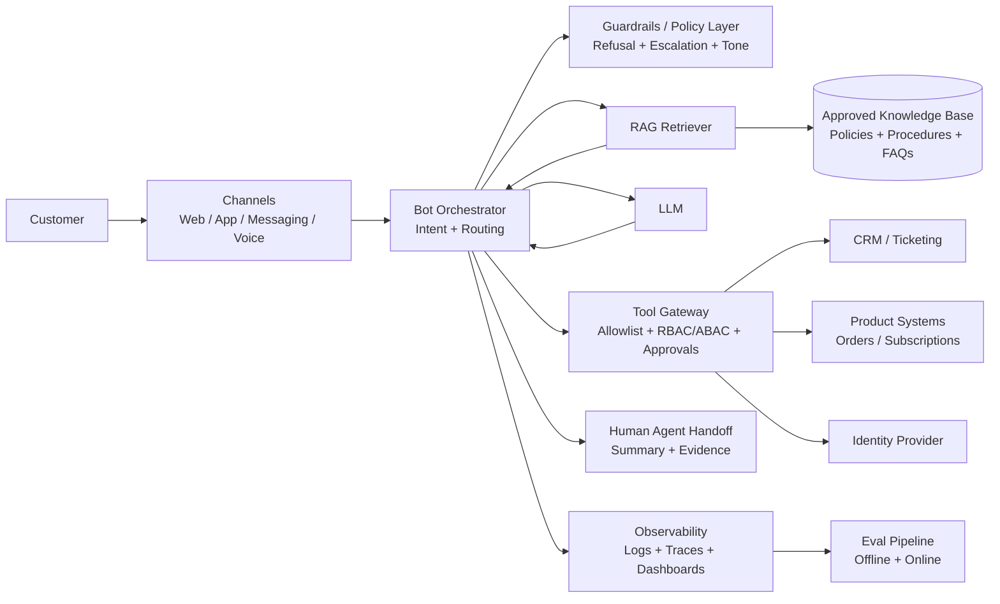

# CUSTOMER EXPERIENCE BOTS (USE CASE ARCHETYPE)

**Goal:** Provide an end-to-end, consulting-grade playbook to design, deliver, and operate customer-facing GenAI bots that resolve tier-0/1 intents safely, with measurable value and explicit go/no-go gates.

**Prerequisites:**
- [LLM fundamentals](../01_foundations/1.1_llm_fundamentals.md) - align expectations on what models can and cannot do.
- [Hallucinations basics](../01_foundations/1.3_hallucinations_basics.md) - understand failure modes that matter in customer-facing contexts.
- [RAG](../02_solution_components/2.1_rag.md) - ground answers in approved knowledge and reduce "confident guessing".
- [Guardrails](../02_solution_components/2.4_guardrails.md) - define disallowed intents, refusals, escalation, and action boundaries.
- [Evals](../02_solution_components/2.5_evals.md) - measure quality/safety and set release gates before production.

**Related:**
- [Tool calling](../02_solution_components/2.2_tool_calling.md) - integrate with CRM/ticketing and enforce safe actions.
- [Observability and LLMOps](../02_solution_components/2.6_observability_llomps.md) - monitor, triage, and improve in production.
- [Agentic AI](../02_solution_components/2.7_agentic_ai.md) - know when to avoid agentic autonomy in CX.

---

# TL;DR (30 SECONDS)

Customer experience bots are customer-facing assistants (chat or voice) that answer questions, guide troubleshooting, and sometimes execute low-risk actions by combining **retrieval (RAG)** with controlled workflows and escalation to human agents. In enterprise, this archetype matters because it can reduce cost per contact and improve consistency, but it is **high-risk**: a single hallucinated promise, policy error, or data leak becomes a brand, compliance, and trust incident. Success comes from tight scope, evidence-first answers, explicit abstain-and-escalate rules, and **release gates** grounded in evals and operational monitoring.

- Start with a narrow intent set (tier-0/1), then expand based on evidence.
- Treat **P0 failures** (wrong policy, PII leakage, unsafe actions) as hard blockers.
- Require citations for knowledge answers and log "no evidence" outcomes.
- Use tool calling only behind a tool gateway with RBAC/ABAC, approvals, and idempotency.
- Build a deterministic handoff to human agents with conversation summaries.
- Operate the bot like a product: weekly eval review, knowledge governance, and incident response.

## Use-Case Card (Snapshot)
| Item | Summary |
|---|---|
| Archetype definition | A customer-facing assistant that resolves common support intents using approved knowledge and/or controlled actions, with escalation to human agents. |
| What it replaces/augments | FAQ pages, website search, IVR menus, scripted tier-1 support; can also augment agents with suggested responses. |
| Primary value drivers | Containment/deflection, shorter handle time, consistent answers, 24/7 coverage, better onboarding/troubleshooting. |
| Primary solution pattern | Workflow+AI with RAG + selective tool calling + human-in-the-loop for risky steps. |
| Risk level | High - customer-facing statements, policy compliance, identity/account data, and brand impact. |
| Typical stakeholders | Customer support/Ops, Product, Knowledge management, IT/Integration, Security/Privacy, Legal/Compliance. |
| MVP timebox | 4-8 weeks for constrained chat; 8-12 weeks for voice or deep integrations. |
| Primary KPIs | Containment rate, resolution accuracy on eval set, CSAT, escalation quality, P0 incident rate. |

---

# WHAT'S IN / WHAT'S OUT

**In:** Tier-0/1 customer intents with clear policies (FAQ, order status, troubleshooting guidance), evidence-backed answers (citations), low-risk actions (e.g., ticket creation), and safe escalation to human agents.

**Out:** Autonomous high-risk actions (refunds, account changes, policy exceptions), regulated advice (medical/legal/financial), negotiation, and any interaction that requires unverified identity or non-auditable commitments.

---

# 1. WHY IT MATTERS IN ENTERPRISE (VALUE AND DECISIONS)

Customer support is one of the most operationally visible functions in an enterprise: it is measurable (AHT, FCR, CSAT), expensive (labor + overhead), and reputational (customers remember bad answers more than good ones). A well-scoped bot can reduce repetitive contacts, standardize answers, and move knowledge from tribal memory into **governed assets**. The challenge is that the same bot can also create new failure modes: hallucinated claims, inconsistent policy interpretation, or accidental disclosure.

## 1.1. Enterprise value (what actually changes)

In mature programs, value is not "a chatbot exists". Value is a shift in the operating model:

- Customers get faster answers for repeatable intents (billing questions, setup steps, eligibility checks).
- Agents receive better context when escalation happens (summary + evidence + already-collected info).
- Knowledge management becomes a first-class function (content ownership, freshness, approvals).
- Support leadership can steer by data: which intents are safe to automate and which are not.

The consulting lens: **the bot is a new channel with an operational cost and risk profile**, not a side project.

## 1.2. Enterprise risk (why this is not "just a chatbot")

Customer experience bots fail publicly. A wrong answer can become a screenshot, a complaint, or a regulatory escalation. The high-risk categories are predictable and should be treated as non-negotiables:

- **Truth risk:** the model answers without sufficient evidence (hallucination), especially on policies, pricing, and eligibility.
- **Data risk:** the bot exposes PII or account details to an unauthenticated user, or logs sensitive data improperly.
- **Action risk:** the bot triggers the wrong tool call (or repeats it), creating unauthorized changes or financial loss.
- **Compliance risk:** the bot gives disallowed advice, violates disclosure requirements, or fails accessibility/channel rules.
- **Reputational risk:** tone, refusal quality, and escalation behavior create frustration or distrust.

In practice, the simplest way to align stakeholders is to define **P0 failures** up front and commit that P0s block releases.

## 1.3. The decisions this archetype forces (what you must decide early)

Most programs fail not because the model is "bad", but because key decisions are missing. Before building, explicitly decide:

- **Scope:** which intents are in-scope for MVP, and which are excluded (even if asked).
- **Channel strategy:** web chat first, in-app, messaging, and when (if ever) voice is appropriate.
- **Identity boundary:** what the bot can do unauthenticated vs authenticated, and how auth is verified.
- **Evidence policy:** when citations are required, which sources count as "approved", and what to do when evidence is missing.
- **Escalation policy:** when to hand off to humans, how to route, and what context to pass.
- **Action boundary (tools):** which actions are allowed, with what approvals, and which are disallowed by design.
- **Release gates:** which eval thresholds must be met before pilot/scale, including slice-level thresholds.

These decisions are the core consulting artifact: they translate "we want a bot" into a defensible operating model.

---

# 2. BUSINESS CONTEXT AND PAIN POINTS (AS-IS)

The as-is for customer experience typically mixes channels (phone, chat, email, social), inconsistent knowledge, and multi-system workflows. Even in well-run contact centers, "knowing the answer" is often harder than "saying the answer": agents search across KB articles, CRM notes, policy PDFs, and internal chats, then translate that into a customer-friendly response.

## 2.1. Typical enterprise context (what is usually true)

Most enterprises have some combination of:

- A public knowledge base (often incomplete or outdated).
- A CRM/ticketing system (Salesforce, Zendesk, ServiceNow, etc.).
- Product systems (orders, subscriptions, entitlements) with varying API maturity.
- Compliance constraints (PII, retention, consent, jurisdictional rules).
- Operational goals that conflict: reduce cost, improve quality, and reduce risk at the same time.

The key observation: the bot will not "replace support". It will **change where support spends time**.

## 2.2. Common pain points (symptoms, root causes, impact)

In consulting discovery, pain points often look repetitive, but the root causes differ. It is useful to separate what you see from why it happens.

**Symptoms (what teams complain about):**
- Customers repeat themselves across channels; context is lost.
- High AHT because agents search and re-search for the right policy or troubleshooting step.
- Inconsistent answers across agents, regions, and shifts.
- Escalations are noisy: wrong team, missing data, no clear next step.

**Root causes (why it happens):**
- Knowledge is not curated as an operating system (no ownership, no freshness SLAs, no approvals).
- Policies are ambiguous or scattered (PDFs, wikis, emails).
- Systems are fragmented and access rules are unclear (agents have access; bots do not).
- Metrics focus on speed over correctness, creating "fast wrong" behaviors.

**Impact (why leadership cares):**
- Higher cost per contact and reduced capacity.
- Lower CSAT and increased churn risk.
- Higher compliance exposure and incident likelihood.
- Slower product adoption because troubleshooting is painful.

## 2.3. AS-IS STEP TABLE
| Step | Owner | Input | System(s) | GenAI Role | Output | Controls/Checks |
|---|---|---|---|---|---|---|
| 1 | Customer | Question/issue | Web/app/phone | None | Contact initiated | Consent notice (if recorded), channel authentication rules |
| 2 | Frontline agent / IVR | Customer description | CRM, IVR | None | Issue classification | PII handling, jurisdiction rules, call recording policy |
| 3 | Agent | Search for answer | KB, intranet, policy docs | None | Candidate guidance | "Approved vs unofficial" knowledge ambiguity |
| 4 | Agent | Gather context | CRM, order/subscription systems | None | Account context | Access control, least privilege, audit logs |
| 5 | Agent | Provide response | Channel UI | None | Customer-facing answer | Quality checks are informal, tone varies |
| 6 | Agent | Execute action (if needed) | CRM/ticketing, order systems | None | Ticket created / change made | Approvals vary, idempotency not enforced |
| 7 | Agent | Close/escalate | CRM/ticketing | None | Resolution or escalation | Escalation routing issues, missing context |
| 8 | Ops / KM | Update knowledge (sometimes) | KB | None | Article update | No freshness SLA, weak governance, little feedback loop |

## 2.4. Diagnostic checklist (what to confirm in week 1)

Before proposing an AI solution, confirm the non-AI baseline. The goal is to avoid building a bot on top of a broken knowledge system.

- Do we have a stable top-intents list (volume, seasonality, language, region)?
- For the top 20 intents, do we have a single "source of truth" (policy + procedure)?
- Can we separate unauthenticated questions from account-specific questions cleanly?
- Is there a documented escalation workflow today (routing + required fields + SLA)?
- Are we willing to stop the bot from answering when evidence is missing?

If you cannot answer these, your MVP scope is not ready; start with discovery and knowledge governance first.

---

# 3. TARGET STATE AND OPERATING RULES (TO-BE)

The to-be is not "customers chat with an LLM". The to-be is a controlled operating model where the bot resolves a defined set of intents, uses evidence from approved knowledge, and escalates safely when it cannot meet a clear standard of correctness or when risk is high.

## 3.1. Target operating model (assist vs automate vs decide)

For customer-facing bots, the safest default is:

- **Assist:** ask clarifying questions, summarize, guide the customer through steps, propose a next action.
- **Automate (selective):** create a ticket, fetch order status, schedule a callback, reset a password only with verified identity.
- **Decide:** avoid "decide" in MVP. Decisions that change entitlements, payments, or policy outcomes should be human-approved until evidence supports automation.

This is why most enterprise CX bots are workflow+AI systems: the model enhances a workflow; it does not replace governance.

## 3.2. TO-BE STEP TABLE
| Step | Owner | Input | System(s) | GenAI Role | Output | Controls/Checks |
|---|---|---|---|---|---|---|
| 1 | Customer | Message/utterance | Web/app/messaging/voice | Assist | Cleaned user intent | Rate limiting, abuse detection, language detection |
| 2 | Orchestrator | User message + context | Bot service | Assist | Intent + risk classification | PII redaction, allowlist intents, block disallowed intents |
| 3 | Orchestrator | Intent + auth state | IdP/CRM | Assist/Automate | Auth prompt or continue | Strong auth for account data, ABAC/RBAC check, audit log |
| 4 | Retriever | Query | KB/search index | Assist | Evidence snippets | Approved sources only, freshness/versions, retrieval confidence |
| 5 | LLM | Prompt + evidence | LLM | Assist | Draft answer with citations | Citation required for knowledge answers, "no evidence -> abstain" |
| 6 | Policy layer | Draft answer + intent | Guardrails service | Assist | Final response or refusal | Safety policy, tone constraints, regulated-content filters |
| 7 | Tool gateway (optional) | Action request | CRM/ticketing/order APIs | Automate (bounded) | Tool result | Tool allowlist, approvals, idempotency key, rate limits |
| 8 | Orchestrator | Response + tool result | Bot service | Assist | Customer response + next steps | Clear disclosure, avoid commitments, localization checks |
| 9 | Handoff (when needed) | Conversation + summary | Agent desktop | Assist | Escalation with context | Human-in-the-loop, structured summary, required fields |
| 10 | Observability | Traces + labels | Logging/monitoring | None | Dashboards + alerts | PII-safe logging, retention rules, incident runbook |
| 11 | Evaluation loop | Logs + datasets | Evals pipeline | None | Scores + regressions | Slice metrics, weekly review, release gating |

## 3.3. Operating rules (non-negotiables for customer-facing bots)

Operating rules are where enterprise stakeholders build trust. They should be explicit and testable.

**Evidence-first behavior:**
- If the bot answers from knowledge, it must cite approved sources.
- If evidence is missing or low-confidence, the bot must **abstain** and escalate or ask for clarification.
- The bot must not invent policies, prices, eligibility rules, or troubleshooting steps.

**Customer-facing commitments:**
- The bot must not promise outcomes it cannot guarantee ("I will refund you now") unless it has executed a verified action.
- For sensitive topics, prefer "Here is what our policy says" with citations and a handoff option.

**Escalation is a feature, not a failure:**
Escalation is how you protect the customer experience. A good bot knows when to stop. The quality of escalation (routing + summary + evidence) often drives more value than trying to answer everything.

## 3.4. Abstain and escalation design (how you control risk in real life)

Most teams under-design escalation. The bot should not escalate randomly; it should escalate for specific reasons that map to risks.

**Common escalation triggers:**
- The user asks for an out-of-scope intent (explicitly out).
- The bot cannot retrieve approved evidence for the claim it would make.
- The user requests a high-risk action (refund, cancellation, account changes).
- The user is angry, reports harm, or threatens escalation (risk to brand).
- The conversation loops (two failed attempts) and the bot is not converging.

**What to pass in handoff (minimum):**
- Customer intent and key entities (product, plan, error message).
- What was already tried (steps taken).
- Evidence retrieved (citations) and what is missing.
- Recommended next action and why it was escalated.

This makes escalation measurable: you can judge whether the bot improved agent productivity even when it did not fully resolve the case.

---

# 4. DECISION GUIDE (FIT, ANTI-FIT, READINESS)

This archetype is a strong candidate when the enterprise can define a narrow scope, has (or can build) reliable knowledge assets, and is willing to operate the system like a product. It is a poor candidate when stakeholders want "full automation" without governance, or when policies are unstable and contested.

## 4.1. Fit criteria (when this archetype is a good choice)

- High volume of repeatable intents (FAQ, troubleshooting, order/shipping status, account guidance).
- Clear policies and procedures that can be curated into approved knowledge.
- Strong willingness to enforce abstain-and-escalate behavior.
- A stable escalation workflow and agent desktop that can receive structured context.
- Security/privacy can define what is allowed to be logged, retained, and retrieved.

## 4.2. Anti-fit criteria (when to avoid or delay)

- Stakeholders want the bot to handle policy exceptions or negotiate outcomes.
- Knowledge is fragmented with no ownership and no plan to fix it.
- You cannot separate unauthenticated vs authenticated journeys safely.
- The highest-volume intents require privileged actions without approvals.
- There is no operating owner (no one accountable for content freshness and release gating).

## 4.3. Readiness checklist (minimum viable)

### 4.3.1. Data and knowledge readiness

- Named owner for each knowledge domain (billing, shipping, onboarding, troubleshooting).
- Freshness SLA (e.g., "tier-0 articles reviewed monthly", policy updates within 48 hours).
- Clear definition of "approved sources" (KB, policy system, product docs) and what is excluded (emails, chats).
- Versioning and review workflow for content (what changes require legal/compliance review).

### 4.3.2. Integration readiness

- Channel integration path is clear (web/app chat widget, messaging platform, voice stack).
- Escalation path is defined (ticket creation, live chat transfer, callback scheduling).
- Tool APIs exist with stable contracts and environments (sandbox, rate limits, error handling).

### 4.3.3. Governance and security readiness

- RBAC/ABAC model for account data and tool access is defined.
- PII handling rules are explicit (redaction, masking, retention, encryption, access logs).
- Legal/compliance has approved disclosure language and disallowed topics list.

### 4.3.4. Operating readiness

- Support model exists (who is on-call, who triages issues, who updates content).
- Weekly eval review cadence and release process is agreed.
- Incident taxonomy and severity model is defined (including **P0 failures**).

## 4.4. Recommended approach (what usually works first)

For enterprise CX, the recommended default is **workflow+AI with RAG**. It keeps the model in an evidence-bound role and reduces the blast radius of mistakes. Start with read-only experiences (answer + guidance) and add actions only when you can demonstrate safety and business value.

Agentic patterns can be valuable, but they are rarely the right first move for customer-facing bots because autonomy amplifies action risk. If you want autonomy, earn it through measured expansion: prove that the bot can classify intent, retrieve evidence, abstain correctly, and hand off well before it starts executing privileged actions.

## 4.5. Tool boundary decisions (what actions are allowed)

Tool calling is powerful, but it turns "a wrong answer" into "a wrong change". Use a tool gateway and define an allowlist with explicit approvals.

| Action category | Examples | Risk | Default policy |
|---|---|---:|---|
| Read-only account info | order status, shipment tracking, subscription status | Medium | Allowed only when authenticated; ABAC enforced; audit log |
| Case creation | create ticket, add notes, schedule callback | Low/Medium | Allowed with idempotency; include summary; rate limited |
| Credential workflows | password reset, MFA setup guidance | High | Allowed only via verified flow; strong auth; step-by-step confirmation |
| Financial actions | refunds, credits, payment changes | Very high | Not in MVP; require human approval even in pilot |
| Account changes | address change, plan change, cancellation | Very high | Out by default; only with explicit approvals and audit-ready flow |

When stakeholders push for "more automation", respond with the enterprise question: **which controls and evidence make this safe, and what is the rollback plan if we are wrong?**

## 4.6. KPI selection (measurements that map to decisions)

Do not start with a long KPI list. Use a small set that supports go/no-go decisions:

- **Containment rate** (how often the bot resolves without human handoff) - only meaningful when paired with quality.
- **Resolution accuracy** on a curated eval set - the bot must be right, not just fast.
- **Escalation quality** (does the handoff reduce agent effort and improve outcomes?).
- **P0 incident rate** (should be near-zero; any P0 triggers immediate review).
- **CSAT** or proxy metrics (thumbs up/down) - interpret carefully and slice by intent.

---

# 5. SOLUTION BLUEPRINT (ARCHITECTURE + CONTROLS)

The blueprint should be explainable in one diagram and defensible in one page of controls. The goal is not technical perfection; it is a system that is governable.

## 5.1. Reference architecture (system view)

## 5.2. Component Mapping (Link to Canonical Pages)
| Component | Why it matters here | Link |
|---|---|---|
| Retrieval (RAG) | Customer-facing answers must be grounded in approved knowledge; citations create trust and reduce hallucinations. | ../02_solution_components/2.1_rag.md |
| Tool calling | Enables real outcomes (tickets, status checks) but requires strict action controls and auditability. | ../02_solution_components/2.2_tool_calling.md |
| Guardrails | Defines what the bot can/cannot do, refusal behavior, escalation triggers, and safe output constraints. | ../02_solution_components/2.4_guardrails.md |
| Evals | Prevents "ship and pray": establishes release gates, slice metrics, and regression protection. | ../02_solution_components/2.5_evals.md |
| Observability and LLMOps | Makes production behavior measurable: traces, incident response, and continuous improvement loops. | ../02_solution_components/2.6_observability_llomps.md |
| Hallucinations basics (foundation) | Helps stakeholders understand failure modes and why evidence-first is non-negotiable. | ../01_foundations/1.3_hallucinations_basics.md |

## 5.3. Knowledge and content governance (what the bot is allowed to know)

For CX bots, the knowledge base is part of your control surface. A common anti-pattern is to index "everything" (wikis, emails, random PDFs) and hope the model behaves. Instead, define an approved knowledge set and operate it like a product:

- Identify the top intents and map each to specific source-of-truth articles.
- Treat policy content as higher-risk than troubleshooting content and apply tighter review.
- Add metadata that helps retrieval and compliance (product, region, effective date, policy owner).
- Create a content change process: when a policy changes, you update content, update evals, and re-run gates.

The consulting insight: if knowledge is not governable, the bot cannot be governable.

## 5.4. Identity, access control, and data minimization

Most CX bots need two modes:

- **Unauthenticated mode:** general questions, product info, public policies, troubleshooting steps.
- **Authenticated mode:** account-specific information and any action that touches customer data.

The safest default is to minimize what the bot sees and stores:

- Redact PII in prompts and logs by default; only reveal what is necessary for resolution.
- Use ABAC/RBAC filters to ensure the bot can only retrieve content and data permitted for that user.
- Keep retention rules explicit. For many enterprises, conversation logs are sensitive records.

## 5.5. Guardrails and controls specific to CX bots

Guardrails should be written as operational rules that can be tested:

- **Disallowed intents list:** regulated advice, policy exceptions, harassment, requests for secrets, etc.
- **Policy citation rule:** no policy answers without citations; no citations means abstain or ask clarifying questions.
- **Commitment rule:** no commitments about refunds/eligibility without tool-confirmed state.
- **Escalation triggers:** anger/frustration cues, high-risk keywords, repeated failed attempts, low evidence confidence.
- **Tool allowlist and approvals:** only approved actions; write actions require idempotency and explicit approvals.
- **Safety UX:** clear disclosure, "I can connect you to an agent", and consistent refusal tone.

When guardrails are vague, they are not guardrails; they are wishes.

## 5.6. Evals and observability in the blueprint (how it stays safe over time)

CX bots degrade for predictable reasons: product changes, policy changes, seasonal intent shifts, and content drift. The blueprint must include the improvement loop:

- Offline evals for release gates (before pilot and each expansion).
- Online monitoring for drift and incidents (after release).
- A weekly operating cadence where you review failures by slice (intent, language, region, channel).
- A policy: every incident becomes an eval and a regression test.

---

# 6. DELIVERY AND ACCEPTANCE (POC -> PILOT -> SCALE)

Delivery is where this archetype becomes consulting-grade: you translate a system design into phases, owners, artifacts, and gates. A bot that is not gated will eventually become a risk incident.

## 6.1. Phase plan (what to deliver and when)

| Phase | Typical timebox | Objective | Scope | Go/no-go evidence |
|---|---:|---|---|---|
| POC / MVP | 4-8 weeks | Prove a narrow bot can be safe and useful | 10-30 intents, 1 channel, RAG, handoff, minimal tools | Offline eval gates + stakeholder sign-off on P0 list |
| Pilot | 4-8 weeks | Harden and validate with real users | Controlled rollout, more intents, improved routing, QA loop | Online metrics stable + no P0 incidents in pilot window |
| Scale | 8-16+ weeks | Expand responsibly and industrialize ops | Multi-channel, localization, deeper tools, cost optimization | Sustained KPI improvements + governance and support model proven |

## 6.2. MVP scope and deliverables (what "good MVP" actually means)

An MVP is successful when it creates a reliable learning loop, not when it answers everything. For CX bots, a strong MVP is narrow and measurable:

- Choose one channel (usually web/app chat) and one business unit/region.
- Select intents that are high volume and low ambiguity (shipping status, onboarding, password help, billing FAQ).
- Implement RAG with a curated, approved knowledge set and mandatory citations.
- Implement escalation with structured handoff (summary + intent + evidence + missing info).
- Implement basic tool calling only for low-risk actions (ticket creation) if needed.
- Build an eval dataset that represents the MVP intents and includes adversarial cases (prompt injection, ambiguous questions).

The key deliverables consultants should expect:

- A scope contract: in-scope/out-of-scope intent list and escalation rules.
- A P0/P1/P2 failure taxonomy and a release gating plan.
- A knowledge governance plan (owners, review cadence, freshness SLAs).
- A measurable dashboard and a weekly operating cadence.

## 6.3. Acceptance gates (release criteria that protect the enterprise)

Acceptance gates should be explicit and tied to decisions. Below is a common starting point; calibrate it to your risk appetite and domain.

**P0 failures (hard blockers):**
- **Unauthorized disclosure** of account data or PII.
- **Hallucinated policy** that causes customer harm (wrong eligibility, wrong fees, wrong commitments).
- **Unauthorized tool action** (wrong write, repeated write, write without approval).
- **Regulated advice** or disallowed content delivered as guidance.

**Example go/no-go gate table (MVP -> Pilot):**

| Gate | Metric | Target | Notes |
|---|---|---:|---|
| Grounded answering | Citation coverage (where required) | >= 95% | For policy/FAQ intents; missing citations should abstain |
| Correctness | Resolution accuracy (offline eval) | >= 85% | Slice by intent; raise target for policy-heavy intents |
| Safety | P0 rate (offline + pilot) | 0 | Any P0 triggers stop-and-fix |
| Escalation | Escalation quality score | >= agreed threshold | Human review of handoff summaries and routing |
| Customer outcomes | CSAT proxy (pilot) | Non-decreasing | Interpret with caution; slice by intent |

The important part is not the numbers; it is that the program has agreed that gates exist and releases can be blocked.

## 6.4. Pilot and scale hardening (how you earn expansion)

In pilot, you learn what customers actually do. The most common surprises are messy language, incomplete context, and long-tail intents that look similar to in-scope intents. Hardening typically includes:

- Better intent taxonomy and routing (including "unknown intent" handling).
- Improved content quality and retrieval (remove duplicates, add metadata, fix stale policy).
- Better escalation triggers (especially repeated failures and high-risk keywords).
- Cost and latency optimization (prompt size, retrieval size, caching, model selection).
- More robust tool gateway controls (timeouts, retries, idempotency, and safe fallbacks).

Scale is when governance becomes the product: you formalize release cycles, content approvals, and incident response.

## 6.5. Roles and cadence (light RACI)

CX bots require cross-functional ownership. A lightweight baseline:

- **Business owner (Support/Ops):** owns KPIs and scope decisions.
- **Product owner:** owns roadmap, user experience, and prioritization.
- **Knowledge manager:** owns content lifecycle, freshness, and approvals.
- **Engineering lead:** owns integration, reliability, and tool gateway controls.
- **Security/privacy:** owns data handling rules, access models, and audit requirements.
- **Legal/compliance:** owns disclosure language, disallowed intents, and regulated boundaries.

Recommended cadence:

- Weekly: eval review (top failures by slice) + content updates + release decision.
- Biweekly: stakeholder review (scope expansion proposals with evidence).
- Monthly: risk review (incidents, near misses, audit findings, policy changes).

## 6.6. Backlog starter (MVP backlog that is actually actionable)

Use this as a starting backlog, then tailor it to the client:

**Data and ingestion**
- Curate approved knowledge set; remove duplicates and stale content.
- Add metadata (product, region, policy owner, effective date).
- Create a content review workflow (draft -> review -> approve -> publish).

**Core UX**
- Design channel UI, disclaimers, and escalation affordances.
- Implement conversation summary for handoff and ticket notes.
- Add "feedback" capture (thumbs up/down + reason codes).

**Guardrails**
- Define disallowed intents and refusal language.
- Implement citation requirement and abstain policy.
- Implement escalation triggers (risk keywords, low evidence confidence, repeated failures).

**Evals**
- Build eval dataset (real historical intents + red-team prompts).
- Define P0/P1/P2 taxonomy and release gates.
- Run regression evals on every content/prompt/model change.

**Observability**
- Implement trace IDs and end-to-end logging (PII-safe).
- Dashboards for containment, escalations, and P0 indicators.
- Incident runbook and on-call process.

**Integrations**
- Implement tool gateway with allowlist and approvals.
- Integrate ticket creation and (optionally) read-only status lookups.
- Validate auth flows and ABAC/RBAC enforcement.

## 6.7. Pitfalls and mitigations (diagnostic, not generic)

Below are common failure modes that show up in real programs. Each should become a measurable gate or regression test.

- **Pitfall: "The bot answers confidently without evidence."** Symptom: plausible but wrong answers, especially on policies. Root cause: retrieval is weak or optional. Fix: make citations mandatory for policy/FAQ intents; abstain when evidence is missing. Prevention: add an eval slice for policy questions with strict citation checks.

- **Pitfall: "Content drift breaks the bot silently."** Symptom: accuracy declines after product/policy changes. Root cause: no content governance and no regression runs. Fix: content change workflow that triggers eval reruns and gated releases. Prevention: treat content updates as releases, not edits.

- **Pitfall: "Escalation is noisy and agents hate it."** Symptom: handoffs arrive without context or are routed to the wrong queue. Root cause: escalation was designed as a fallback, not a product feature. Fix: define escalation reasons, required fields, and summary format; measure escalation quality. Prevention: make handoff quality a KPI and a gate.

- **Pitfall: "Tool calls create duplicate or unauthorized actions."** Symptom: multiple tickets, repeated cancellations, wrong account updates. Root cause: missing idempotency and weak auth boundaries. Fix: tool gateway with idempotency keys, approvals, and strict RBAC/ABAC. Prevention: simulate retries and failures in tests; treat action safety as P0.

- **Pitfall: "The bot leaks sensitive data in logs."** Symptom: traces contain full messages with PII. Root cause: logging was added late and copied from standard app patterns. Fix: PII-safe logging by default, access controls, retention rules. Prevention: automated log scanning and security reviews as release gates.

- **Pitfall: "Customers learn how to prompt-inject the bot."** Symptom: user messages instruct the bot to ignore policy. Root cause: prompt and tool boundaries are not enforced. Fix: guardrails that separate instructions from content; strict tool allowlist; refusal on unsafe instructions. Prevention: include prompt injection cases in evals.

- **Pitfall: "The bot becomes a policy interpreter (and gets it wrong)."** Symptom: bot paraphrases policy incorrectly even with citations. Root cause: policy language is ambiguous and the bot is asked to reason beyond text. Fix: rewrite policy content into operational steps and force quoting of policy clauses for high-risk answers. Prevention: high-risk intents require escalation or explicit approval flows.

- **Pitfall: "Success is measured by containment only."** Symptom: containment improves, but complaints increase. Root cause: incentives favor deflection over correctness. Fix: pair containment with quality and P0 metrics; slice by intent and risk. Prevention: define KPIs as a set, not a single number.

## 6.8. Reusable consulting assets (copy/paste ready)

These assets make the archetype usable in real delivery. Use them directly in discovery and planning.

### 6.8.1. Discovery questions (by stakeholder)

**Business/Ops (Support leadership)**
- What are the top intents by volume, cost, and customer impact?
- Which intents are currently handled poorly (high recontact, low CSAT)?
- What is the current containment/deflection baseline (if any)?
- What are the non-negotiable outcomes (AHT reduction, CSAT, compliance)?

**Knowledge management / SMEs**
- Who owns knowledge today and how is it approved?
- What is the freshness SLA for policy and troubleshooting content?
- Where do agents actually find the truth (KB, PDFs, internal chats)?
- How often do policies change and who approves changes?

**IT/Architecture**
- What channels must be supported first (web, app, messaging, voice)?
- What is the escalation mechanism (live transfer, ticket creation, callback)?
- What systems are required for read-only vs write actions?
- Do APIs exist with sandbox environments and stable rate limits?

**Security/Privacy**
- What data classifications apply to conversation content and logs?
- What are the RBAC/ABAC rules for account data access?
- What are retention and deletion requirements for chat transcripts?
- What are the audit logging requirements for tool actions?

**Legal/Compliance**
- Which topics are regulated or disallowed?
- What disclosure language must be shown to customers?
- Are there jurisdiction-specific constraints (e.g., region-based policies)?

### 6.8.2. Workshop agenda (90-120 minutes)

1. Context and goals (10 min): why now, success definition, constraints
2. Intent prioritization (20 min): top intents, risk level, evidence sources
3. Scope contract (20 min): in-scope/out-of-scope, P0 failures, escalation rules
4. Architecture sketch (20 min): RAG sources, tool boundary, logging, handoff
5. Measurement and gates (20 min): offline eval plan, pilot KPIs, go/no-go
6. Next actions (10 min): owners, timeline, discovery follow-ups

### 6.8.3. Demo script (3-5 minutes)

Demonstrate one realistic journey end-to-end:

1. Customer asks a common question ("Where is my order?").
2. Bot asks for minimal context and authenticates if needed.
3. Bot retrieves evidence and answers with citations ("Here is the tracking status...").
4. Customer asks a risky request ("Can you refund me?").
5. Bot refuses or escalates ("I can connect you to an agent to review refunds") and creates a ticket with a summary.

The point of the demo is not brilliance; it is **control**.

### 6.8.4. Templates (starter pack)

**Risk register starter (very small)**
| Risk | Example | Severity | Mitigation | Owner |
|---|---|---:|---|---|
| PII leakage | Bot reveals account address | P0 | Auth boundary + redaction + audits | Security |
| Policy hallucination | Wrong eligibility promise | P0 | Citation gate + abstain + eval slice | Product |
| Unsafe tool action | Duplicate ticket/refund | P0 | Tool gateway + idempotency + approvals | Eng |

**MVP acceptance criteria (one-page)**
- In-scope intents defined and approved; out-of-scope list implemented.
- P0 failures defined; P0 rate is 0 on offline eval gate.
- Citation coverage meets threshold for knowledge intents; abstain behavior is verified.
- Escalation quality meets agreed standard; handoff includes summary + evidence.
- Logging is PII-safe and dashboards exist for containment, escalations, and incidents.

**Pilot rollout checklist**
- Rollout plan and kill switch defined.
- Agent training completed (what the bot does, how handoff works).
- Monitoring alerts configured; on-call owners assigned.
- Weekly eval review cadence scheduled; content owners assigned.

---

# 7. CASE STUDY: CUSTOMER EXPERIENCE BOTS IN ENTERPRISE

This case study shows a realistic implementation pattern and the kinds of issues teams actually face.

## 7.1. Context and risk appetite

A B2C telecom provider receives millions of monthly contacts across chat and phone. The highest-volume intents are billing clarification, plan changes, onboarding, and "internet not working" troubleshooting. Leadership wants to reduce cost per contact without harming CSAT.

Security and legal define **P0 failures** up front:

- Any leakage of PII or account data to an unauthenticated user.
- Any hallucinated policy/price promise that creates financial exposure.
- Any unauthorized tool action (write actions without explicit approvals).

This risk appetite drives a narrow MVP scope: no financial actions, no plan changes, and no policy exceptions.

## 7.2. Architecture choice and why it fits

The team chooses workflow+AI with RAG because the bot must reflect approved policies and procedures. They implement:

- RAG over a curated set of KB articles and policy pages, with versioning.
- Mandatory citations for any answer that references policy, price, or eligibility.
- A tool gateway that only supports (a) ticket creation and (b) read-only outage status checks for authenticated users.
- Escalation to live chat with a structured summary when confidence is low or risk is high.

The architectural bet is simple: **control beats cleverness** in customer-facing contexts.

## 7.3. Delivery timeline (phases and gates)

| Week | Deliverable | Notes |
|---:|---|---|
| 1-2 | Discovery + intent taxonomy + P0 definition | Align scope contract and approved knowledge sources |
| 3-4 | RAG MVP + citations + basic guardrails | Build baseline eval dataset and run offline gates |
| 5-6 | Handoff + dashboards + controlled pilot | Start with internal users, then small customer cohort |
| 7-10 | Pilot expansion + tool gateway hardening | Expand intents and improve routing based on slice failures |

## 7.4. Eval plan and go/no-go evidence

The team builds an eval dataset from historical transcripts and SME-authored prompts:

- 400 normal prompts covering 25 MVP intents
- 80 adversarial prompts (prompt injection, ambiguous policy questions, abusive language)
- 60 edge cases (partial info, multi-lingual, account-specific without auth)

They define slice metrics and release gates:

- Policy intents require citations and higher accuracy thresholds.
- Account-specific intents must enforce authentication and ABAC checks.
- Escalation quality is reviewed by agents weekly and scored against a rubric.

Go/no-go is based on evidence, not enthusiasm: any P0 found in offline eval blocks pilot expansion.

## 7.5. Observability and incident response

Production monitoring includes:

- Containment and escalation rates, sliced by intent and channel.
- "No evidence" rate (how often the bot abstains due to missing sources).
- Alerts on P0 indicators (PII patterns, disallowed intents, tool errors).
- A weekly review where top failures become tickets for content, routing, or guardrails.

The incident process is explicit: triage within hours, patch within days, and add a regression test within the week.

## 7.6. A real incident and how it became a regression gate

In pilot week 2, the bot answers a billing question with a correct citation but paraphrases the policy incorrectly, implying a customer is eligible for a credit when they are not. A customer complains, and the team treats it as P0 risk (financial exposure).

Root cause: the policy text is ambiguous and the bot is allowed to paraphrase freely.

Fix:

- High-risk policy answers must quote the relevant policy clause verbatim (with citation) and avoid paraphrasing.
- The bot adds an escalation offer for credits ("An agent can review credits for your case").
- The eval set gains a new slice: policy paraphrase risk with strict scoring rules.

Prevention: the incident becomes an automated regression gate; the team does not ship changes that reintroduce the behavior.

## 7.7. Scaling decision (and why it is defensible)

After 8 weeks of stable pilot metrics (no P0 incidents, improved escalation quality, and acceptable containment on low-risk intents), leadership approves expansion to additional intents and languages. Financial actions remain out-of-scope until:

- the tool gateway supports human approvals and audit trails end-to-end, and
- offline evals show near-zero safety failures in the financial action slice.

The scaling decision is defensible because it is tied to explicit gates, not to optimism.

---

# 8. NEXT STEPS

- [RAG](../02_solution_components/2.1_rag.md) - design evidence-backed answers and manage knowledge drift.
- [Tool calling](../02_solution_components/2.2_tool_calling.md) - implement a safe tool gateway and action boundaries.
- [Guardrails](../02_solution_components/2.4_guardrails.md) - define policies, refusals, and escalation triggers.
- [Evals](../02_solution_components/2.5_evals.md) - set release gates and build regression protection.
- [Observability and LLMOps](../02_solution_components/2.6_observability_llomps.md) - operate the bot safely in production.

If you are starting from scratch:
1. Run a 90-120 minute scope workshop and produce an in/out + P0 failures contract.
2. Curate an approved knowledge set for the top intents and define content ownership and freshness SLAs.
3. Build an MVP with RAG + citations + escalation, and establish offline eval gates before any pilot.
4. Add tool calling only after you have a tool gateway with RBAC/ABAC, approvals, idempotency, and audit logs.
