# INTERNAL GENAI COPILOTS (USE CASE ARCHETYPE)

**Goal:** Provide an end-to-end, consulting-grade playbook to design, deliver, and operate internal employee copilots that unify knowledge access and streamline workflows without leaking sensitive data.

**Prerequisites:**
- [1.1 LLM Fundamentals](../01_foundations/1.1_llm_fundamentals.md) - Understanding how models process text.
- [2.1 RAG](../02_solution_components/2.1_rag.md) - RAG is the primary pattern for this archetype.

**Related:**
- [3.1 Customer Experience Bots](./3.1_customer_experience_bots.md) - Similar pattern but higher external risk.

---

# TL;DR (30 SECONDS)

Internal GenAI Copilots are employee-facing assistants that reduce the "knowledge tax" of finding information across fragmented enterprise systems (Intranet, Drive, SharePoint, Wikis). By combining **RAG (Retrieval Augmented Generation)** with **selective tool calling**, they help employees answer questions ("What is the travel policy?") and perform low-risk tasks ("Reset my VPN password").

In enterprise, this archetype is the highest-volume adoption driver, but it carries **insider risk**. A copilot must never reveal to an employee what they are not already allowed to see. The primary failure mode is **permission bypass** (showing executive comps to a junior engineer) or **data poisoning** (learning from obsolete process docs). Success relies on **ACL-aware retrieval**, strict citation rules, and a product-led rollout that treats internal users as customers.

-   **Privacy is the P0:** The copilot must respect existing Document ACLs (Access Control Lists).
-   **No "Search Everything" MVP:** Start with a specific domain (IT, HR, Sales) where data quality is known.
-   **Draft, don't execute:** For complex tasks, the copilot prepares the action for human review.
-   **Citations are mandatory:** Every knowledge answer must link to the source of truth; "I don't know" is better than a hallucination.

## Use-Case Card (Snapshot)
| Item | Summary |
|---|---|
| Archetype definition | An internal assistant that authenticates employees and helps them find info or perform tasks using specific enterprise data. |
| What it replaces/augments | Intranet search, "Ask HR" tickets, wiki browsing, asking colleagues on Slack/Teams ("Social Search"). |
| Primary value drivers | **Knowledge Velocity** (faster answers), **Onboarding Speed** (new hires), **Support Deflection** (IT/HR Tier 0). |
| Primary solution pattern | **RAG + Tool Calling + Identity Propagation**. The model acts as a "reasoning engine" over retrieved docs. |
| Risk level | **Medium/High** - Risks include internal data leakage (Mosaic Effect), hallucinated policies, and "lazy" verification by employees. |
| Typical stakeholders | CIO/CTO, HR Leadership, Knowledge Management, CISO/Security, Legal/Compliance. |
| MVP timebox | **6-8 weeks** for a single-domain pilot (e.g., "IT Helpdesk Copilot"). |
| Primary KPIs | Adoption rate (% MAU), Search Relevance (Thumbs Up/Down), Time Saved (per task), Ticket Deflection Rate. |

---

# WHAT'S IN / WHAT'S OUT

**In:**
-   **Knowledge Retrieval:** Searching indexed knowledge bases (policies, runbooks, technical docs).
-   **Document Summarization:** Explaining complex documents (contracts, research papers) *if the user has access*.
-   **Procedural Q&A:** Answering "How-to" questions grounded in internal data ("How do I file expenses?").
-   **Low-Risk Actions:** Checking ticket status, booking rooms, finding people.
-   **Assisted Drafting:** "Human-in-the-loop" drafting (writing emails, creating draft tickets, summarizing meetings).

**Out:**
-   **Autonomous Decision Making:** High-stakes decisions (hiring/firing, salary changes, approval of contracts).
-   **Compartmented Data:** Access to strictly confidential data (M&A, Executive Compensation) without explicit, separate approval flows.
-   **Uncontrolled Internet Access:** Browsing the open web without a proxy or specific business purpose.
-   **General Purpose Chat:** "Chat with the Bot" about unrelated topics (e.g., "Write a poem about my dog").
-   **Shadow HR:** Becoming a "therapist" or handling sensitive employee relations issues.

---

# 1. WHY IT MATTERS IN ENTERPRISE (VALUE AND DECISIONS)

In most large enterprises, knowledge is fragmented across dozens of silos: SharePoint, Google Drive, Confluence, ServiceNow, Slack, and local PDFs. Employees spend up to **20% of their time** just looking for information or waiting for others to answer them. An Internal Copilot promises to unify this access, acting as a "universal interface" to the company's brain.

## 1.1. Enterprise value (what actually changes)

Value in this archetype comes from reclaiming lost time and reducing friction. It is an **efficiency** play.

-   **Onboarding Velocity:** New hires often drown in documentation. A copilot lets them ask "How do I sign up for benefits?" or "How do I setup my dev environment?" and get an instant, cited answer instead of reading 50 obsolescent PDFs.
-   **Support Deflection:** IT and HR teams see fewer "Tier 0" tickets (FAQs), allowing them to focus on complex, high-value issues. This reduces burnout in support functions.
-   **Process Consistency:** Everyone gets the same answer about the "Remote Work Policy," grounded in the latest document, reducing "tribal knowledge" variance and policy violations.
-   **Data Hygiene:** The deployment process forces the organization to audit and clean up old, conflicting documents (a hidden but massive benefit). You cannot index chaos.

## 1.2. Enterprise risk (why this is not just "plug and play")

Simply "connecting everything to an LLM" is a security nightmare. The risks are specific and dangerous:

-   **The "Mosaic Effect":** An LLM might combine three pieces of low-sensitivity data (e.g., a calendar invite, a travel booking, and a project code name) to infer a high-sensitivity fact (e.g., "We are acquiring Company X").
-   **Permission Bypass:** If the RAG system indexes a document the user shouldn't see, the LLM will happily summarize it. **This is the #1 blocker for internal copilots.** Access Control Lists (ACLs) must be respected.
-   **Lazy Verification:** Employees might trust the bot's summary of a contract or policy without reading the actual source. This creates liability if the bot is wrong (e.g., "The bot said I could expense this").
-   **Hallucinated Procedures:** The bot might invent a "password bypass" procedure that doesn't exist, wasting IT's time and frustrating the user.
-   **Data Poisoning:** If the underlying documents are wrong, the bot will confidently be wrong. "Garbage In, Garbage Out" is amplified at scale.

```mermaid
flowchart TB
    subgraph RISKS["Internal Copilot Risk Landscape"]
        direction TB
        
        subgraph SECURITY["🔴 Security Risks (P0)"]
            R1[Permission Bypass<br/>User sees protected docs]
            R2[Mosaic Effect<br/>Inference reveals secrets]
        end
        
        subgraph TRUST["🟡 Trust Risks"]
            R3[Lazy Verification<br/>Users skip citations]
            R4[Hallucinated Procedures<br/>Bot invents steps]
        end
        
        subgraph QUALITY["🟠 Quality Risks"]
            R5[Data Poisoning<br/>Stale/wrong docs indexed]
            R6[Keyword Mismatch<br/>Right doc, wrong query]
        end
    end
    
    R1 --> M1[ACL-aware retrieval]
    R2 --> M2[Cross-domain guardrails]
    R3 --> M3[Citation click-through]
    R4 --> M4[Groundedness evals]
    R5 --> M5[Freshness SLAs]
    R6 --> M6[Semantic search + reranking]
    
    style SECURITY fill:#fee,stroke:#c33
    style TRUST fill:#ffe,stroke:#cc3
    style QUALITY fill:#fec,stroke:#c93
```



## 1.3. The decisions this archetype forces

Consultants must drive these hard decisions early. Do not build until these are answered:

-   **Data Access Model:** Will you ingest *everything* and try to filter at query time (complex, risky), or ingest *only* "public" internal data first (safer, faster MVP)?
-   **Bring Your Own Device (BYOD):** Can employees access this from personal phones? If so, does the chat history contain sensitive company data? (Requires MDM/MAM decisions).
-   **Citation Enforcement:** Will you block answers that don't have a high-confidence citation? (Recommended: **Yes**. "No source, no answer.")
-   **Action Autonomy:** Will the bot *do* things (execute APIs) or just *describe how* to do them? Start with description + drafting.
-   **History Retention:** How long do you keep chat logs? (Legal often wants *shorter* retention; Training wants *longer*).
-   **Feedback Loop:** Who is responsible when the bot gives a wrong answer? (It must be the *content owner*, not the AI team).

---

# 2. BUSINESS CONTEXT AND PAIN POINTS (AS-IS)

The status quo in most enterprises is **"Search Fatigue"** and **"Tribal Knowledge."**

## 2.1. Typical enterprise context (what is usually true)

-   **Multiple Search Bars:** One for the Intranet, one for the Wiki, one for the CRM, one for Email. None of them work well.
-   **Stale Content:** "The policy on the Wiki says X, but the PDF on the portal says Y." Nobody deletes anything.
-   **The "Tap on the Shoulder":** When search fails, employees ask their colleagues (Slack/Teams). This interrupts high-performers and propagates out-of-date information.
-   **Gatekeepers:** IT and HR become human search engines, answering the same questions repeatedly.

## 2.2. Common pain points (symptoms, root causes, impact)

**Symptoms:**
-   "I can't find anything on SharePoint; I just ask Dave."
-   "I put in a ticket for IT and waited 2 days just to get a link to a wiki page."
-   New hires take 6 months to become fully productive because they don't know "where things are."
-   "I searched for 'holiday' and got the 2019 policy."

**Root Causes:**
-   **Siloed Indices:** Search engines don't cross system boundaries.
-   **No Deletion Policy:** Old documents accumulate forever, polluting search results.
-   **Keyword Mismatch:** Users search for "time off" but the policy is called "Absence Management."
-   **Complex Permissions:** Documents are locked down so tightly that even search crawlers can't see them.

**Impact:**
-   **Productivity Tax:** Thousands of hours lost per year in "treasure hunts."
-   **High Operational Cost:** Support teams (HR/IT/Legal) are overstaffed to handle Tier 0 queries.
-   **Compliance Risk:** Employees follow the "old way" because they found an old doc.
-   **Employee Frustration:** Internal tools feel "broken" compared to consumer consumer tech.

## 2.3. As-Is user journey (the "Search Fatigue" loop)

The following diagram shows the typical employee knowledge-seeking journey and where friction accumulates:

```mermaid
flowchart LR
    subgraph LOOP["The Search Fatigue Loop"]
        direction TB
        Q[Employee has question] --> S1[Search Intranet]
        S1 --> R1{Relevant<br/>results?}
        R1 -->|No / Too many| S2[Search Wiki]
        S2 --> R2{Found<br/>answer?}
        R2 -->|Conflicting docs| S3[Search Email/Slack]
        S3 --> R3{Found<br/>answer?}
        R3 -->|No| ASK[Ask Colleague<br/>"Tap on Shoulder"]
        ASK --> R4{Got reliable<br/>answer?}
        R4 -->|No| TICKET[File Support Ticket]
        R4 -->|"Maybe..."| ACT[Act on info]
        TICKET --> WAIT[Wait 1-3 days]
        WAIT --> LINK[Get link to PDF<br/>user already saw]
    end
    
    subgraph PAIN["Pain Points"]
        P1[😤 Wasted time]
        P2[😤 Interrupted colleagues]
        P3[😤 Tribal knowledge]
        P4[😤 Stale information]
    end
    
    R1 -.-> P1
    ASK -.-> P2
    R4 -.-> P3
    LINK -.-> P4
```

## 2.4. AS-IS STEP TABLE

| Step | Owner | Input | System(s) | GenAI Role | Output | Controls/Checks |
|---|---|---|---|---|---|---|
| 1 | Employee | Has a question (e.g., "Parental Leave Policy") | Brain / Slack | None | Keywords formulated | None |
| 2 | Employee | Searches Intranet | SharePoint / Intranet | None | List of links (often irrelevant or 100+ results) | Keyword match only |
| 3 | Employee | Opens 3-5 documents | PDF Reader / Browser | None | Reading / Skimming / Ctrl+F | Manual verification |
| 4 | Employee | Finds conflicting info | Wiki vs PDF | None | Confusion / Frustration | "Last Modified" date check (if visible) |
| 5 | Employee | **Social Looping** (Asks colleague) | Slack / Teams | None | Answer (eventually) | Social trust (often unreliable) |
| 6 | Employee | Files Ticket (if stuck) | Service Desk | None | Ticket created | SLA starts |
| 7 | Support | Responds to ticket | Ticket System | None | Link to same PDF user missed | Support costs incurred |
| 8 | Employee | Acts on info | HR System | None | Application submitted | Manual approval |

## 2.4. Diagnostic checklist (what to confirm in week 1)

Before validating the archetype, check the ecosystem:

-   **Access Control Health:** Are your Active Directory / Okta groups actually clean? Or does "Everyone" have access to too much?
-   **Data Quality:** Do you have a "Source of Truth" for policies? Or are there 5 versions of the "Remote Work Policy"?
-   **Search Logs:** What are the top 50 search terms on your current intranet? (Answers what to build first).
-   **Integration:** Can we programmatically read the ACLs (permissions) of the documents we want to index?
-   **Identity Strategy:** Is there a single SSO provider?
-   **Device Strategy:** Do we need to support mobile?

---

# 3. TARGET STATE AND OPERATING RULES (TO-BE)

The To-Be state is a conversational interface that understands intent, authenticates the user, searches across *safe* sources, and synthesizes an answer *with proof*.

## 3.1. Target operating model (Assist vs Automate)

-   **Assist (90% of value):** "Here is the summary of the policy, and here is the link to the full document." The user is responsible for the final decision. This is the MVP.
-   **Automate (Selective):** "I have submitted your ticket." "I have booked that meeting room." Only for reversible or low-risk actions.
-   **Draft (High Value):** "I have drafted the email to the vendor based on these notes. Please review and send." This keeps the human in the loop for quality control.

```mermaid
flowchart LR
    subgraph ASSIST["🟢 ASSIST (90% of MVP Value)"]
        A1[Summarize policy]
        A2[Explain procedures]
        A3[Find experts/people]
        A4[Answer HR/IT FAQs]
    end
    
    subgraph DRAFT["🟡 DRAFT (Human Approves)"]
        B1[Draft email]
        B2[Prepare ticket]
        B3[Summarize meeting]
        B4[Create document outline]
    end
    
    subgraph AUTOMATE["🟠 AUTOMATE (Selective)"]
        C1[Submit IT ticket]
        C2[Book meeting room]
        C3[Check ticket status]
        C4[Reset password]
    end
    
    ASSIST -->|"Build trust first"| DRAFT
    DRAFT -->|"Prove safety"| AUTOMATE
    
    style ASSIST fill:#d4edda,stroke:#155724
    style DRAFT fill:#fff3cd,stroke:#856404
    style AUTOMATE fill:#f8d7da,stroke:#721c24
```



## 3.2. TO-BE STEP TABLE

| Step | Owner | Input | System(s) | GenAI Role | Output | Controls/Checks |
|---|---|---|---|---|---|---|
| 1 | Employee | Natural language question | Copilot Interface | Assist | Intent classification | Auth Check (SSO / MFA) |
| 2 | Orchestrator| User Query + User Identity | Identity Provider (IdP) | Assist | Filtered Query | **ACL Enforcement** (User Groups) |
| 3 | Retriever | Query | Vector DB / Search Index | Assist | Top-k chunks (user-accessible only) | Re-ranking for relevance |
| 4 | LLM | Prompt + Context | LLM | Assist | Synthesized Answer | Hallucination Check / Grounding |
| 5 | Employee | Reviews Answer | Copilot UI | Decide | **Clicks Citation to verify** | **Citation Mandatory** |
| 6 | Employee | Requests Action ("Open Ticket") | Copilot UI | Automate | API Payload | Tool Allowlist + Permission Check |
| 7 | Tool Gateway| API Call | ITSM / HRIS | Automate | Action Confirmation | Audit Log + Idempotency |
| 8 | Employee | Feedback (Thumbs Up/Down) | Copilot UI | None | Signal data | RLHF / Evaluation Loop |

## 3.3. Operating rules (non-negotiables)

-   **The "ACL-First" Rule:** The system must strictly enforce that the LLM only sees context the specific user is allowed to see. If the user can't read the doc, the LLM can't use it.
-   **Citation Mandate:** Every fact-based answer must include a clickable citation. "I don't know" is better than an uncited hallucination.
-   **Data Freshness SLA:** The ingestion pipeline must remove deleted documents within < 24 hours. Stale data is a security risk.
-   **Identity Propagation:** When calling tools (e.g., Jira), the bot acts *on behalf of* the user, not as a super-admin. The user must have permission to perform the action natively.
-   **"Draft Mode" Default:** For any action that sends communication (email, Slack), the bot defaults to showing a draft for approval, never auto-sending.
-   **No "Admin" Access:** The bot should never have "God Mode" access to documents.

---

# 4. DECISION GUIDE (FIT, ANTI-FIT, READINESS)

Is your organization ready for an internal copilot? Use this guide to decide where to start.

## 4.1. Fit criteria (when this is a good choice)

-   **Knowledge-Heavy Roles:** Engineering, Legal, Consulting, Research, Support.
-   **Rich Documentation:** You have policies, runbooks, and wikis (even if they are messy, they exist).
-   **Modern Identity:** You use a centralized IdP (Okta, Azure AD) that can be integrated via OIDC/SAML.
-   **Culture of Verification:** Employees are used to checking sources and "trust but verify."
-   **Access to Experts:** You have SMEs who can validate the bot's answers during the pilot.

## 4.2. Anti-fit criteria (when to avoid)

-   **Zero Documentation:** If all knowledge is "in people's heads," RAG will fail. You need a knowledge capture project first.
-   **Broken Permissions:** If your SharePoint permissions are "Everyone has access to everything" because it was easier that way, **do not build RAG yet.** You will leak sensitive data.
-   **High-Stakes Decisions:** Do not use this for medical diagnosis, legal advice, or firing decisions without expert human review.
-   **Toxic Culture:** If employees don't trust IT/HR, they won't trust the bot.

## 4.2.1. Fit vs Anti-Fit decision tree

Use this decision tree to quickly evaluate whether the Internal Copilot archetype is appropriate:

```mermaid
flowchart TD
    Start[Evaluate Internal Copilot Fit] --> Q1{Documentation<br/>exists?}
    
    Q1 -->|No| Anti1[❌ Anti-fit:<br/>Knowledge capture first]
    Q1 -->|Yes| Q2{ACLs are<br/>reliable?}
    
    Q2 -->|No| Anti2[❌ Anti-fit:<br/>Fix permissions first]
    Q2 -->|Yes| Q3{Single SSO<br/>provider?}
    
    Q3 -->|No| Anti3[⚠️ Harder:<br/>Identity fragmentation]
    Q3 -->|Yes| Q4{Content owners<br/>identified?}
    
    Q4 -->|No| Partial[⚠️ Define owners<br/>before launch]
    Q4 -->|Yes| Q5{Employees trust<br/>internal tools?}
    
    Q5 -->|No| Anti4[❌ Anti-fit:<br/>Culture change needed]
    Q5 -->|Yes| Fit[✅ Good fit:<br/>Start domain-specific MVP]
    
    style Fit fill:#9f9,stroke:#333
    style Anti1 fill:#f99,stroke:#333
    style Anti2 fill:#f99,stroke:#333
    style Anti3 fill:#ff9,stroke:#333
    style Anti4 fill:#f99,stroke:#333
    style Partial fill:#ff9,stroke:#333
```



## 4.3. Readiness checklist

### 4.3.1. Data readiness
-   Sources identified (SharePoint, Confluence, Google Drive).
-   **Permissions Hygiene:** Are ACLs reliable? (Critical).
-   Secrets scanning performed (ensure no API keys, passwords, or PII in the docs).
-   Data Owners identified (Who owns the "Remote Work Policy"?).

### 4.3.2. Integration readiness
-   SSO / IdP ready for integration; user groups are mapped.
-   APIs available for any desired actions (e.g., ServiceNow API).
-   Test environments available (for tool calling).

### 4.3.3. Governance readiness
-   "Acceptable Use Policy" for AI defined and communicated.
-   Data privacy review completed (Data Protection Impact Assessment).
-   **Incident Response Plan:** What happens if the bot leaks a salary document? (Have a "Kill Switch").
-   Union / Works Council notification (if applicable in EMEA).

## 4.4. Recommended approach

Start with **Domain-Specific RAG**. Instead of "Search Everything," build "IT Helpdesk Copilot" or "HR Benefits Copilot."
-   **Why:** Smaller data set, known permissions, clear "Source of Truth," measurable success (ticket deflection).
-   **Then:** Expand to other domains once the pattern is proven secure.

---

# 5. SOLUTION BLUEPRINT (ARCHITECTURE + CONTROLS)

The blueprint must handle the complexity of checking permissions *before* generating answers.

## 5.1. Reference Architecture

```mermaid
flowchart LR
    User[Employee] --> UI[Copilot Web/App]
    UI --> Auth[Identity Prov (SSO)]
    UI --> Orch[Orchestrator API]

    Orch --> Guard[Guardrails<br/>(Input Filter)]
    Orch --> Router{Router}

    Router -->|Knowledge| RAG[RAG Pipeline]
    RAG --> Search[Vector Search]
    Search --> Docs[(Document Store)]
    Search -.-> ACL[**ACL Filter**<br/>(User Groups)]

    Router -->|Action| Tools[Tool Gateway]
    Tools --> TargetSys[Internal APIs<br/>(Jira, Workday)]
    TargetSys -.->  OnBehalf[**On-Behalf-Of**<br/>Auth Flow]

    Orch --> LLM[LLM Service]
    LLM --> Orch
    Orch --> Audit[Audit Logs]
    
    subgraph Governance
        ACL
        Guard
        Audit
    end
```

## 5.2. Component Mapping

| Component | Why it matters here | Link |
|---|---|---|
| **Retrieval (RAG)** | The core engine. Must handle **document-level permissions** (ACLs) and citations. | [2.1 RAG](../02_solution_components/2.1_rag.md) |
| **Tool Calling** | Enables actions (tickets, lookups). Must use **on-behalf-of** authentication. | [2.2 Tool Calling](../02_solution_components/2.2_tool_calling.md) |
| **Guardrails** | Prevents jailbreaks, blocks toxic queries, and filters PII in output. | [2.4 Guardrails](../02_solution_components/2.4_guardrails.md) |
| **Evals** | Critical for ensuring the bot doesn't hallucinate policies or procedures. | [2.5 Evals](../02_solution_components/2.5_evals.md) |
| **Observability** | Tracks who asked what (Audit Trail) and what data was accessed. | [2.6 Observability](../02_solution_components/2.6_observability_llomps.md) |

## 5.3. Architecture Specifics: The "ACL Sandwich"

For internal copilots, security is the architecture. You cannot rely on the LLM to filter secrets; you must filter the *context* passed to it.

1.  **Ingestion Time:**
    -   Extract text *and* metadata.
    -   Extract **Access Control Lists (ACLs)**: Who can read this? (e.g., `["group:engineering", "user:alice"]`).
    -   Store vector + ACLs in the Vector DB.

2.  **Query Time:**
    -   Authenticate user via IdP (e.g., OIDC).
    -   Retrieve user's group memberships (e.g., `["group:engineering", "group:full-time"]`).

3.  **Filtration (The Filter):**
    -   The vector search query **MUST** include a filter clause.
    -   `SELECT * FROM docs WHERE query_vector ≈ doc_vector AND permissions INTERSECT user_groups`.
    -   *Result:* The search engine returns only documents the user is allowed to see.

4.  **Generation:**
    -   The LLM receives trusted, user-accessible context.
    -   The LLM generates the answer with citations.

5.  **Audit:**
    -   Log the Query, the User ID, and the Document IDs retrieved.


---

# 6. DELIVERY AND ACCEPTANCE (POC -> PILOT -> SCALE)

Delivery must be phased to manage the "blast radius" of potential data leaks.

## 6.1. Phase plan

| Phase | Timebox | Objective | Scope | Go/No-Go Gate |
|---|---|---|---|---|
| **Phase 1: POC (Tech Pilot)** | 4-6 Weeks | Prove technical viability & Security | 1 Data Source (e.g., Public Policies), 10 IT Users | **ACL Filter functioning 100%**, Retrieval Accuracy > 80% |
| **Phase 2: Pilot (Friendly Users)** | 6-8 Weeks | Prove business value | 1 Department (e.g., HR), Integration with Ticket System | Employee CSAT > 4/5, No P0 Hallucinations, **No Data Leaks** |
| **Phase 3: Expansion (Dept Rollout)** | 3 Months | Scale to business units | More sources (Sales/Eng), Personalization | Cost/User stable, Latency < 3s, Support Deflection measurable |
| **Phase 4: Global Scale** | Ongoing | Enterprise-wide utility | Full integration, multi-modal, mobile | Governance board approval, SLA established, dedicated Operations team |


## 6.2. Roles and Cadence

-   **Product Owner:** Internal Product Manager (defines features, owns the "roadmap").
-   **Knowledge Owner:** IT/HR/Legal Directors (responsible for the *content* the bot serves). They must sign off on answers.
-   **Security Lead:** Approves data access patterns and audits the ACL logic. Owns the "Red Teaming".
-   **Engineering Lead:** Owns the RAG pipeline, integration, and performance.
-   **Data Steward:** Responsible for cleaning up data sources (permissions, staleness).
-   **Legal Counsel:** Reviews the "System Prompt" and Disclaimer.
-   **Cadence:** Daily standup during POC; Weekly demo/review during Pilot; Monthly Governance Board reviews.

## 6.3. Acceptance Gates (The "Definition of Done")

**P0 Failures (Blockers):**
-   **Data Leak:** User A sees User B's private document (even once). **Stop the line.**
-   **Wrong Action:** Bot creates a ticket with the wrong priority or content that causes ops impact.
-   **Toxic Output:** Bot generates offensive content.
-   **Fabrication:** Bot invents a policy that carries legal risk.

**Gate Metrics:**
-   **Groundedness:** > 90% of answers have valid, relevant citations.
-   **Refusal Rate:** Bot correctly refuses to answer out-of-scope questions (e.g., "What is the CEO's salary?") > 95% of the time.
-   **Latency:** Time to First Token < 1.5s; Total Time < 5s (Internal users have lower patience).

## 6.4. Common Pitfalls and Mitigations

Below are failure modes that surface in real internal copilot programs. Each is written diagnostically so it can become a measurable gate or regression test.

-   **Pitfall: "The Empty Search Bar"**
    -   *Symptom:* Users don't know what to ask; adoption stalls because the interface feels cold.
    -   *Root cause:* No onboarding or contextual guidance; the UI assumes users already know what the copilot can do.
    -   *Fix:* Add "Starter Prompts" or "Suggested Questions" in the UI based on user role and recent activity.
    -   *Prevention:* Include onboarding prompts as a release gate; measure first-session engagement.

-   **Pitfall: "The Permissions Nightmare"**
    -   *Symptom:* Users see documents they shouldn't; security escalates a P0.
    -   *Root cause:* ACLs at the source are incorrect or the ingestion pipeline ignores them.
    -   *Fix:* Implement "Principal Propagation" tightly. Audit permissions *at the source* (SharePoint, Google Drive) before indexing. Use query-time filtering.
    -   *Prevention:* Run automated ACL compliance checks weekly; add red-team tests for permission bypass to the eval set.

-   **Pitfall: "The Noise"**
    -   *Symptom:* RAG retrieves 50 outdated versions of the same form; answers are inconsistent.
    -   *Root cause:* No deletion policy; stale content accumulates and pollutes retrieval.
    -   *Fix:* Implement "Recency Weighting" in retrieval. Clean up the source data (archive old docs, delete duplicates).
    -   *Prevention:* Enforce freshness SLAs as part of knowledge governance; run weekly content audits.

-   **Pitfall: "The All-Knowing Bot"**
    -   *Symptom:* Users expect the bot to know about a meeting they had 5 minutes ago; frustration when it doesn't.
    -   *Root cause:* Expectations are set by consumer products with real-time sync; enterprise pipelines have latency.
    -   *Fix:* Manage expectations explicitly. Show "Data Refresh Latency" in the UI (e.g., "I update once a day").
    -   *Prevention:* Include latency expectations in onboarding; measure and surface "last updated" timestamps.

-   **Pitfall: "Shadow IT"**
    -   *Symptom:* Departments build their own little bots using unsanctioned APIs; security has no visibility.
    -   *Root cause:* The official platform is too slow or restrictive; teams route around it.
    -   *Fix:* Provide a centralized "Platform as a Service" for RAG so the secure path is also the easy path.
    -   *Prevention:* Fast-track onboarding for new domains; publish an internal catalog of approved integrations.

-   **Pitfall: "The Lazy Verifier"**
    -   *Symptom:* Employees trust the bot's summary without clicking the citation; errors propagate.
    -   *Root cause:* The UI makes it too easy to accept answers without verification.
    -   *Fix:* Design friction: require citation click-through for high-stakes domains (policy, legal, finance).
    -   *Prevention:* Add "citation click rate" as a metric; flag low-verification domains for review.

-   **Pitfall: "The Mosaic Attack"**
    -   *Symptom:* The bot combines low-sensitivity data to reveal high-sensitivity facts (e.g., inferring M&A activity).
    -   *Root cause:* ACL filtering is per-document, not per-inference; the model reasons across documents.
    -   *Fix:* Add a post-generation guardrail that scans for sensitive entity combinations; restrict cross-domain synthesis.
    -   *Prevention:* Include mosaic-effect test cases in the eval set; run periodic red-team reviews.

-   **Pitfall: "Data Poisoning at Scale"**
    -   *Symptom:* The bot confidently cites an obsolete procedure or incorrect policy.
    -   *Root cause:* No content ownership; documents are indexed without freshness or approval signals.
    -   *Fix:* Tag documents with owners and review dates; exclude stale content from retrieval.
    -   *Prevention:* Define knowledge governance SLAs before launch; make content owners accountable for accuracy.

---

# 7. MEASUREMENT AND ACCEPTANCE (HOW YOU PROVE IT WORKS)

Measurement for internal copilots must balance **adoption** (are people using it?) with **quality** (are the answers correct and safe?). Unlike customer-facing bots, internal copilots often have slower feedback loops because employees are less likely to file complaints and more likely to silently stop using the tool.

## 7.1. Business KPIs (what leadership cares about)

Business KPIs should map to the value proposition: reduced time searching, fewer support tickets, and faster onboarding.

| KPI | Definition | Target (example) | Notes |
|-----|------------|------------------|-------|
| Adoption rate | % of employees who use the copilot weekly (MAU/WAU) | > 40% within 6 months | Slice by department and role |
| Time saved | Self-reported or observed time reduction per task | > 30 min/week | Measure via surveys or session analysis |
| Ticket deflection | % reduction in IT/HR Tier-0 tickets | > 20% | Compare to baseline before launch |
| Onboarding velocity | Time-to-productivity for new hires | Reduced by > 25% | Track for cohorts before/after copilot |
| CSAT / NPS | Employee satisfaction with the copilot | CSAT > 4/5 | Survey quarterly; slice by domain |

## 7.2. System Quality Metrics (what the AI team tracks)

System metrics help detect degradation before users complain. These should be on dashboards and reviewed weekly.

| Metric | Definition | Target | Notes |
|--------|------------|--------|-------|
| Groundedness | % of answers with valid, relevant citations | > 90% | Critical for trust and auditability |
| Citation click-through | % of users who click the source link | > 30% | Low rates may indicate blind trust |
| ACL compliance | % of retrievals that pass permission checks | 100% | Any failure is P0 |
| Refusal accuracy | Bot correctly refuses out-of-scope questions | > 95% | Include adversarial tests |
| Latency (TTFT) | Time to first token | < 1.5s | Internal users expect responsiveness |
| Latency (total) | Total response time | < 5s | Longer times drive abandonment |
| Error rate | % of sessions with errors or empty responses | < 2% | Track by source and domain |

## 7.3. Acceptance Gates (go/no-go thresholds per phase)

Acceptance gates turn metrics into decisions. These should be explicit and agreed before each phase.

| Phase | Gate | Metric | Threshold | Action if failed |
|-------|------|--------|-----------|------------------|
| POC | ACL compliance | Permission bypass rate | 0% | Stop. Fix ACL pipeline before proceeding. |
| POC | Retrieval quality | Precision@5 on eval set | > 80% | Improve chunking, embeddings, or reranking |
| Pilot | Groundedness | Citation coverage | > 90% | Review abstain logic and retrieval |
| Pilot | P0 incidents | Data leak or fabrication | 0 | Stop. Root cause and fix before expansion |
| Pilot | User satisfaction | CSAT | > 4/5 | Investigate top complaints; improve UX |
| Scale | Adoption | WAU / employee count | > 40% | Investigate adoption blockers; improve onboarding |
| Scale | Cost efficiency | Cost per query | Within budget | Optimize model selection, caching, retrieval |

---

# 8. CASE STUDY: GLOBAL CONSULTING FIRM COPILOT

## 8.1. Context
A global firm with 50,000 employees wanted to reduce the time consultants spent looking for "past project examples" and "expert methodologies." The goal was to increase billable utilization by saving non-billable research time.

## 8.2. Architecture Choice
They built a RAG system indexing 1M+ documents (SharePoint, PPTs, PDFs).
-   **Key Decision:** They implemented **"Document Level Security"** where the search index mirrored Active Directory groups.
-   **Pattern:** RAG + summarization. No autonomous actions in Phase 1 (Drafting only).

## 8.3. The Incident (Regression)
During the pilot, the bot summarized a "Draft M&A Strategy" document for a junior analyst.
-   **Root Cause:** The document was saved in a "Public" folder by mistake by a Partner, but the title contained "Confidential." The ACL was technically "Public," so the bot respected the ACL but violated the *intent*.
-   **Fix:** Added a **"Content Scanner" Guardrail** that flags documents with "Confidential" / "Strictly Private" in the title/body *even if* ACLs allow access. These documents are now excluded from the index or require a second explicit confirmation.

## 8.4. Outcomes
-   **Time Created:** Consultants saved ~2 hours/week on research/formatting.
-   **Adoption:** 60% of workforce used it weekly within 6 months.
-   **Behavior Change:** The firm launched a "Data Hygiene" initiative to clean up SharePoint permissions, driven by the desire to have better Copilot results.

## 8.5. Key Takeaways
-   **Permissions are messy:** You will find public files that should be private.
-   **Trust is fragile:** One leak can shut down the program.
-   **Metadata matters:** Searching by "Client Industry" or "Year" was as important as vector search.

---
