# ENTERPRISE PROCESS AUTOMATION (USE CASE ARCHETYPE)

**Goal:** Provide an end-to-end, consulting-grade playbook to design, deliver, and operate GenAI-powered process automation that transforms repetitive, document-heavy, and decision-intensive workflows across Finance, HR, Operations, Legal, IT, and beyond.

**Prerequisites:**
- [1.1 LLM Fundamentals](../01_foundations/1.1_llm_fundamentals.md) - Understanding model capabilities for reasoning and extraction
- [2.2 Tool Calling](../02_solution_components/2.2_tool_calling.md) - Critical for system integration and action execution

**Related:**
- [3.1 Customer Experience Bots](./3.1_customer_experience_bots.md) - External-facing automation with similar patterns
- [3.2 Internal GenAI Copilots](./3.2_genai_copilots_internal.md) - Employee-facing assistant with knowledge retrieval

---

# TL;DR (30 SECONDS)

Enterprise Process Automation uses GenAI to transform high-volume, document-intensive, and judgment-requiring workflows that were previously too complex or ambiguous for traditional RPA. Unlike rule-based automation, GenAI can **read unstructured documents**, **classify ambiguous cases**, **extract entities from messy inputs**, and **generate human-quality outputs** (emails, reports, summaries). This archetype applies across the enterprise: invoice processing in Finance, contract review in Legal, employee onboarding in HR, incident triage in IT, regulatory filings in Compliance, and order-to-cash in Operations.

The value is measured in **throughput**, **cycle time reduction**, and **error rate improvement**. The risk is **wrong decisions at scale**: a miscategorized invoice or a misinterpreted contract clause can cascade into financial, legal, or operational failures. Success requires **human-in-the-loop for high-stakes steps**, **strong evals on edge cases**, and **clear escalation rules** when confidence is low.

- **Start with "Assist" not "Automate":** Prepare the action, let humans approve.
- **Treat LLM as a reasoning layer:** Use it for classification, extraction, and generation—not as a database.
- **Define P0 failures per domain:** A wrong tax code is different from a wrong customer name.
- **Build the escalation path first:** The process must survive when the model is wrong.
- **Measure accuracy on slices:** Aggregate metrics hide domain-specific failures.

## Use-Case Card (Snapshot)
| Item | Summary |
|---|---|
| Archetype definition | GenAI-powered automation of enterprise workflows that require document understanding, classification, extraction, or generation—tasks too complex for pure RPA. |
| What it replaces/augments | Manual data entry, document review, case triage, approval workflows, report generation, email drafting, compliance checks. |
| Primary value drivers | **Throughput** (volume per FTE), **Cycle Time** (hours to minutes), **Accuracy** (error rate reduction), **Cost** (process cost per unit). |
| Primary solution pattern | **Workflow+AI with Tool Calling + Human-in-the-Loop** for high-stakes decisions. Agentic patterns for mature, low-risk processes. |
| Risk level | **Medium/High** - Domain-dependent. Financial and legal processes carry regulatory risk; operational processes carry SLA risk. |
| Typical stakeholders | Process Owners, Shared Services, IT/Integration, Finance/Legal/HR/Ops Leadership, Compliance, Internal Audit. |
| MVP timebox | **6-10 weeks** for a single process (e.g., Invoice Processing, Contract Extraction). |
| Primary KPIs | Straight-Through Processing (STP) rate, accuracy on eval set, exception rate, cycle time, cost per transaction. |

---

# WHAT'S IN / WHAT'S OUT

**In:**
- **Document Processing:** Invoice extraction, contract clause identification, form parsing, receipt categorization.
- **Classification and Triage:** Case routing, ticket categorization, compliance flagging, risk scoring.
- **Data Extraction:** Entity extraction from unstructured text, table parsing, multi-document synthesis.
- **Content Generation:** Drafting responses, generating reports, summarizing documents, creating notifications.
- **Decision Support:** Recommending approvals, flagging anomalies, validating completeness.

**Out:**
- **Autonomous High-Stakes Decisions:** Payment execution, contract signing, hiring/firing, regulatory submissions without human approval.
- **Real-Time Trading:** Sub-second latency requirements incompatible with LLM inference.
- **Replacement of Domain Expertise:** GenAI assists experts; it does not replace actuaries, lawyers, or auditors.
- **Unstructured "Do Everything" Automation:** Each process needs scoped inputs, outputs, and controls.

---

# 1. WHY IT MATTERS IN ENTERPRISE (VALUE AND DECISIONS)

Enterprise operations run on processes: purchase-to-pay, order-to-cash, hire-to-retire, record-to-report, incident-to-resolution. These processes are often semi-automated with traditional RPA for structured steps, but **the unstructured, judgment-requiring steps remain manual bottlenecks**. Employees read documents, classify cases, extract data from PDFs, and make decisions based on policy. GenAI unlocks these bottlenecks.

## 1.1. Enterprise value (what actually changes)

Value in this archetype is operational: faster, cheaper, more accurate process execution.

- **Throughput Improvement:** A team that processes 100 invoices/day can handle 500+ with GenAI extraction and validation, freeing capacity for exceptions.
- **Cycle Time Reduction:** Contract review that takes 3 days becomes 3 hours when GenAI pre-extracts key clauses and flags risks.
- **Error Rate Reduction:** Manual data entry has 1-3% error rates; GenAI with validation can achieve <0.5% on well-defined tasks.
- **Cost per Transaction:** Shared services centers measure cost per invoice, cost per hire, cost per ticket. GenAI reduces these directly.
- **Scalability:** Peak loads (month-end close, open enrollment, holiday orders) no longer require temporary staffing.

The consulting lens: **process automation is about operational leverage**, not technology deployment. Value is measured in units processed, not models deployed.

## 1.2. Enterprise risk (why this is not just RPA with LLMs)

GenAI automation fails differently than RPA. RPA fails loudly on unexpected inputs; GenAI fails quietly with plausible-looking wrong answers.

- **Confident Wrong Answers:** The model extracts a wrong invoice amount but formats it correctly. Downstream systems accept it.
- **Edge Case Blindness:** The model works for 95% of cases but fails on the 5% that are most expensive (complex contracts, non-standard invoices).
- **Data Leakage in Context:** A model processing multiple customers' documents might leak information across contexts if not properly isolated.
- **Regulatory Exposure:** Automated decisions in regulated processes (credit, insurance, HR) require explainability and audit trails.
- **Drift and Degradation:** Document formats change, policies change, vendors change. The model degrades silently.

## 1.3. The decisions this archetype forces

Before automating, explicitly decide:

- **Process Scope:** Which process steps are in-scope for GenAI? Which remain manual?
- **Automation Level:** Assist (prepare for human), Automate (execute with audit), or Agentic (multi-step autonomous)?
- **Confidence Thresholds:** At what confidence does the system proceed vs. escalate?
- **Exception Handling:** What happens when the model fails or confidence is low?
- **Approval Workflow:** Which actions require human approval? At what dollar thresholds?
- **Audit Requirements:** What must be logged for compliance, and for how long?
- **Rollback Plan:** How do you recover from a batch of wrong decisions?

---

# 2. BUSINESS CONTEXT AND PAIN POINTS (AS-IS)

Enterprise processes are often "paved cowpaths": digital versions of paper-based workflows designed decades ago. They work, but they are slow, error-prone, and expensive to scale.

## 2.1. Typical enterprise context (what is usually true)

Most enterprises have:

- **Hybrid Processes:** Some steps are automated (ERP, workflow tools); others are manual (reading emails, reviewing documents).
- **Document-Heavy Workflows:** PDFs, scanned images, emails, and spreadsheets are the actual inputs—not structured data.
- **Exception-Driven Work:** The "happy path" is often automated, but 20-40% of cases require manual handling.
- **Siloed Systems:** Data lives in ERP, CRM, HRIS, document management, email—rarely connected.
- **Metrics Gaps:** Process owners know volume and cycle time, but not accuracy or rework rate.

## 2.2. Common pain points by domain

```mermaid
flowchart TB
    subgraph FINANCE["💰 Finance & Accounting"]
        F1[Invoice processing backlog]
        F2[Month-end close delays]
        F3[Expense report validation]
        F4[Vendor onboarding delays]
    end
    
    subgraph LEGAL["⚖️ Legal & Compliance"]
        L1[Contract review bottleneck]
        L2[Regulatory filing preparation]
        L3[Policy compliance checks]
        L4[Due diligence document review]
    end
    
    subgraph HR["👥 Human Resources"]
        H1[Resume screening volume]
        H2[Onboarding paperwork]
        H3[Benefits enrollment errors]
        H4[Policy question overload]
    end
    
    subgraph OPS["⚙️ Operations & IT"]
        O1[Ticket triage and routing]
        O2[Incident categorization]
        O3[Change request validation]
        O4[Report generation manual work]
    end
```

**Root Causes (shared across domains):**
- Documents require reading and interpretation, not just data transfer.
- Business rules are complex, context-dependent, and often undocumented.
- Exception handling requires judgment that RPA cannot provide.
- Systems are not integrated; copy-paste remains common.

## 2.3. As-Is process journey (where automation stalls)

## 2.4. AS-IS STEP TABLE (Generic Process)

| Step | Owner | Input | System(s) | GenAI Role | Output | Controls/Checks |
|---|---|---|---|---|---|---|
| 1 | Source System | Document (PDF/Email/Scan) | Email, Portal, Scanner | None | Raw document | Format validation |
| 2 | Operations | Document content | Viewer/Manual | None | Extracted data (manual) | Dual-entry for high-value |
| 3 | Operations | Extracted data | Spreadsheet | None | Validated data | Rule checks (manual) |
| 4 | Operations | Case context | Multiple systems | None | Classification/decision | Supervisor review for exceptions |
| 5 | Operations | Validated data | ERP/CRM/HRIS | None | Transaction posted | System validation |
| 6 | Operations | Transaction records | BI/Reporting | None | Reports | Manual compilation |

## 2.5. Diagnostic checklist (what to confirm in week 1)

Before automating, understand the process reality:

- **Volume and Seasonality:** How many documents/transactions per day/month? What are peak periods?
- **Document Variety:** How many document types? How standardized are they?
- **Exception Rate:** What % require manual handling today? Why?
- **Accuracy Baseline:** What is the current error rate? How is it measured?
- **Business Rules:** Are decision rules documented? Are they consistently applied?
- **System Landscape:** What systems are involved? Are APIs available?
- **Regulatory Requirements:** What audit trails are required? What decisions need explainability?

---

# 3. TARGET STATE AND OPERATING RULES (TO-BE)

The to-be state is not "full automation." It is a **tiered operating model** where GenAI handles high-volume, lower-risk steps, and humans focus on exceptions, approvals, and oversight.

## 3.1. Target operating model (Assist vs Automate vs Agentic)

For process automation, the safest progression is:

- **Assist:** GenAI extracts data, classifies cases, and prepares actions—humans review and approve.
- **Automate:** GenAI executes low-risk, high-confidence actions directly, with audit logging.
- **Agentic:** GenAI orchestrates multi-step workflows autonomously, with humans handling exceptions.

**Key principle:** Move right only with evidence. Each level requires demonstrated accuracy, reliability, and control.

## 3.2. TO-BE STEP TABLE (GenAI-Augmented Process)

| Step | Owner | Input | System(s) | GenAI Role | Output | Controls/Checks |
|---|---|---|---|---|---|---|
| 1 | Ingestion | Document (PDF/Email/Scan) | Document AI, Email Parser | Assist | Parsed document, metadata | Format validation, OCR confidence |
| 2 | Extraction | Parsed document | LLM + Extraction Service | Assist | Structured fields + confidence | Field-level confidence scores |
| 3 | Validation | Extracted fields | Rules Engine + LLM | Assist/Automate | Validated data, exceptions flagged | Business rule checks, threshold gates |
| 4 | Classification | Case context | LLM + Classification Model | Assist/Automate | Category, risk score, routing | Confidence threshold, escalation trigger |
| 5 | Decision Support | Validated data + rules | LLM + Policy Engine | Assist | Recommendation + rationale | Human approval for high-value/risk |
| 6 | Execution | Approved action | Tool Gateway + APIs | Automate | Transaction posted | Idempotency, audit log, rollback capability |
| 7 | Generation | Transaction outcome | LLM | Automate | Notifications, reports, summaries | Template compliance, tone check |
| 8 | Monitoring | All steps | Observability Stack | None | Dashboards, alerts, eval signals | SLA tracking, drift detection |

## 3.3. Operating rules (non-negotiables)

- **Confidence-Based Routing:** Every extraction/classification has a confidence score. Below threshold → human review.
- **Human-in-the-Loop for High Stakes:** Transactions above $ threshold, legal commitments, and regulatory filings require human approval.
- **Idempotency and Rollback:** Every action must be reversible or at minimum auditable and compensatable.
- **Audit Trail:** Every decision (human and AI) is logged with inputs, outputs, confidence, and rationale.
- **Exception Path:** The process must function when GenAI is unavailable or wrong. Escalation is a feature.
- **Domain-Specific P0s:** Define critical failures per process (wrong payment amount, wrong contract party, wrong tax code).

## 3.4. Escalation and exception design

---

# 4. DECISION GUIDE (FIT, ANTI-FIT, READINESS)

Not every process is a good candidate for GenAI automation. Use this guide to prioritize.

## 4.1. Fit criteria (when this archetype is a good choice)

- **High Volume:** Hundreds or thousands of transactions per month justify automation investment.
- **Document-Heavy:** Process involves reading, interpreting, or extracting from unstructured documents.
- **Judgment-Requiring:** Current automation fails because steps require interpretation, not just data transfer.
- **Defined Business Rules:** Even if complex, the decision logic can be articulated.
- **Measurable Accuracy:** You can define "correct" and measure it.
- **Tolerance for Exceptions:** The process already has exception handling; you're improving throughput, not eliminating oversight.

## 4.2. Anti-fit criteria (when to avoid)

- **Low Volume:** 10 cases/month doesn't justify the integration and maintenance cost.
- **Zero Documentation:** If SMEs can't explain the rules, the model can't learn them.
- **Real-Time Latency Requirements:** Sub-second decisions don't fit current LLM inference latency.
- **Fully Unstructured Scope:** "Automate everything" without defined inputs/outputs fails.
- **No Error Tolerance:** If a single error causes catastrophic failure, start with Assist, not Automate.
- **Regulatory Black Box Prohibition:** Some regulations require rule-based, explainable decisions.

## 4.2.1. Fit vs Anti-Fit decision tree

```mermaid
flowchart TD
    Start[Evaluate Process for GenAI Automation] --> Q1{Volume ><br/>100/month?}
    
    Q1 -->|No| Anti1[❌ Anti-fit:<br/>ROI unlikely]
    Q1 -->|Yes| Q2{Document/<br/>text-heavy?}
    
    Q2 -->|No| Anti2[⚠️ Consider:<br/>Traditional RPA first]
    Q2 -->|Yes| Q3{Rules can be<br/>articulated?}
    
    Q3 -->|No| Anti3[❌ Anti-fit:<br/>Document rules first]
    Q3 -->|Yes| Q4{Accuracy<br/>measurable?}
    
    Q4 -->|No| Anti4[⚠️ Define metrics<br/>before building]
    Q4 -->|Yes| Q5{Exception path<br/>exists?}
    
    Q5 -->|No| Partial[⚠️ Build exception<br/>handling first]
    Q5 -->|Yes| Fit[✅ Good fit:<br/>Proceed with MVP]
    
    style Fit fill:#9f9,stroke:#333
    style Anti1 fill:#f99,stroke:#333
    style Anti2 fill:#ff9,stroke:#333
    style Anti3 fill:#f99,stroke:#333
    style Anti4 fill:#ff9,stroke:#333
    style Partial fill:#ff9,stroke:#333
```

## 4.3. Readiness checklist

### 4.3.1. Data and document readiness
- Sample documents available (50+ representative examples across variants).
- Ground truth labeled (what is the "correct" extraction/classification for each sample?).
- Document formats catalogued (PDF, scanned, email, structured, semi-structured).
- Edge cases identified (non-standard vendors, multi-language, handwritten, poor quality).

### 4.3.2. Process readiness
- Process map exists (steps, owners, systems, decision points).
- Business rules documented (or SMEs available to articulate).
- Exception handling defined (what happens when automation fails?).
- Approval workflows clear (who approves what, at what thresholds?).

### 4.3.3. Integration readiness
- Source systems have APIs or export capabilities.
- Target systems can receive automated inputs (ERP, CRM, HRIS).
- Tool gateway pattern is feasible (auth, rate limits, idempotency).

### 4.3.4. Governance readiness
- Audit requirements defined (what to log, how long to retain).
- Regulatory constraints understood (explainability, human oversight).
- Error handling and rollback procedures defined.

## 4.4. Recommended approach

Start with **one process, one document type, one happy path**. Prove value and safety before expanding.

Recommended sequence:
1. **Assist on extraction:** GenAI extracts; humans validate.
2. **Automate on high-confidence:** Above threshold → auto-process; below → human queue.
3. **Expand scope:** Add document types, edge cases, exception handling.
4. **Move to Agentic:** Only after sustained accuracy and reliability.

---

# 5. SOLUTION BLUEPRINT (ARCHITECTURE + CONTROLS)

The blueprint must handle document ingestion, extraction, validation, execution, and monitoring in a controlled, auditable manner.

## 5.1. Reference Architecture

## 5.2. Component Mapping

| Component | Why it matters here | Link |
|---|---|---|
| **Tool Calling** | Core capability: GenAI must read from and write to enterprise systems safely. | [2.2 Tool Calling](../02_solution_components/2.2_tool_calling.md) |
| **Retrieval (RAG)** | Useful for policy lookup, precedent search, and knowledge grounding. | [2.1 RAG](../02_solution_components/2.1_rag.md) |
| **Guardrails** | Prevents wrong actions, enforces business rules, and ensures safe outputs. | [2.4 Guardrails](../02_solution_components/2.4_guardrails.md) |
| **Evals** | Critical for measuring extraction accuracy, classification precision, and drift. | [2.5 Evals](../02_solution_components/2.5_evals.md) |
| **Observability** | Tracks every decision, enables debugging, and supports compliance. | [2.6 Observability](../02_solution_components/2.6_observability_llomps.md) |

## 5.3. Architecture Specifics: The "Confidence Gateway"

For process automation, the key architectural pattern is the **Confidence Gateway**: every extraction, classification, and decision has a confidence score, and low-confidence items are routed to humans.

## 5.4. Tool calling best practices for process automation

Process automation requires many tool calls. Best practices:

- **Idempotency Keys:** Every transaction gets a unique key to prevent duplicates on retry.
- **Staged Execution:** Prepare action → validate → execute. Don't execute directly.
- **Rollback Capability:** For write operations, implement compensating transactions.
- **Rate Limiting:** Respect target system limits; implement backoff and queuing.
- **Error Handling:** Distinguish transient errors (retry) from permanent errors (escalate).

| Action Category | Examples | Risk Level | Recommended Pattern |
|---|---|---|---|
| Read-only | Get invoice status, lookup vendor, check balance | Low | Automate freely with logging |
| Create | Post journal entry, create ticket, add line item | Medium | Automate with idempotency + audit |
| Update | Modify record, change status, update amount | Medium/High | Staged execution + approval for high-value |
| Delete/Reverse | Cancel order, reverse entry, void document | High | Human approval required |
| External Send | Email, payment, API to third party | High | Staged + human approval for financial/legal |

---

# 6. DELIVERY AND ACCEPTANCE (POC -> PILOT -> SCALE)

Process automation delivery must balance speed of value with control over risk.

## 6.1. Phase plan

| Phase | Timebox | Objective | Scope | Go/No-Go Gate |
|---|---|---|---|---|
| **Phase 1: POC** | 4-6 Weeks | Prove extraction/classification accuracy | 1 document type, 1 process step, offline evals | Extraction accuracy ≥ 90%, Classification precision ≥ 85% |
| **Phase 2: Pilot** | 6-8 Weeks | Prove end-to-end value with humans-in-loop | Full process, 1 business unit, Assist mode | STP rate ≥ 70%, No P0 errors, Cycle time reduced |
| **Phase 3: Automate** | 8-12 Weeks | Move high-confidence cases to auto-execution | Confidence-gated automation, exception handling | Accuracy stable, Exception rate manageable, Audit clean |
| **Phase 4: Scale** | 12+ Weeks | Expand to more processes and business units | Multi-process, multi-region, Agentic pilots | ROI proven, Governance mature, Operations model stable |

## 6.2. MVP scope and deliverables

A strong MVP for process automation is **narrow and measurable**:

- **One process** (e.g., AP Invoice Processing, not "Finance Automation").
- **One document type** (e.g., standard vendor invoices, not all invoice formats).
- **Assist mode first** (GenAI extracts; humans validate and approve).
- **Eval dataset** (100+ documents with ground truth labels).
- **Exception handling** (clear path for low-confidence or failed cases).

Key deliverables:
- Extraction accuracy report by field.
- Classification precision/recall report.
- Confidence threshold analysis.
- Exception rate and root cause breakdown.
- Cycle time comparison: before vs. with GenAI assist.

## 6.3. Acceptance gates

**P0 failures (hard blockers):**
- **Wrong financial amount** posted to ERP without detection.
- **Wrong party** identified in contract or transaction.
- **Regulatory violation** (e.g., missing audit trail, unauthorized approval).
- **Data leakage** (documents from one customer visible to another).

**Example go/no-go gate table (POC → Pilot):**

| Gate | Metric | Target | Notes |
|---|---|---|---|
| Extraction accuracy | Field-level accuracy on eval set | ≥ 90% | Key fields (amount, date, vendor) must be ≥ 95% |
| Classification precision | Precision on eval set | ≥ 85% | Slice by category; critical categories higher |
| Confidence calibration | High-confidence predictions are accurate | ≥ 95% accuracy when confidence ≥ 95% | Calibration curve must be reliable |
| Exception rate | % of cases requiring human intervention | ≤ 30% | Target improves in later phases |
| P0 rate | Critical errors | 0 | Any P0 stops pilot |

## 6.4. Roles and cadence

- **Process Owner:** Owns business outcomes, approves process changes, defines P0s.
- **SME/Operations Lead:** Validates extractions, defines exception handling, trains model via feedback.
- **Engineering Lead:** Owns integration, extraction models, tool gateway.
- **Data Scientist/ML Lead:** Owns evals, confidence calibration, accuracy analysis.
- **Compliance/Audit:** Reviews audit trails, approves controls, validates regulatory compliance.

Cadence:
- Daily: Review exception queue, provide feedback on extractions.
- Weekly: Accuracy review, confidence threshold tuning, exception root cause analysis.
- Biweekly: Stakeholder review with process owner, scope expansion decisions.
- Monthly: Compliance review, drift analysis, model update decisions.

## 6.5. Backlog starter

**Data and Ingestion**
- Document collection and labeling (50+ per variant).
- OCR and parsing pipeline for target document types.
- Ground truth dataset with field-level labels.

**Extraction and Classification**
- Field extraction model/prompt for target documents.
- Classification model for document types and case categories.
- Confidence scoring and threshold configuration.

**Validation and Rules**
- Business rule implementation (field-level, cross-field, cross-document).
- Exception flagging logic.
- Approval workflow integration.

**Integration and Execution**
- Tool gateway with target system APIs.
- Idempotency and rollback implementation.
- Notification and confirmation flows.

**Evals and Monitoring**
- Eval dataset and pipeline.
- Accuracy dashboards by field, document type, confidence band.
- Drift detection and alerting.
- Audit log and compliance reporting.

## 6.6. Common Pitfalls and Mitigations

- **Pitfall: "The 95% Trap"**
    - *Symptom:* Aggregate accuracy is 95%, but the 5% errors are in high-value transactions.
    - *Root cause:* Metrics are not sliced by value/risk.
    - *Fix:* Slice accuracy by transaction value, document type, and risk category.
    - *Prevention:* Define tiered accuracy targets; high-value transactions need higher accuracy.

- **Pitfall: "The Confidence Illusion"**
    - *Symptom:* Model reports high confidence on wrong extractions.
    - *Root cause:* Confidence is not calibrated; the model is overconfident.
    - *Fix:* Calibrate confidence using held-out data; adjust thresholds based on empirical accuracy.
    - *Prevention:* Include confidence calibration in every eval cycle.

- **Pitfall: "The Format Drift"**
    - *Symptom:* Accuracy degrades over time as document formats change.
    - *Root cause:* Vendors change invoice formats; internal forms are updated; no monitoring.
    - *Fix:* Implement drift detection; trigger retraining or prompt updates.
    - *Prevention:* Monitor accuracy weekly by document source; version document formats.

- **Pitfall: "The Integration Nightmare"**
    - *Symptom:* Extraction works but posting to ERP fails unpredictably.
    - *Root cause:* Target system has undocumented validation rules, rate limits, or state dependencies.
    - *Fix:* Build comprehensive integration tests; implement retry and escalation logic.
    - *Prevention:* Map integration requirements in week 1; test with production-like data early.

- **Pitfall: "The All-or-Nothing Rollout"**
    - *Symptom:* Full automation is deployed; errors cascade before detection.
    - *Root cause:* Skipped Assist phase; no human-in-the-loop period.
    - *Fix:* Roll back to Assist mode; reintroduce human review.
    - *Prevention:* Always start with Assist; require evidence before each automation level.

- **Pitfall: "The Audit Gap"**
    - *Symptom:* Compliance asks "why did the system make this decision?" and there's no answer.
    - *Root cause:* Audit logging was added late or logs don't capture rationale.
    - *Fix:* Log inputs, outputs, confidence, and model reasoning at every step.
    - *Prevention:* Design audit logging as a day-1 requirement, not an afterthought.

---

# 7. MEASUREMENT AND ACCEPTANCE (HOW YOU PROVE IT WORKS)

Measurement for process automation must balance **efficiency** (speed, cost) with **quality** (accuracy, compliance).

## 7.1. Business KPIs (what leadership cares about)

| KPI | Definition | Target (example) | Notes |
|-----|------------|------------------|-------|
| Straight-Through Processing (STP) Rate | % of cases processed without human intervention | ≥ 70% | Key efficiency metric |
| Cycle Time | Time from document receipt to completion | Reduced by ≥ 50% | Compare to baseline |
| Cost per Transaction | Fully-loaded cost to process one case | Reduced by ≥ 40% | Include GenAI cost |
| Exception Rate | % of cases requiring human intervention | ≤ 30% | Lower is better, but 0% is suspicious |
| Backlog Size | Number of pending cases | Reduced by ≥ 60% | Peak periods matter |

## 7.2. System Quality Metrics (what the AI team tracks)

| Metric | Definition | Target | Notes |
|--------|------------|--------|-------|
| Extraction Accuracy | Field-level accuracy on eval set | ≥ 90% | Slice by field importance |
| Classification Precision | Precision on classification | ≥ 85% | Slice by category risk |
| Confidence Calibration | Accuracy at each confidence level | Matches confidence | Calibration curve |
| P0 Error Rate | Critical errors | 0 | Any P0 triggers review |
| Drift Score | Accuracy change over time | Stable ± 2% | Triggers retraining |
| Latency | Time per document | ≤ 30 seconds | Includes extraction + validation |

## 7.3. Acceptance Gates (go/no-go thresholds per phase)

| Phase | Gate | Metric | Threshold | Action if failed |
|-------|------|--------|-----------|------------------|
| POC | Extraction | Field accuracy on eval set | ≥ 90% | Improve extraction; more training data |
| POC | Classification | Precision on eval set | ≥ 85% | Refine categories; add examples |
| Pilot | STP Rate | Straight-through processing | ≥ 50% | Tune confidence; improve rules |
| Pilot | P0 Errors | Critical errors | 0 | Root cause; add guardrails |
| Automate | Accuracy Stability | Accuracy over 4 weeks | Stable ± 2% | Investigate drift; retrain |
| Automate | Exception Rate | Human intervention rate | ≤ 30% | Optimize thresholds; add rules |
| Scale | ROI | Cost savings vs investment | Positive NPV | Re-scope or pause |

---

# 8. CASE STUDY: INVOICE PROCESSING AUTOMATION

## 8.1. Context

A global manufacturing company processes 50,000+ invoices per month across 20 countries. The current process involves manual extraction by a shared services team, validation against POs and receipts, and posting to SAP. Cycle time averages 5 days, error rate is 2.5%, and month-end creates significant backlogs.

Leadership defines **P0 failures**:
- Wrong payment amount posted.
- Payment to wrong vendor.
- Duplicate payment.
- Missed regulatory compliance (VAT, withholding).

## 8.2. Architecture Choice

The team chose **Assist → Automate progression** with a Confidence Gateway:

- **Document AI** for OCR and initial parsing.
- **LLM** for field extraction (vendor, amount, line items, dates) and PO matching.
- **Confidence Gateway** at 90% threshold: below → human review; above → auto-validation.
- **SAP Integration** via Tool Gateway with idempotency keys.
- **Exception Queue** for manual handling of low-confidence and rule violations.

## 8.3. Delivery Timeline

| Week | Milestone | Outcome |
|---:|---|---|
| 1-2 | Document collection + labeling | 500 invoices labeled with ground truth |
| 3-5 | Extraction model + evals | 92% field accuracy on eval set |
| 6-8 | PO matching + validation rules | 85% match rate; exceptions identified |
| 9-11 | Assist mode pilot (2 countries) | 60% STP rate; reduced cycle time by 40% |
| 12-16 | Auto-execution rollout | 75% STP rate; 0 P0 errors in 1000+ invoices |

## 8.4. The Incident and Regression

In week 14, a batch of 50 invoices from a new vendor format had extraction accuracy drop to 60%. The low accuracy triggered an increase in the exception queue, but 3 invoices with borderline confidence (89-91%) were auto-processed with wrong amounts.

**Root cause:** New vendor used a non-standard layout; the model had no training examples.

**Fix:**
- Added layout detection as a pre-check; unknown layouts route to human review regardless of field confidence
- Collected and labeled 50 examples of the new format; retrained
- Adjusted confidence threshold for new vendors to 95% for first 30 days

**Prevention:** Added "vendor format coverage" as a metric; new vendors trigger review period.

## 8.5. Outcomes

- **STP Rate:** 75% (up from 0% manual).
- **Cycle Time:** Reduced from 5 days to 1.5 days.
- **Error Rate:** Reduced from 2.5% to 0.3%.
- **Cost per Invoice:** Reduced by 55%.
- **Team Redeployment:** 40% of shared services capacity reallocated to exception handling and process improvement.

## 8.6. Key Takeaways

- **Start with Assist:** The 60-day Assist phase built trust and surfaced edge cases before automation.
- **Confidence is king:** The Confidence Gateway prevented most errors from reaching production.
- **New inputs break models:** Document format changes require monitoring and rapid response.
- **Measure in slices:** Aggregate metrics hid the vendor-specific accuracy problem.

---
