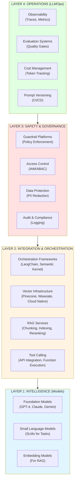
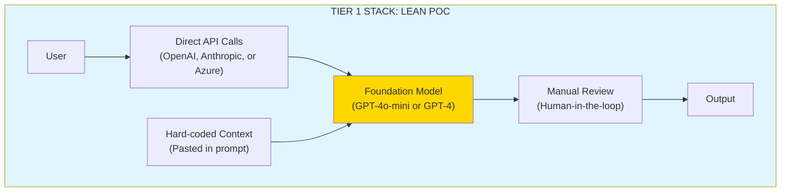
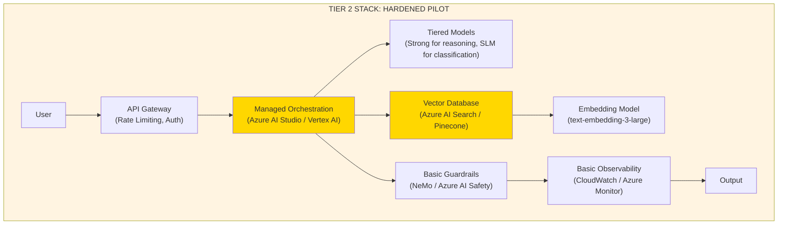
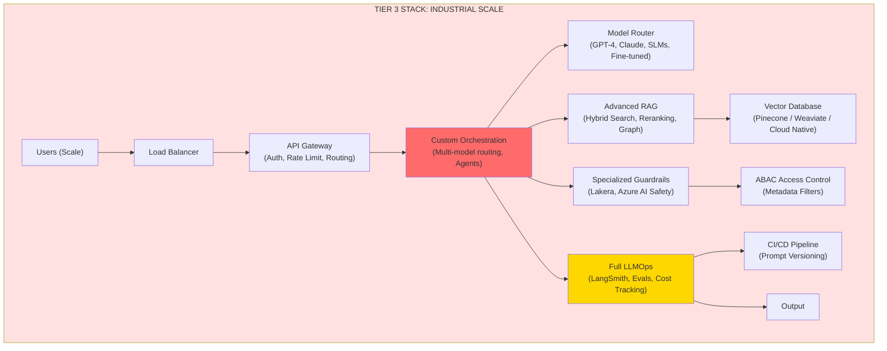
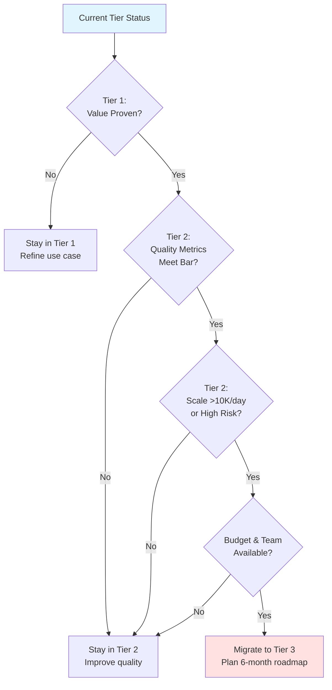
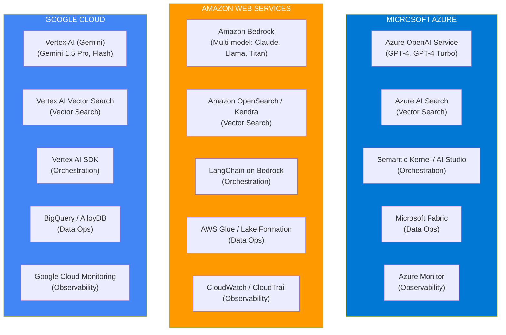
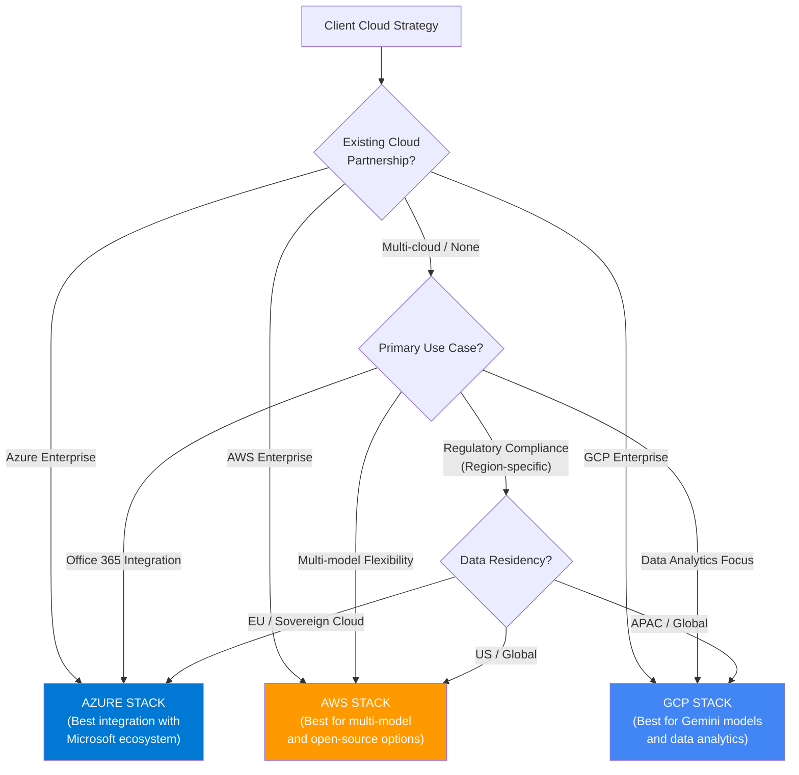
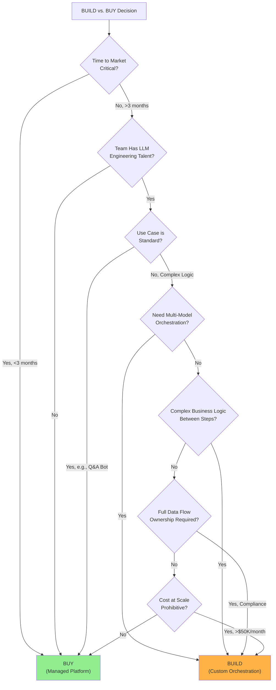
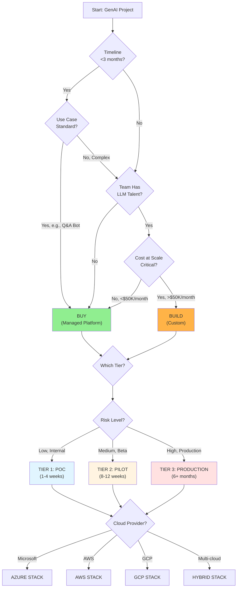

# ENTERPRISE GENAI STACKS

**Purpose:** Provide strategy and technology consultants with reference architectures, decision frameworks, and a practical roadmap to design enterprise GenAI stacks that balance speed, reliability, cost, and compliance across different maturity stages.

**Audience:** Strategy consultants, solution architects, technology consultants, delivery leads

**When to use:**
- Before starting a GenAI engagement to understand stack options and trade-offs.
- During discovery to align stakeholders on architecture decisions and timeline.
- During solution design to select appropriate stack tier and components.
- During vendor selection to map requirements to hyperscaler blueprints.

**Prerequisites:**
- [`../01_foundations/1.1_llm_fundamentals.md`](../01_foundations/1.1_llm_fundamentals.md) — Understanding the core engine constraints
- [`../02_solution_components/2.1_rag.md`](../02_solution_components/2.1_rag.md) — RAG as the primary data integration pattern

**Related:**
- [`4.2_vendor_selection_matrix.md`](./4.2_vendor_selection_matrix.md) — Choosing the specific providers for each layer
- [`../02_solution_components/2.6_observability_llomps.md`](../02_solution_components/2.6_observability_llomps.md) — The operational layer of the stack
- [`../02_solution_components/2.4_guardrails.md`](../02_solution_components/2.4_guardrails.md) — Security and safety components

---

# TL;DR (30 SECONDS)

An enterprise GenAI stack is **not a single product**—it is a multi-layered system that evolves with your maturity. Most enterprise stacks follow a four-layer model: **Intelligence** (models), **Integration** (RAG/Tools/Orchestration), **Safety** (Guardrails/Governance), and **Operations** (Observability/Evals).

The most common consulting mistake is over-engineering the POC. Teams should start lean to prove value, then scale systematically. We define three tiers of stack maturity:
1.  **POC Stacks (Tier 1):** Focus on speed. Use managed APIs, minimal orchestration, and human review.
2.  **Pilot Stacks (Tier 2):** Focus on reliability. Introduce Vector DBs, managed orchestration, and basic guardrails.
3.  **Production Stacks (Tier 3):** Focus on operations. Require custom orchestration, advanced RAG, and full observability.

For regulated industries, **Hyperscaler Blueprints** (Azure, AWS, GCP) provide the safest starting point. The "Build vs. Buy" decision should always focus on competitive differentiation: build what creates advantage, buy what is a commodity.

---

# WHAT'S IN / WHAT'S OUT

**In scope:**
- Reference architecture patterns (four-layer taxonomy)
- Stage-based stack evolution (POC to Pilot to Production)
- Hyperscaler blueprint mappings (Azure, AWS, GCP)
- Build vs. Buy decision framework with decision tree
- Cost and complexity comparisons across tiers
- Migration paths between tiers

**Out of scope:**
- Detailed low-level configuration for specific cloud services
- Code-level implementation of orchestration frameworks
- Vendor-specific pricing calculators (covered in 4.2)
- Detailed security implementation patterns (covered in 2.4)

---

# 1. THE ENTERPRISE GENAI STACK TAXONOMY

To have a productive conversation with a CTO or Architect, consultants must use a consistent taxonomy. The contemporary enterprise stack is best understood through **four functional layers**, each serving a distinct purpose.

## 1.1. The Four-Layer Stack Model

### Why This Model Matters

This layered model helps consultants identify gaps, estimate effort, and communicate with stakeholders. Executives understand "layers" better than technical jargon, and this structure aids in planning migrations—moving from POC to Production implies strengthening each layer systematically.

---

## 1.2. Layer 1: The Intelligence Layer (The Models)

**Purpose:** The core reasoning engine that understands and generates language.

**Components:**
- **Foundation Models** (GPT-4, Claude 3.5 Sonnet, Gemini 1.5 Pro): General-purpose reasoning for complex tasks.
- **Small Language Models** (SLMs): GPT-4o-mini, Llama-3.1-8B, Gemma-2B for fast, low-cost tasks.
- **Embedding Models**: text-embedding-3-large, Claude embeddings, or open-source (e.g., BGE-large) for RAG.

**Key Decision Points:**
- **Model selection:** Balance cost against capability.
- **Multi-model strategy:** Use strong models for hard tasks and SLMs for simple classification.
- **Provider lock-in:** Consider portability (OpenAI API) vs. ecosystem integration (Azure OpenAI, Bedrock).

**Consulting Insight:** In Tier 1 (POC), use the best available model to prove value. In Tier 3 (Production), optimize costs by routing simple tasks to SLMs, reserving powerful models for complex reasoning.

---

## 1.3. Layer 2: The Integration Layer (Context & Orchestration)

**Purpose:** Feed the model the right data at the right time and coordinate multi-step workflows.

**Components:**

| Component | Purpose | Examples |
|-----------|---------|----------|
| **Vector Infrastructure** | Store and search semantic representations of documents | Pinecone, Weaviate, Azure AI Search, Amazon OpenSearch, Vertex AI Vector Search |
| **Orchestration Frameworks** | Manage multi-step reasoning, tool calls, and agent loops | LangChain, LlamaIndex, Semantic Kernel, LangGraph, Custom Python/Node.js |
| **RAG Services** | Chunking, embedding, indexing, and reranking pipelines | Custom pipelines, Azure AI Search, Amazon Kendra, Vertex AI RAG APIs |
| **Tool Calling** | Enable models to interact with external systems | Function calling APIs, OpenAI Tools, Anthropic Tools, Custom API wrappers |

**Key Decision Points:**
- **RAG vs. Fine-tuning:** RAG is for dynamic knowledge; fine-tuning is for style/behavior (rarely needed in consulting).
- **Orchestration complexity:** Choose between managed platforms (Azure AI Studio), frameworks (LangChain), or custom code.
- **Vector DB choice:** Managed (Pinecone) for speed, Cloud-native (Azure AI Search) for compliance, or Open-source (Weaviate) for control.

**Consulting Insight:** In Tier 1, skip orchestration frameworks—use direct API calls. In Tier 2, use managed orchestration to reduce ops burden. In Tier 3, consider custom orchestration only if you need specific routing logic or multi-model workflows.

---

## 1.4. Layer 3: The Safety & Governance Layer (The Shield)

**Purpose:** Ensure the AI system doesn't cause harm, leak data, or violate policies.

**Components:**

| Component | Purpose | Enterprise Requirements |
|-----------|---------|------------------------|
| **Guardrail Platforms** | Block unsafe outputs, enforce policies | Azure AI Content Safety, AWS Bedrock Guardrails, NeMo Guardrails, Lakera Guard |
| **Access Control** | Enforce "who can see what" at retrieval time | ABAC (Attribute-Based Access Control), RBAC, IAM integration |
| **Data Protection** | Redact PII, secrets, and sensitive data before model ingestion | Azure AI Service PII detection, AWS Comprehend, Custom redaction pipelines |
| **Audit & Compliance** | Log all interactions for regulatory compliance | CloudWatch, Azure Monitor, Custom audit logs, SIEM integration |

**Key Decision Points:**
- **Guardrail placement:** Decide between pre-input (content filtering), post-output (response filtering), or both.
- **Access control:** Embed in vector DB (metadata filters) or proxy layer (gateway).
- **Compliance scope:** Determine if GDPR (EU), HIPAA (US healthcare), or SOC 2 (general enterprise) applies.

**Consulting Insight:** In Tier 1, rely on model safety filters and manual review. In Tier 2, add explicit guardrails for P0 failures (PII leakage, policy violations). In Tier 3, implement specialized guardrail platforms and strict ABAC for regulated industries.

---

## 1.5. Layer 4: The Operations Layer (LLMOps)

**Purpose:** Measure, monitor, and maintain the AI system at scale.

**Components:**

| Component | Purpose | Key Capabilities |
|-----------|---------|------------------|
| **Observability** | Trace queries, track latency, detect anomalies | LangSmith, Arize Phoenix, OpenTelemetry, Custom dashboards |
| **Evaluation Systems** | Gate releases based on quality metrics | Custom eval frameworks, LangSmith Evals, PromptLayer, Continuous eval pipelines |
| **Cost Management** | Track token usage, optimize spend, budget alerts | Custom cost tracking, Cloud billing dashboards, Token usage APIs |
| **Prompt Versioning** | Version control prompts, A/B test changes | Git, Prompt registries (Weights & Biases), CI/CD pipelines |

**Key Decision Points:**
- **Observability depth:** Basic (CloudWatch/Azure Monitor) vs. specialized (LangSmith) vs. custom.
- **Eval frequency:** Pre-release only, continuous monitoring, or both.
- **Cost optimization:** Reactive (alerts) vs. proactive (routing to cheaper models).

**Consulting Insight:** In Tier 1, skip specialized observability—use model provider logs. In Tier 2, add basic observability to catch regressions. In Tier 3, invest in full LLMOps stack to enable rapid iteration and cost optimization.

---

# 2. STAGE-BASED STACK EVOLUTION

One of the most common consulting mistakes is **over-engineering a POC** or **under-investing in production readiness**. The stack should evolve systematically as the business case hardens and scale requirements become clear.

## 2.1. The Three-Tier Maturity Model

```mermaid
flowchart LR
    subgraph Tier1["TIER 1: LEAN POC<br/>(Weeks 1-4)"]
        T1G["Goal: Prove Value"]
        T1T["Timeline: <4 weeks"]
        T1C["Cost: $500-2K/month"]
        T1R["Risk: Low (internal only)"]
    end
    
    subgraph Tier2["TIER 2: HARDENED PILOT<br/>(Weeks 4-12)"]
        T2G["Goal: Test with Real Users"]
        T2T["Timeline: 8-12 weeks"]
        T2C["Cost: $2K-10K/month"]
        T2R["Risk: Medium (controlled)"]
    end
    
    subgraph Tier3["TIER 3: INDUSTRIAL SCALE<br/>(Month 6+)"]
        T3G["Goal: Deploy at Scale"]
        T3T["Timeline: 6+ months"]
        T3C["Cost: $10K-100K+/month"]
        T3R["Risk: High (production)"]
    end
    
    Tier1 -->|"Value Proven"| Tier2
    Tier2 -->|"Pilot Success"| Tier3
    
    style Tier1 fill:#e1f5ff
    style Tier2 fill:#fff4e1
    style Tier3 fill:#ffe1e1
```

---

## 2.2. Tier 1: The Lean POC (Speed-First)

**Goal:** Validate the use case with stakeholders in <4 weeks and get budget approval for the pilot.

**Stack Composition:**

**Layer-by-Layer Breakdown:**

| Layer | Components | Rationale |
|-------|------------|-----------|
| **Intelligence** | Single foundation model (GPT-4o-mini or GPT-4) | Most capable model to prove concept, minimize failures |
| **Integration** | None (hard-coded context in prompt) | Skip complexity, focus on use case validation |
| **Safety** | Model safety filters + manual review | Built-in safety is "good enough" for internal POC |
| **Operations** | Basic logging (model provider logs) | No specialized tooling needed for <100 queries/day |

**Why Tier 1?**
This tier is ideal for internal stakeholders and low-risk use cases (no PII, no financial transactions). It is the right choice when the team lacks LLM engineering experience and needs to move fast to meet a deadline.

**Red Flags:**
Do not use this tier for customer-facing applications, use cases requiring real-time data integration, or scenarios in regulated industries like healthcare or finance.

**Key Metrics:**
- **Typical Timeline:** 1-4 weeks
- **Typical Cost:** $500-2,000/month (model API calls only)
- **Success Criteria:** Stakeholder approval, budget for Tier 2

---

## 2.3. Tier 2: The Hardened Pilot (Reliability-First)

**Goal:** Test with real users in a controlled environment, measure quality, and gather feedback.

**Stack Composition:**

**Layer-by-Layer Breakdown:**

| Layer | Components | Rationale |
|-------|------------|-----------|
| **Intelligence** | Tiered models (GPT-4 for complex, GPT-4o-mini for simple) | Optimize cost while maintaining quality |
| **Integration** | Managed orchestration (Azure AI Studio, Vertex AI) + Vector DB | Reduce ops burden, enable RAG for dynamic knowledge |
| **Safety** | Explicit guardrails (NeMo Guardrails, Azure AI Content Safety) + PII redaction | Block P0 failures (PII leakage, policy violations) |
| **Operations** | Basic observability (CloudWatch, Azure Monitor) + eval framework | Catch regressions, measure quality improvements |

**Why Tier 2?**
Tier 2 supports real users (internal or external beta) and dynamic knowledge bases via RAG. It is suitable for moderate risk scenarios where quality must be systematically measured.

**Red Flags:**
Avoid this tier for high-risk use cases like medical advice, complex multi-agent workflows, or fine-tuned models for domain specificity. If scale exceeds 10K queries/day, look to Tier 3.

**Key Metrics:**
- **Typical Timeline:** 8-12 weeks
- **Typical Cost:** $2,000-10,000/month (models + vector DB + orchestration)
- **Success Criteria:** Quality metrics meet bar, user satisfaction >70%, P0 incident rate <1%

---

## 2.4. Tier 3: Industrial Scale (Operations-First)

**Goal:** Deploy across the business with 24/7 support, optimize for cost and reliability.

**Stack Composition:**

**Layer-by-Layer Breakdown:**

| Layer | Components | Rationale |
|-------|------------|-----------|
| **Intelligence** | Multi-model strategy (GPT-4, Claude, fine-tuned SLMs) + fallback logic | Optimize cost, handle failures, domain-specific performance |
| **Integration** | Custom orchestration (LangChain/LangGraph or custom) + Advanced RAG | Full control over routing, complex workflows, optimal retrieval |
| **Safety** | Specialized guardrail platforms (Lakera, Azure AI Safety) + Strict ABAC | Regulated industries, zero-tolerance for P0 failures |
| **Operations** | Full observability (LangSmith, Arize Phoenix) + Continuous evals | Enable rapid iteration, catch drift, optimize spend |

**Why Tier 3?**
This is necessary for production deployment at high scale (>10K queries/day), particularly in regulated industries (healthcare, finance, legal). It supports complex workflows and critical cost optimization.

**Red Flags:**
Do not jump to Tier 3 if you are still validating the use case, have a limited budget, lack engineering resources, or have a simple use case where Tier 2 suffices.

**Key Metrics:**
- **Typical Timeline:** 6+ months (includes migration from Tier 2)
- **Typical Cost:** $10,000-100,000+/month (models + infrastructure + tooling)
- **Success Criteria:** 99.9% uptime, cost per query <target, quality metrics stable, zero P0 incidents

---

## 2.5. Stack Evolution Decision Framework

Use this framework to determine when to move to the next tier:

---

## 2.6. Comparison Matrix: Tier 1 vs. Tier 2 vs. Tier 3

| Dimension | Tier 1 (POC) | Tier 2 (Pilot) | Tier 3 (Production) |
|-----------|--------------|----------------|---------------------|
| **Timeline** | 1-4 weeks | 8-12 weeks | 6+ months |
| **Cost/month** | $500-2K | $2K-10K | $10K-100K+ |
| **User Base** | Internal stakeholders | Real users (beta) | Production users |
| **Risk Level** | Low (internal only) | Medium (controlled) | High (production) |
| **Intelligence** | Single foundation model | Tiered models | Multi-model + fine-tuned |
| **Integration** | None (hard-coded) | Managed orchestration + Vector DB | Custom orchestration + Advanced RAG |
| **Safety** | Model filters + manual review | Explicit guardrails + PII redaction | Specialized guardrails + ABAC |
| **Operations** | Basic logging | Basic observability + evals | Full LLMOps stack |
| **Use Cases** | Proof of concept, demos | Beta testing, controlled rollout | Production deployment |
| **Success Metrics** | Stakeholder approval | Quality metrics, user satisfaction | Uptime, cost, quality, compliance |

---

# 3. HYPERSCALER BLUEPRINTS

For most enterprise clients, the stack is dictated by their **existing cloud partnership**. Consultants must be able to map components to Azure, AWS, and GCP ecosystems.

## 3.1. The Hyperscaler Stack Comparison

---

## 3.2. Detailed Hyperscaler Component Mapping

| Layer | Component | **Microsoft Azure** | **AWS** | **Google Cloud (GCP)** |
|-------|-----------|---------------------|---------|------------------------|
| **Intelligence** | Foundation Models | Azure OpenAI Service (GPT-4, GPT-4 Turbo, GPT-4o) | Amazon Bedrock (Claude, Llama, Titan, Mistral) | Vertex AI (Gemini 1.5 Pro, Flash, Embeddings) |
| **Intelligence** | Embedding Models | text-embedding-3-large (via Azure OpenAI) | Titan Embeddings, Cohere Embed (via Bedrock) | text-embedding-004 (Vertex AI) |
| **Integration** | Vector Search | Azure AI Search (native vector search) | Amazon OpenSearch Serverless, Amazon Kendra | Vertex AI Vector Search, BigQuery Vector Search |
| **Integration** | Orchestration | Semantic Kernel, Azure AI Studio (managed) | LangChain (Bedrock integration), AWS Step Functions | Vertex AI SDK, Vertex AI Workbench |
| **Integration** | RAG Services | Azure AI Search (chunking, indexing, reranking) | Amazon Kendra (managed RAG), Bedrock Knowledge Bases | Vertex AI RAG APIs, Document AI |
| **Safety** | Guardrails | Azure AI Content Safety, Azure Policy | AWS Bedrock Guardrails, AWS WAF | Vertex AI Safety Settings, Cloud Armor |
| **Safety** | Access Control | Azure AD, Azure RBAC, ABAC | AWS IAM, AWS KMS, ABAC | Google Cloud IAM, VPC Service Controls |
| **Safety** | Data Protection | Azure AI Service PII detection, Azure Key Vault | AWS Comprehend (PII), AWS Secrets Manager | Cloud DLP, Secret Manager |
| **Operations** | Observability | Azure Monitor, Application Insights, Log Analytics | CloudWatch, CloudTrail, X-Ray | Google Cloud Monitoring, Cloud Logging, Trace |
| **Operations** | Data Ops | Microsoft Fabric, Azure Synapse, Azure Data Factory | AWS Glue, AWS Lake Formation, EMR | BigQuery, AlloyDB, Dataflow, Dataproc |

---

## 3.3. Hyperscaler Selection Framework

The decision of which hyperscaler to recommend usually depends on four factors:

1.  **Existing Cloud Partnership (The dominant factor):** Leveraging existing enterprise agreements and cloud infrastructure reduces procurement time and complexity.
2.  **Use Case Fit:**
    *   **Azure:** Best for Office 365 integration and typical enterprise workflows.
    *   **AWS:** Best for multi-model flexibility and open-source models.
    *   **GCP:** Best for data analytics and Gemini model features.
3.  **Regulatory Compliance:**
    *   **Azure:** Strong in EU (GDPR) and healthcare (HIPAA).
    *   **AWS:** Strong in US (FedRAMP) and financial services.
    *   **GCP:** Strong data residency options for APAC.
4.  **Model Preferences:** Azure implies OpenAI; AWS implies Claude/Llama; GCP implies Gemini.

---

## 3.4. Hyperscaler Feature Comparison

| Feature | Azure | AWS | GCP |
|---------|-------|-----|-----|
| **Managed Orchestration** | Excellent (Azure AI Studio) | Limited (LangChain integration) | Excellent (Vertex AI Workbench) |
| **Native Vector Search** | Excellent (Azure AI Search) | Limited (Managed OpenSearch) | Excellent (Vertex AI Vector Search) |
| **Managed RAG** | Excellent (Azure AI Search) | Excellent (Amazon Kendra) | Excellent (Vertex AI RAG APIs) |
| **Multi-Model Support** | Standard (OpenAI models only) | Excellent (Claude, Llama, Titan) | Standard (Gemini models only) |
| **Fine-Tuning Support** | Excellent (Azure OpenAI) | Excellent (Custom Models) | Excellent (Model Garden) |
| **Guardrails** | Excellent (Azure AI Content Safety) | Excellent (Bedrock Guardrails) | Basic (Safety settings) |
| **Data Residency** | Strong (EU, Sovereign) | Strong (Global) | Strong (APAC, Global) |
| **Cost Transparency** | Good (per-token pricing) | Good (per-model pricing) | Good (per-token pricing) |

---

# 4. THE "BUILD vs. BUY" DECISION FRAMEWORK

Clients often ask: *"Should we use a managed platform like Azure AI Studio or OpenAI Assistants, or build our own orchestration?"*

This is a critical consulting decision. Getting it wrong leads to either over-engineering (implying wasted time and budget) or under-investing (creating technical debt and vendor lock-in).

## 4.1. The Build vs. Buy Decision Tree

---

## 4.2. When to BUY (Managed Platforms)

**Recommendation: Buy when you need speed, lack specialized talent, or have standard use cases.**

### 4.2.1. Managed Platform Options

| Platform | Provider | Best For | Limitations |
|----------|----------|----------|-------------|
| **Azure AI Studio** | Microsoft | Azure ecosystem, enterprise workflows, managed RAG | Limited to OpenAI models, Azure-only |
| **OpenAI Assistants API** | OpenAI | Simple agent workflows, file search, function calling | Vendor lock-in, cost at scale |
| **Vertex AI Workbench** | Google | GCP ecosystem, Gemini models, data analytics | Limited to Gemini models, GCP-only |
| **Amazon Bedrock Agents** | AWS | Multi-model, serverless, AWS ecosystem | Complex setup, less managed than alternatives |

### 4.2.2. Buy Criteria Checklist

Managed platforms are the right choice if:
- **Time to Market** is the primary driver (need first user in <3 months).
- The team **lacks specialized LLM engineering** talent.
- The use case is **standard**, such as policy Q&A, document summarization, or a basic chatbot.
- You prefer the provider to handle **infrastructure security** and scaling.
- **Vendor lock-in** is acceptable or the client is already committed to the ecosystem.
- **Cost at scale** is projected to be manageable (<$50K/month).

### 4.2.3. Buy: Pros and Cons

**Pros:**
- **Fast time to market:** Launch in weeks, not months.
- **Managed security and compliance:** The provider handles infrastructure.
- **Automatic scaling:** No need to manage server instances.
- **Lower initial cost:** Requires minimal engineering investment.

**Cons:**
- **Vendor lock-in:** Migration is difficult.
- **Cost at scale:** Per-request pricing can become expensive.
- **Limited customization:** Constrained by platform capabilities.
- **Less control:** Optimization for specific use cases is limited.

---

## 4.3. When to BUILD (Custom Orchestration)

**Recommendation: Build when you need control, have complex requirements, or cost at scale matters.**

### 4.3.1. Custom Orchestration Patterns

| Pattern | Use Case | Complexity |
|---------|----------|------------|
| **Framework-Based** (LangChain, LlamaIndex) | Standard workflows with some customization | Medium (weeks to months) |
| **Custom Python/Node.js** | Complex business logic, multi-model routing | High (months) |
| **Agent Frameworks** (LangGraph, AutoGen) | Multi-agent systems, complex reasoning | Very High (months to years) |

### 4.3.2. Build Criteria Checklist

Custom orchestration is the right choice if:
- You need **multi-model orchestration** (e.g., using Claude for drafting and GPT-4 for grading).
- You have **complex business logic** between steps that exceeds simple platform capabilities.
- You require **full ownership** of data flow and auditing for strict compliance.
- **Cost at scale** with managed platforms would be prohibitive (>$50K/month).
- You need **domain-specific optimizations** like custom routing or fine-tuned models.
- You have the necessary **engineering resources** (LLM engineers, DevOps).

### 4.3.3. Build: Pros and Cons

**Pros:**
- **Full control:** Optimize for specific high-value use cases.
- **Cost optimization:** Route to cheaper models and cache responses.
- **No vendor lock-in:** Elements are portable across providers.
- **Better observability:** Full control over metrics, logging, and tracing.

**Cons:**
- **Long time to market:** Takes months, not weeks.
- **Engineering investment:** Requires specialized, expensive talent.
- **Responsibility:** You own security, compliance, and infrastructure scaling.
- **Maintenance burden:** Requires ongoing updates and bug fixes.

---

## 4.4. Hybrid Approach: Buy + Extend

Often the best choice is a hybrid approach—buying a managed platform and extending it with custom components.

**Typical Patterns:**
- **Managed RAG + Custom Orchestration:** Use Azure AI Search for vector storage but control the routing logic with LangChain.
- **Managed Models + Custom Safety:** Rely on OpenAI models but implement a custom guardrail service for compliance.
- **Managed Platform + Custom Tools:** Use Azure AI Studio for orchestration but integrate custom APIs for industry-specific tools.

This approach offers the balance of managed infrastructure speed with the flexibility of custom logic.

---

## 4.5. Build vs. Buy: Cost Comparison Example

**Scenario:** Customer support chatbot, 10K queries/day, 500 tokens/query average

| Approach | Monthly Cost | Setup Time | Maintenance |
|----------|--------------|------------|-------------|
| **Buy (OpenAI Assistants)** | ~$15K/month | 2-4 weeks | Low |
| **Buy (Azure AI Studio)** | ~$12K/month | 4-6 weeks | Low |
| **Build (LangChain + OpenAI API)** | ~$8K/month (optimized) | 8-12 weeks | Medium |
| **Build (Custom + Multi-model)** | ~$5K/month (optimized) | 16-24 weeks | High |

**Takeaway:** Buy is faster and lower risk, but Build can be 2-3x cheaper at scale if you have engineering resources.

---

# 5. REAL-WORLD CASE STUDIES

## 5.1. Case Study: FINCORP (Financial Services)

**Context:** A mid-sized financial services firm wanted to automate "Underwriting Research," a manual process where underwriters spent 40% of their time searching through loan applications, credit reports, and internal policy wikis.

### The Journey: Tier 1 → Tier 2 → Tier 3

**Tier 1: The POC (Weeks 1-3)**
- **Stack:** Azure OpenAI (GPT-4) with manual PDF upload.
- **Decision:** Skip orchestration and prove value first.
- **Result:** Proved the model could accurately summarize risk factors; pilot budget approved.

**Tier 2: The Pilot (Weeks 4-12)**
- **Stack:** Azure AI Search for RAG + Azure OpenAI + basic LangChain logic.
- **Decision:** Add RAG for real-time data access and minimize operations.
- **Result:** Reduced research time by 25%, but flagged cost concerns ($8K/month) and data freshness issues.

**Tier 3: Production (Month 6+)**
- **Stack:** Amazon Bedrock (Multi-model) + Pinecone + Custom Guardrails.
- **Decision:** Migrate to AWS for multi-model flexibility and build custom orchestration to optimize costs.
- **Result:** Reduced research time by 30% and lowered token costs by 45% by routing simple tasks to SLMs. Achieved zero P0 incidents.

**Lessons Learned:**
1.  **Start lean:** Proving value in Tier 1 is essential before infrastructure investment.
2.  **Optimize costs:** Multi-model routing in Tier 3 saved 45% on operational costs.
3.  **Custom when needed:** Building custom orchestration was justified by the scale and cost savings.

---

## 5.2. Case Study: TECHSTART (SaaS Startup)

**Context:** A fast-growing SaaS startup wanted to add an AI-powered customer support chatbot to reduce support ticket volume.

**Initial Approach (Buy)**
They launched an MVP in 2 weeks using the OpenAI Assistants API.
- **Outcome:** Reduced ticket volume by 30% quickly.
- **Issue:** As usage grew to 5K queries/day, costs spiked from $3K to $12K/month.

**Migration to Hybrid (Month 4)**
They migrated to a hybrid stack: OpenAI API for models, but custom LangChain orchestration and Pinecone for vector storage.
- **Outcome:** Reduced costs by 60% through optimized routing and caching.
- **Benefit:** Retained fast iteration cycles while gaining control over the ticket creation workflow.

**Lessons Learned:**
- **Buy first:** Use managed platforms to validate the product-market fit.
- **Migrate later:** Move to hybrid or build architectures only when cost or control becomes a blocker.

---

## 5.3. Case Study: HEALTHCORP (Healthcare Provider)

**Context:** A large healthcare provider needed an internal knowledge assistant for clinicians. Regulatory compliance (HIPAA) and patient safety were non-negotiable.

**Tier 2: The Pilot (Regulatory-First)**
They started with a setup focused on compliance: Azure OpenAI Service (HIPAA-compliant) and Azure AI Search.
- **Result:** Met HIPAA requirements and reduced lookup time by 40%.
- **Limitation:** Access control was too broad for sensitive patient data.

**Tier 3: Production**
Moved to a production stack with fine-tuning and strict governance.
- **Stack:** Azure OpenAI (Fine-tuned for medical terms) + Custom Guardrails + Strict ABAC.
- **Result:** Achieved zero safety incidents and a further 50% reduction in research time. Full audit trails satisfied compliance officers.

**Lessons Learned:**
- **Regulation dictates stack:** Use services that offer BAA (Business Associate Agreements) and strict compliance from day one.
- **Safety is paramount:** In healthcare, custom guardrails are required to ensure zero error tolerance.

---

# 6. QUICK REFERENCE: STACK SELECTION DECISION TREE

Use this decision tree at the start of an engagement to quickly identify the right stack approach:

---

# 7. COST ESTIMATION FRAMEWORK

Understanding costs at each tier is critical for budget planning and stakeholder alignment.

## 7.1. Cost Breakdown by Tier

Tier 1 is dominated by simple API calls. In Tier 2, infrastructure costs for Vector DBs and Orchestration appear. By Tier 3, costs shift toward compute and operational tooling, with model costs relatively decreasing due to optimization.

## 7.2. Cost Estimation Formula

**Monthly Cost = (Model Costs) + (Infrastructure Costs) + (Tooling Costs) + (Engineering Costs)**

### Model Costs
To calculate model costs: `(Queries/Day × Avg Tokens/Query × Days/Month) × Token Price`.
*Example:* 10K queries/day with GPT-4 can reach ~$7,200/month.

### Infrastructure & Tooling
- **Tier 1:** Minimal (~$100).
- **Tier 2:** Managed services add ~$1K-3K/month.
- **Tier 3:** High-scale compute and dedicated vector storage can run $10K-20K+/month.

## 7.3. Cost Optimization Strategies

| Strategy | Impact | Tier Applicability |
|----------|--------|-------------------|
| **Use cheaper models** | 30-50% savings | Tier 1 (start cheap), Tier 3 (route to SLM) |
| **Cache responses** | 20-40% savings | Tier 2 (basic), Tier 3 (advanced) |
| **Optimize prompts** | 10-20% savings | All Tiers |
| **Batch processing** | 20-30% savings | Tier 3 (bulk tasks) |

---

# 8. MIGRATION PATHS

## 8.1. Tier 1 → Tier 2 Migration
**Timeline:** 4-8 weeks | **Risk:** Low

Transitioning to Tier 2 involves adding persistence and safety without rebuilding the core logic.
1.  **Add Vector DB:** Set up an index (e.g., Azure AI Search) and migrate documents.
2.  **Add Orchestration:** Introduce a managed layer to handle the retrieval loop.
3.  **Add Guardrails:** Implement explicit checks for PII and policy safety.
4.  **Add Observability:** Ensure you can track basic quality metrics.

## 8.2. Tier 2 → Tier 3 Migration
**Timeline:** 3-6 months | **Risk:** Medium-High

This is a major architectural shift. It often requires moving from managed, generic flows to custom, optimized microservices.
1.  **Plan Architecture:** Design for multi-model routing and custom agentic workflows.
2.  **Build Custom Orchestration:** Replace rigid managed flows with flexible code-based routing.
3.  **Implement Advanced RAG:** Add reranking, hybrid search, and graph-based retrieval.
4.  **Full LLMOps:** Deploy continuous evaluation pipelines and automated CI/CD for prompts.

---

# 9. COMMON ANTI-PATTERNS (WHAT NOT TO DO)

## 9.1. Over-Engineering the POC
**Anti-Pattern:** Building Tier 3 infrastructure for a Tier 1 use case.
*Example:* Spending 3 months building custom orchestration for a simple internal demo.
**Impact:** Wasted budget and lost stakeholder confidence.
**Advice:** Time-box the POC to 4 weeks. Only invest in infrastructure after the value is clear.

## 9.2. Under-Investing in Production
**Anti-Pattern:** Using a Tier 1 stack for production deployment.
*Example:* Deploying a customer-facing bot with no guardrails or observability.
**Impact:** High risk of safety failures, P0 incidents, and uncontrolled costs.
**Advice:** Always match the stack tier to the risk level. Production requires observability and safety from day one.

## 9.3. Vendor Lock-In Without Strategy
**Anti-Pattern:** Choosing a vendor without considering the exit strategy.
*Example:* Using a proprietary API for everything, then facing 3x cost spikes with no way to migrate.
**Advice:** Use abstractions (like LangChain) and negotiate data portability early.

## 9.4. Ignoring Security and Compliance
**Anti-Pattern:** Retrofitting security after building the stack.
*Example:* Building a healthcare app on a public cloud service that isn't HIPAA compliant.
**Advice:** Security-first design is cheaper than rebuilding. Involve security teams in the design phase.

## 9.5. Skipping Observability
**Anti-Pattern:** Flying blind in production.
*Example:* Launching a bot without logging, making it impossible to diagnose user complaints.
**Advice:** Instrument from day one. You cannot improve what you cannot measure.

---